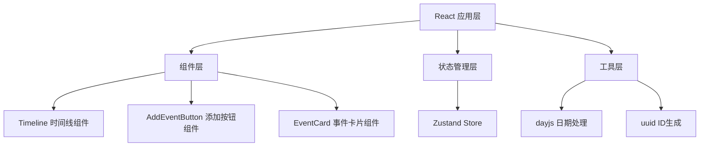

## 1. 架构设计



## 2. 技术描述

- **前端框架**: React 18 + TypeScript + Vite
- **状态管理**: Zustand
- **路由**: React Router DOM
- **日期处理**: dayjs
- **ID生成**: uuid
- **HTTP客户端**: axios
- **样式方案**: CSS Modules + CSS Transitions

## 3. 项目结构

```
d:\P\tasks\auto39\
├── src\
│   ├── components\
│   │   ├── Timeline.tsx          # 时间线展示组件
│   │   ├── AddEventButton.tsx    # 浮动添加按钮及表单
│   │   └── EventCard.tsx         # 事件卡片组件（性能优化）
│   ├── store\
│   │   └── useTimelineStore.ts   # Zustand 状态管理
│   ├── types\
│   │   └── index.ts              # TypeScript 类型定义
│   ├── App.tsx                   # 主应用组件
│   ├── main.tsx                  # 应用入口
│   └── index.css                 # 全局样式
├── index.html
├── package.json
├── vite.config.js
└── tsconfig.json
```

## 4. 核心数据模型

### 4.1 事件数据类型

```typescript
interface TimelineEvent {
  id: string;
  date: string;           // YYYY-MM-DD 格式
  title: string;
  summary: string;        // 概要（最多100字）
  description: string;    // 完整描述
  images: string[];       // 图片URL数组（1-3张）
  createdAt: number;
}
```

### 4.2 Store 状态定义

```typescript
interface TimelineState {
  events: TimelineEvent[];
  addEvent: (event: Omit<TimelineEvent, 'id' | 'createdAt'>) => void;
  toggleExpand: (id: string) => void;
}
```

## 5. 性能优化方案

### 5.1 渲染性能优化
1. **React.memo 包裹 EventCard**：避免不必要的重渲染
2. **useMemo 缓存事件列表**：按日期排序等计算结果缓存
3. **stable key**：使用事件ID而非index作为列表key
4. **CSS硬件加速**：transform 和 opacity 属性动画

### 5.2 动画性能保障
1. 使用 CSS transitions 而非 JS 动画
2. 动画属性仅使用 transform 和 opacity
3. 避免布局抖动（Layout Thrashing）

## 6. 关键修复点说明

| 问题编号 | 修复方案 | 实现位置 |
|----------|----------|----------|
| 1 | 修正左右交替逻辑：`index % 2 === 0` 为左侧 | EventCard.tsx 布局判断 |
| 2 | 展开动画添加 opacity: 0→1 过渡 | EventCard.tsx 样式 |
| 3 | 添加 dragOver/dragLeave 事件处理，边框样式切换 | AddEventButton.tsx |
| 4 | 提交按钮点击：scale(0.95)→scale(1) + 短暂变绿 | AddEventButton.tsx 样式 |
| 5 | React.memo + useMemo + 稳定key 优化 | EventCard.tsx, Timeline.tsx |
