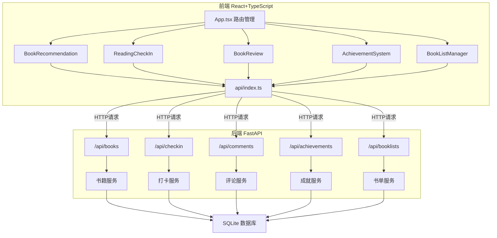
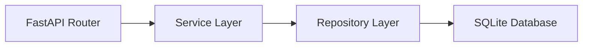
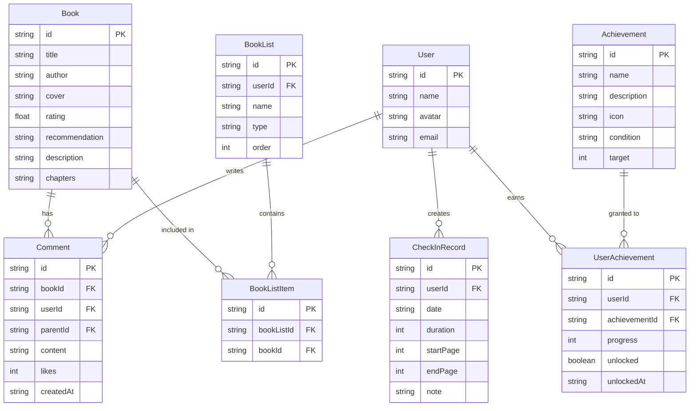

## 1. 架构设计



## 2. 技术说明

- 前端：React@18 + TypeScript + Vite + TailwindCSS
- 初始化工具：vite-init（react-ts 模板）
- 后端：FastAPI (Python 3.10+)
- 数据库：SQLite（开发阶段，使用mock数据辅助前端开发）
- 状态管理：Zustand
- 图表：Chart.js + react-chartjs-2
- HTTP客户端：Axios
- 日期处理：date-fns
- 图标：lucide-react

## 3. 路由定义

| 路由 | 用途 |
|------|------|
| / | 首页，展示书籍推荐和统计概览 |
| /book/:id | 书籍详情页，展示书籍信息和评论 |
| /checkin | 阅读打卡页，日历热力图和趋势图 |
| /reviews | 书评讨论页，评论列表和交互 |
| /achievements | 成就系统页，徽章展示和进度 |
| /booklists | 我的书单页，书单管理和排序 |

## 4. API定义

### 4.1 书籍相关

```typescript
interface Book {
  id: string;
  title: string;
  author: string;
  cover: string;
  rating: number;
  recommendation: string;
  description: string;
  chapters: string[];
}

// GET /api/books/recommendations → Book[]
// GET /api/books/:id → Book
```

### 4.2 打卡相关

```typescript
interface CheckInRecord {
  id: string;
  date: string;
  duration: number;
  startPage: number;
  endPage: number;
  note: string;
}

// GET /api/checkin?days=30 → CheckInRecord[]
// POST /api/checkin → CheckInRecord
// PUT /api/checkin/:id → CheckInRecord
```

### 4.3 评论相关

```typescript
interface Comment {
  id: string;
  bookId: string;
  userId: string;
  userName: string;
  avatar: string;
  content: string;
  likes: number;
  replies: Comment[];
  createdAt: string;
}

// GET /api/comments?bookId=&page=1&limit=10&sort=latest → { items: Comment[], total: number }
// POST /api/comments → Comment
// POST /api/comments/:id/like → { likes: number }
// POST /api/comments/:id/reply → Comment
```

### 4.4 成就相关

```typescript
interface Achievement {
  id: string;
  name: string;
  description: string;
  icon: string;
  unlocked: boolean;
  progress: number;
  target: number;
  condition: string;
}

// GET /api/achievements → Achievement[]
```

### 4.5 书单相关

```typescript
interface BookList {
  id: string;
  name: string;
  type: 'want' | 'reading' | 'read';
  cover: string;
  books: Book[];
  order: number;
}

// GET /api/booklists → BookList[]
// POST /api/booklists → BookList
// PUT /api/booklists/:id → BookList
// DELETE /api/booklists/:id → void
// POST /api/booklists/:id/books → BookList
// PUT /api/booklists/reorder → BookList[]
```

## 5. 服务器架构图



## 6. 数据模型

### 6.1 数据模型定义



### 6.2 数据定义语言

```sql
CREATE TABLE books (
    id TEXT PRIMARY KEY,
    title TEXT NOT NULL,
    author TEXT NOT NULL,
    cover TEXT NOT NULL,
    rating REAL NOT NULL,
    recommendation TEXT NOT NULL,
    description TEXT NOT NULL,
    chapters TEXT NOT NULL
);

CREATE TABLE users (
    id TEXT PRIMARY KEY,
    name TEXT NOT NULL,
    avatar TEXT NOT NULL,
    email TEXT UNIQUE NOT NULL
);

CREATE TABLE checkin_records (
    id TEXT PRIMARY KEY,
    user_id TEXT NOT NULL REFERENCES users(id),
    date TEXT NOT NULL,
    duration INTEGER NOT NULL,
    start_page INTEGER NOT NULL,
    end_page INTEGER NOT NULL,
    note TEXT DEFAULT '',
    UNIQUE(user_id, date)
);

CREATE TABLE comments (
    id TEXT PRIMARY KEY,
    book_id TEXT NOT NULL REFERENCES books(id),
    user_id TEXT NOT NULL REFERENCES users(id),
    parent_id TEXT REFERENCES comments(id),
    content TEXT NOT NULL CHECK(LENGTH(content) <= 200),
    likes INTEGER DEFAULT 0,
    created_at TEXT NOT NULL DEFAULT (datetime('now'))
);

CREATE TABLE achievements (
    id TEXT PRIMARY KEY,
    name TEXT NOT NULL,
    description TEXT NOT NULL,
    icon TEXT NOT NULL,
    condition TEXT NOT NULL,
    target INTEGER NOT NULL
);

CREATE TABLE user_achievements (
    id TEXT PRIMARY KEY,
    user_id TEXT NOT NULL REFERENCES users(id),
    achievement_id TEXT NOT NULL REFERENCES achievements(id),
    progress INTEGER DEFAULT 0,
    unlocked INTEGER DEFAULT 0,
    unlocked_at TEXT,
    UNIQUE(user_id, achievement_id)
);

CREATE TABLE book_lists (
    id TEXT PRIMARY KEY,
    user_id TEXT NOT NULL REFERENCES users(id),
    name TEXT NOT NULL,
    type TEXT NOT NULL CHECK(type IN ('want', 'reading', 'read')),
    sort_order INTEGER NOT NULL DEFAULT 0
);

CREATE TABLE book_list_items (
    id TEXT PRIMARY KEY,
    book_list_id TEXT NOT NULL REFERENCES book_lists(id) ON DELETE CASCADE,
    book_id TEXT NOT NULL REFERENCES books(id)
);

CREATE INDEX idx_checkin_user_date ON checkin_records(user_id, date);
CREATE INDEX idx_comments_book ON comments(book_id, created_at);
CREATE INDEX idx_comments_likes ON comments(book_id, likes);
CREATE INDEX idx_user_achievements_user ON user_achievements(user_id);
```
