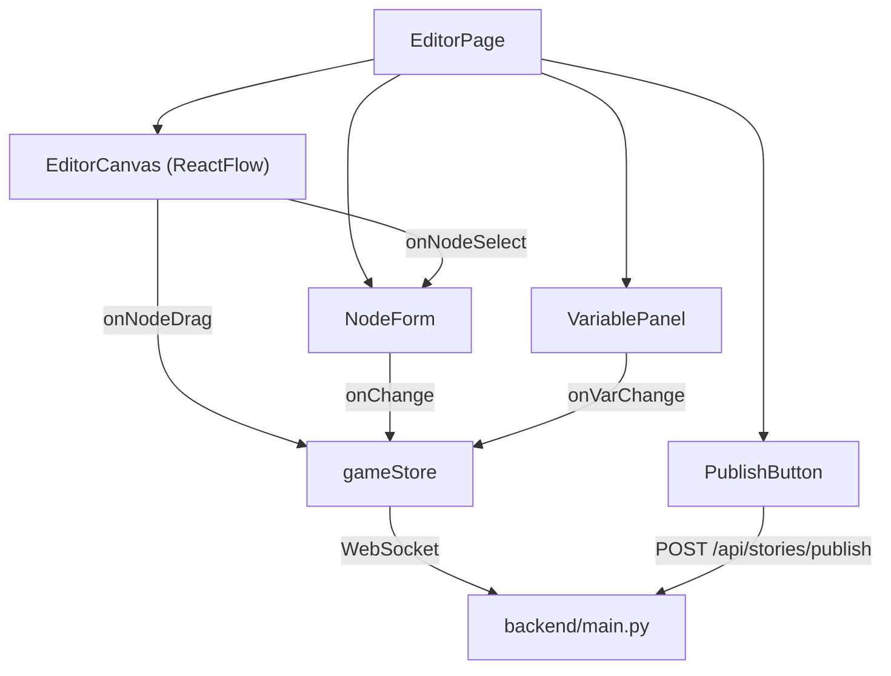
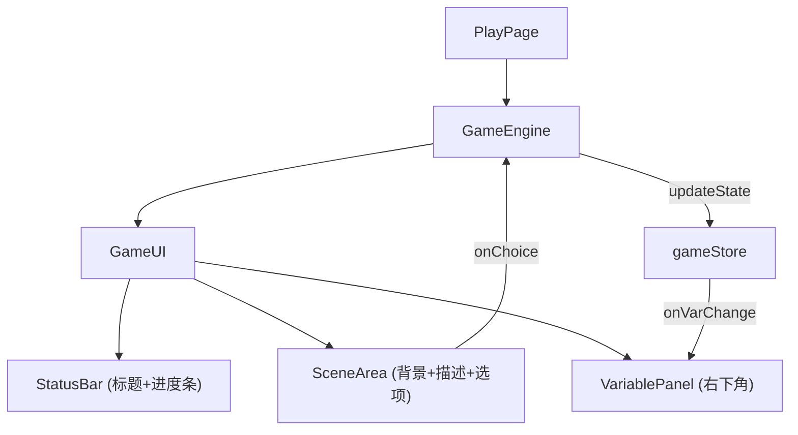

# 文字冒险游戏编辑器与游玩器 - 技术架构文档

## 1. 技术栈选型

### 1.1 前端技术栈
| 技术 | 版本 | 用途 |
|------|------|------|
| React | 18.x | UI框架 |
| TypeScript | 5.x | 类型安全 |
| React Router | 6.x | 路由管理 |
| Zustand | 4.x | 状态管理（轻量替代Redux） |
| ReactFlow | 11.x | 节点画布编辑器 |
| Axios | 1.x | HTTP客户端 |
| Socket.IO Client | 4.x | WebSocket实时通信 |
| UUID | 9.x | 生成唯一ID |
| Vite | 5.x | 构建工具 |
| Tailwind CSS | CDN | 原子化CSS |

### 1.2 后端技术栈
| 技术 | 版本 | 用途 |
|------|------|------|
| FastAPI | 0.109.x | RESTful API框架 |
| Python | 3.11 | 后端语言 |
| WebSocket (FastAPI内置) | - | 实时通信 |
| Uvicorn | 0.27.x | ASGI服务器 |

### 1.3 数据存储
- 开发阶段：内存存储 + JSON文件持久化
- 生产建议：PostgreSQL + Redis缓存

---

## 2. 项目目录结构

```
auto40/
├── frontend/                          # 前端项目
│   ├── package.json
│   ├── vite.config.js
│   ├── tsconfig.json
│   ├── index.html
│   └── src/
│       ├── main.tsx                   # 应用入口
│       ├── App.tsx                    # 根组件（路由）
│       ├── types/
│       │   └── index.ts               # 全局类型定义
│       ├── stores/
│       │   └── gameStore.ts           # Zustand全局状态
│       ├── api/
│       │   └── client.ts              # Axios+Socket客户端
│       ├── editor/                    # 编辑器模块
│       │   ├── EditorCanvas.tsx       # 画布（ReactFlow）
│       │   ├── NodeForm.tsx           # 节点编辑面板
│       │   └── VariablePanel.tsx      # 变量管理面板
│       ├── game/                      # 运行时模块
│       │   ├── GameEngine.tsx         # 游戏引擎核心
│       │   └── GameUI.tsx             # 游戏界面渲染
│       ├── pages/
│       │   ├── HomePage.tsx           # 作品列表页（瀑布流）
│       │   ├── EditorPage.tsx         # 编辑器页
│       │   └── PlayPage.tsx           # 游玩页
│       └── components/
│           ├── Navbar.tsx             # 导航栏+搜索
│           └── StoryCard.tsx          # 故事卡片
├── backend/                           # 后端项目
│   ├── main.py                        # FastAPI入口
│   ├── models.py                      # Pydantic数据模型
│   ├── storage.py                     # 数据存储层
│   └── requirements.txt
└── .trae/documents/
    ├── PRD.md
    └── ARCHITECTURE.md
```

---

## 3. 数据模型定义

### 3.1 核心TypeScript类型

```typescript
// 变量定义
interface GameVariable {
  id: string;
  name: string;
  type: 'number' | 'boolean';
  initialValue: number | boolean;
  minValue?: number;
  maxValue?: number;
  color?: string;
}

// 变量修改规则
interface VariableRule {
  variableId: string;
  operation: 'add' | 'subtract' | 'set' | 'toggle';
  value: number | boolean;
}

// 触发条件
interface TriggerCondition {
  variableId: string;
  operator: '>' | '<' | '>=' | '<=' | '==' | '!=';
  value: number | boolean;
}

// 场景节点
interface SceneNode {
  id: string;
  title: string;
  description: string;
  backgroundImageUrl: string;
  backgroundMusicUrl: string;
  variableRules: VariableRule[];
  position: { x: number; y: number };
  isStart?: boolean;
}

// 连线（分支）
interface SceneEdge {
  id: string;
  source: string;
  target: string;
  label: string;           // 选项文字
  conditions: TriggerCondition[];
}

// 故事
interface Story {
  id: string;
  title: string;
  author: string;
  coverImageUrl: string;
  playCount: number;
  averageRating: number;
  ratingCount: number;
  createdAt: string;
  published: boolean;
  shortUrl?: string;
  nodes: SceneNode[];
  edges: SceneEdge[];
  variables: GameVariable[];
  startNodeId?: string;
}

// 游戏运行时状态
interface GameRuntimeState {
  currentNodeId: string;
  variables: Record<string, number | boolean>;
  visitedNodes: string[];
}
```

---

## 4. 组件架构设计

### 4.1 编辑器模块组件关系



### 4.2 游戏运行时组件关系



---

## 5. 状态管理设计（Zustand Store）

```typescript
interface GameStore {
  // 故事数据
  story: Story | null;
  setStory: (s: Story) => void;
  updateNode: (nodeId: string, data: Partial<SceneNode>) => void;
  updateEdge: (edgeId: string, data: Partial<SceneEdge>) => void;
  addNode: (node: SceneNode) => void;
  addEdge: (edge: SceneEdge) => void;
  removeNode: (nodeId: string) => void;
  removeEdge: (edgeId: string) => void;

  // 变量
  variables: GameVariable[];
  addVariable: (v: GameVariable) => void;
  updateVariable: (id: string, data: Partial<GameVariable>) => void;
  removeVariable: (id: string) => void;

  // 运行时状态
  runtimeState: GameRuntimeState | null;
  setCurrentNode: (nodeId: string) => void;
  applyVariableRules: (rules: VariableRule[]) => void;
  resetRuntime: () => void;

  // 选中节点
  selectedNodeId: string | null;
  setSelectedNode: (id: string | null) => void;
}
```

---

## 6. API接口设计

### 6.1 RESTful API

| 方法 | 路径 | 描述 | 请求体 | 响应 |
|------|------|------|--------|------|
| GET | `/api/stories` | 获取已发布故事列表（支持分页+搜索） | - | `Story[]` |
| GET | `/api/stories/:id` | 获取单个故事详情 | - | `Story` |
| POST | `/api/stories` | 创建新故事（空模板） | `{title, author}` | `Story` |
| PUT | `/api/stories/:id` | 更新故事（编辑器全量保存） | `Story` | `Story` |
| POST | `/api/stories/:id/publish` | 发布故事，生成短链接 | - | `{shortUrl}` |
| POST | `/api/stories/:id/play` | 增加游玩计数 | - | `{playCount}` |
| POST | `/api/stories/:id/rate` | 提交评分 | `{rating: number}` | `{averageRating}` |
| GET | `/api/s/:shortId` | 通过短链接跳转/获取故事 | - | `Story` |

### 6.2 WebSocket 协议

- **连接路径**：`/ws/stories/:storyId`
- **客户端发送**：
  ```json
  { "type": "save", "data": <Story> }
  { "type": "heartbeat", "ts": 1234567890 }
  ```
- **服务端推送**：
  ```json
  { "type": "saved", "success": true, "ts": 1234567890 }
  { "type": "conflict", "message": "..." }
  ```

---

## 7. 关键技术实现方案

### 7.1 编辑器画布（ReactFlow）
- 自定义节点组件：卡片式，显示标题缩略图
- 自定义连线：贝塞尔曲线 + SVG箭头marker + 流动虚线动画
- 网格背景：`react-flow` 内置 `Background` 组件，`variant: BackgroundVariant.Dots`
- 性能优化：`onlyRenderVisibleElements: true`，50节点流畅

### 7.2 触发条件与选项显示逻辑
```typescript
function evaluateConditions(
  conditions: TriggerCondition[],
  varValues: Record<string, number | boolean>
): boolean {
  return conditions.every(c => {
    const current = varValues[c.variableId];
    switch (c.operator) {
      case '>': return (current as number) > (c.value as number);
      case '<': return (current as number) < (c.value as number);
      case '==': return current === c.value;
      case '!=': return current !== c.value;
      default: return true;
    }
  });
}
```

### 7.3 动画实现
- **CSS过渡**：所有组件 `transition: all 0.3s ease`
- **淡入淡出**：`opacity: 0 → 1` + `keyframes`
- **进度条渐变**：`linear-gradient(90deg, #0f3460, #e94560)`
- **数字跳动**：`@keyframes bounceNumber` scaleY 动画
- **星星旋转**：`@keyframes starRotate` rotate(360deg)

### 7.4 响应式布局
- 使用 Tailwind 的 `flex + grid` + 断点：`sm / md / lg / xl`
- 宽屏 (`xl:>1200px`)：`grid-cols-2` 编辑器+预览
- 窄屏 (`md:<768px`)：`grid-cols-1` 堆叠

---

## 8. 构建与启动配置

### 8.1 Vite 代理配置
```javascript
// vite.config.js
export default {
  server: {
    proxy: {
      '/api': 'http://localhost:8000',
      '/ws': { target: 'ws://localhost:8000', ws: true }
    }
  }
}
```

### 8.2 启动命令
```bash
# 后端
cd backend && pip install -r requirements.txt && uvicorn main:app --reload --port 8000

# 前端
cd frontend && npm install && npm run dev
```

---

## 9. 性能保障措施

1. **ReactFlow优化**：开启 `onlyRenderVisibleElements`，使用 `useCallback` 包裹事件
2. **状态更新**：Zustand 天然支持选择器，避免不必要重渲染
3. **动画优化**：使用 `transform` 和 `opacity` 触发GPU加速，避免 `layout thrashing`
4. **图片优化**：背景图使用 `loading="lazy"`，建议CDN托管
5. **WebSocket节流**：保存操作 debounce 300ms，避免频繁发送
