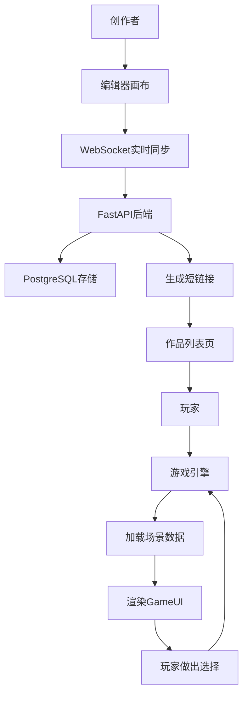

# 文字冒险游戏编辑器与游玩器 - 产品需求文档

## 1. 产品概述

### 1.1 产品定位
一款在线文字冒险游戏创作与游玩平台，解决创作者难以快速搭建分支叙事、管理角色状态和发布作品的痛点。

### 1.2 目标用户
- **创作者**：希望快速构建互动叙事作品的作家、游戏设计师、教育工作者
- **玩家**：喜欢阅读互动故事、体验分支剧情的普通用户

### 1.3 核心价值
- 所见即所得的可视化编辑器，降低创作门槛
- 强大的变量状态系统，支持复杂叙事逻辑
- 一键发布与分享，扩大作品传播范围

---

## 2. 功能模块

### 2.1 编辑器模块

| 功能点 | 描述 | 优先级 |
|--------|------|--------|
| 节点画布 | 使用ReactFlow展示场景节点卡片，支持拖拽排列、滚轮缩放、平移 | P0 |
| 场景节点 | 每个节点包含：标题、描述文本、背景图片URL、背景音乐URL | P0 |
| 分支连线 | 节点间通过贝塞尔曲线连接，带箭头动画，支持触发条件配置 | P0 |
| 触发条件 | 连线可设置条件：某变量值大于n、拥有某物品、布尔值为真 | P0 |
| 节点编辑面板 | 右侧面板展示选中节点详情，支持实时修改并同步到画布 | P0 |
| 网格背景 | 画布网格背景随平移同步移动，网格线为浅灰虚线 | P1 |

### 2.2 玩家状态管理

| 功能点 | 描述 | 优先级 |
|--------|------|--------|
| 变量定义 | 定义游戏变量：数字类型（生命值、金钱、好感度）、布尔类型 | P0 |
| 变量初始值 | 每个变量可设置初始值和变量名 | P0 |
| 变量修改规则 | 每个场景节点可编写修改变量的规则（加减、赋值、取反） | P0 |
| 实时更新面板 | 右侧半透明深色毛玻璃面板显示变量，数值变化带缩放动画 | P0 |

### 2.3 游戏运行时模块

| 功能点 | 描述 | 优先级 |
|--------|------|--------|
| 场景渲染 | 根据当前节点加载描述文本、背景图、背景音乐 | P0 |
| 选择系统 | 展示分支选项，根据条件显示/隐藏可选选项 | P0 |
| 变量更新 | 用户选择后更新变量，影响后续分支逻辑 | P0 |
| 顶部状态栏 | 显示故事标题、章节进度条（渐变填充+尾端小圆点动画） | P0 |
| 变量面板 | 右下角显示变量：数字用彩色进度条、布尔用开关图标 | P0 |
| 场景切换 | 淡入淡出过渡动画，帧率≥30fps | P0 |

### 2.4 发布与分享模块

| 功能点 | 描述 | 优先级 |
|--------|------|--------|
| 一键发布 | 生成唯一短链接（如 https://game.example.com/abc123） | P0 |
| 作品列表页 | 瀑布流卡片布局展示已发布故事 | P0 |
| 卡片信息 | 封面图（首场景背景图）、标题、作者、游玩次数、平均评分 | P0 |
| 游玩计数动画 | 游玩次数数字带跳动更新动画 | P1 |
| 评分动画 | 星形图标实/空心切换带旋转动画 | P1 |
| 搜索功能 | 顶部导航搜索框，输入时显示下拉建议列表 | P0 |

---

## 3. 界面设计规范

### 3.1 颜色系统
| 用途 | 颜色值 |
|------|--------|
| 主背景色 | #1a1a2e |
| 卡片背景色 | #16213e |
| 强调色 | #0f3460 |
| 文字高亮色 | #e94560 |
| 主文字色 | #eaeaea |
| 次要文字色 | #a0a0b0 |

### 3.2 视觉规范
- **圆角**：所有卡片和面板使用 8px 圆角
- **阴影**：`box-shadow: 0 4px 15px rgba(0,0,0,0.3)`
- **过渡动画**：`transition: all 0.3s ease`
- **毛玻璃效果**：`backdrop-filter: blur(10px); background: rgba(22, 33, 62, 0.7)`

### 3.3 响应式布局
- **宽屏（>1200px）**：编辑器和游玩器并排两栏
- **中屏（768px-1200px）**：单栏布局，面板浮动
- **窄屏（<768px）**：单栏布局，组件自适应堆叠

### 3.4 字体选择
- 标题字体：Playfair Display（优雅衬线体，增加叙事感）
- 正文字体：Source Han Sans SC（中文阅读优化）
- 代码/数据字体：JetBrains Mono（清晰等宽）

---

## 4. 性能指标

| 指标 | 要求 |
|------|------|
| 编辑器缩放/平移响应时间 | ≤100ms（50节点以内） |
| 场景切换动画帧率 | ≥30fps |
| 首屏加载时间 | ≤2s |
| API响应时间 | ≤500ms |

---

## 5. 用户故事

### 创作者故事
1. 作为创作者，我希望通过拖拽创建场景节点，快速搭建故事骨架
2. 作为创作者，我希望定义生命值、好感度等变量，并在节点中设置修改规则
3. 作为创作者，我希望在连线上设置触发条件，实现复杂分支逻辑
4. 作为创作者，我希望一键发布作品并获得分享链接

### 玩家故事
1. 作为玩家，我希望在瀑布流列表中发现有趣的故事
2. 作为玩家，我希望看到精美的场景背景和进度条
3. 作为玩家，我希望我的选择能影响变量和后续剧情
4. 作为玩家，我希望能搜索我感兴趣的故事

---

## 6. 架构数据流

