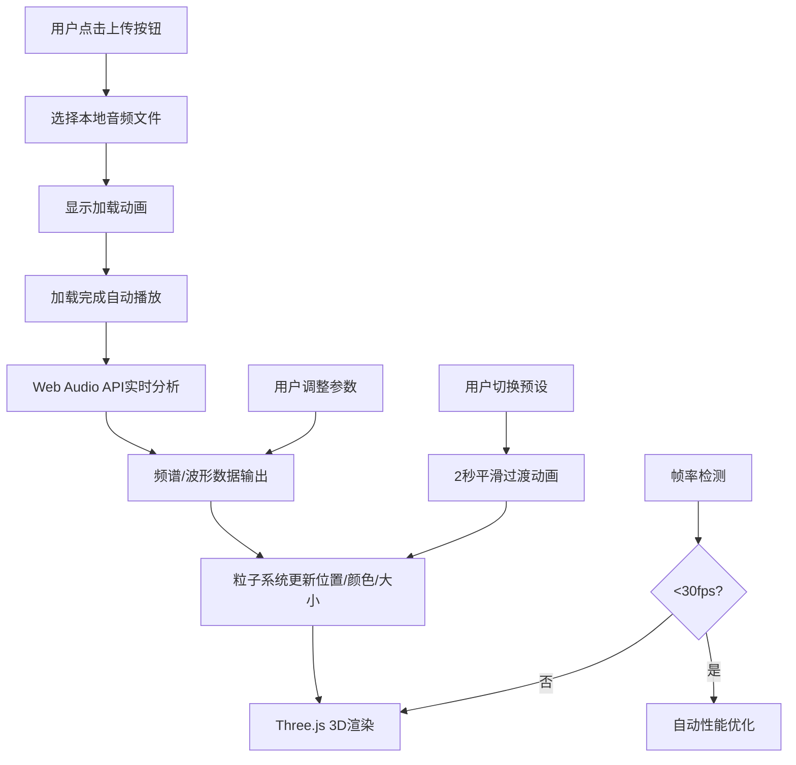

## 1. 产品概述

音乐驱动的3D粒子动画可视化应用，将抽象的音乐作品转化为可视化的动态雕塑，让观众能直观感受音乐的节奏与情感变化。目标用户为数字艺术展览策展人和音乐爱好者，通过实时音频分析和三维粒子系统，创造沉浸式的视听体验。

## 2. 核心功能

### 2.1 用户角色

| 角色 | 注册方式 | 核心权限 |
|------|----------|----------|
| 普通用户 | 无需注册 | 上传音频、调整可视化参数、切换预设效果 |

### 2.2 功能模块

1. **主可视化页面**: 3D粒子渲染画布、音频上传区域、预设切换按钮、控制面板、帧率指示器
2. **音频分析模块**: Web Audio API频谱分析、节奏检测、频率频段映射
3. **粒子系统模块**: 3000-8000个粒子的实时渲染、动态位置/颜色/大小更新
4. **控制面板模块**: 参数滑块控制、可视化模式切换、性能优化开关

### 2.3 页面详情

| 页面名称 | 模块名称 | 功能描述 |
|----------|----------|----------|
| 主可视化页面 | 3D渲染画布 | Three.js粒子系统渲染，支持鼠标旋转、滚轮缩放 |
| 主可视化页面 | 音频上传区域 | 支持mp3/wav/ogg格式上传，加载时显示旋转动画，加载完成后切换为播放/暂停按钮 |
| 主可视化页面 | 预设切换按钮 | 3种预设效果（星云流动、脉冲膨胀、螺旋旋转），2秒平滑过渡 |
| 主可视化页面 | 控制面板 | 4个参数滑块（粒子数量、运动速度、颜色敏感度、粒子透明度），实时数值显示 |
| 主可视化页面 | 帧率指示器 | 右上角圆形指示器，颜色随帧率变化，点击可手动切换性能模式 |

## 3. 核心流程

用户点击上传按钮选择音频文件 → 系统加载音频并显示旋转动画 → 加载完成后自动播放并开始实时音频分析 → 音频频谱数据驱动粒子系统动态变化 → 用户可切换预设效果、调整参数滑块、切换可视化模式 → 系统自动检测帧率，低于30fps时自动进入性能优化模式

## 4. 用户界面设计

### 4.1 设计风格

- **主色调**: 深色太空主题，背景色#0a0a1a
- **粒子颜色**: 动态映射，低频红橙色系、中频黄绿色系、高频蓝紫色系
- **UI控件**: 半透明毛玻璃效果（backdrop-filter: blur(10px)），圆角矩形设计
- **按钮样式**: 圆角8px，悬停时透明度从0.2变为0.4，点击时缩放0.95再弹回1.0
- **字体**: 现代无衬线字体，白色/浅灰色文字
- **图标风格**: 简洁线性图标，播放/暂停图标平滑过渡动画

### 4.2 页面设计概述

| 页面名称 | 模块名称 | UI元素 |
|----------|----------|----------|
| 主可视化页面 | 3D渲染画布 | 全屏Three.js场景，PerspectiveCamera初始位置(0,0,15)，支持鼠标旋转、滚轮缩放（范围5-30），阻尼效果 |
| 主可视化页面 | 左上角区域 | 当前播放音频文件名（12px白色字体），右侧脉冲圆点动画 |
| 主可视化页面 | 右上角区域 | 帧率指示器（圆形，绿色>50fps，黄色30-50fps，红色<30fps），实时帧率数字（滑动切换动画） |
| 主可视化页面 | 页面中央 | 音频上传按钮/播放暂停按钮（蓝色渐变圆环加载动画） |
| 主可视化页面 | 预设切换区域 | 3个预设按钮横向排列，选中状态高亮 |
| 主可视化页面 | 右下角控制面板 | 半透明毛玻璃深色背景，4个渐变色轨道滑块，数值显示缩放弹出动画 |

### 4.3 响应式设计

桌面端优先设计，移动端适配：控制面板在移动端改为底部抽屉式，滑块控件优化触摸交互。

### 4.4 3D场景指引

- **环境**: 深色太空背景，无HDRI，纯深色渐变营造宇宙感
- **光照**: 环境光+点光源，粒子自发光（emissive）效果
- **相机设置**: PerspectiveCamera，fov=75，near=0.1，far=1000，初始位置(0,0,15)
- **相机动画**: 鼠标左键拖拽绕Y轴旋转，滚轮缩放（范围5-30），阻尼效果0.05，松开后惯性滑动0.5秒
- **构图**: 粒子群位于场景中心，占屏幕中央60%区域
- **交互**: 粒子响应音频频谱变化，形成呼吸/流动/旋转效果
- **后处理**: Bloom泛光效果增强粒子发光感，可选抗锯齿
- **性能预算**: 5000粒子时60fps稳定，8000粒子时不低于40fps
