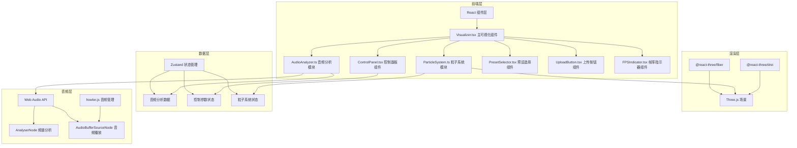

## 1. 架构设计



## 2. 技术栈描述

- **前端框架**: React@18 + TypeScript@5
- **构建工具**: Vite@5
- **3D渲染**: Three@0.160 + @react-three/fiber@8 + @react-three/drei@9
- **状态管理**: Zustand@4
- **音频处理**: howler@2 + Web Audio API
- **工具库**: uuid@9
- **样式方案**: 原生CSS + CSS变量

## 3. 目录结构

```
src/
├── types.ts              # 类型定义
├── styles.css            # 全局样式
├── main.tsx              # 应用入口
├── App.tsx               # 根组件
├── ParticleSystem.ts     # 粒子系统核心模块
├── AudioAnalyzer.ts      # 音频分析模块
├── store/
│   └── useStore.ts       # Zustand状态管理
├── components/
│   ├── Visualizer.tsx    # 主可视化组件
│   ├── ControlPanel.tsx  # 控制面板组件
│   ├── PresetSelector.tsx # 预设选择器
│   ├── UploadButton.tsx  # 上传按钮组件
│   ├── FPSIndicator.tsx  # 帧率指示器
│   └── Visualizer3D.tsx  # 3D场景组件
└── utils/
    ├── audio.ts          # 音频工具函数
    ├── colors.ts         # 颜色映射工具
    └── animation.ts      # 动画缓动函数
```

## 4. 核心数据流向

### 4.1 音频分析数据流

```
AudioAnalyzer.ts
    ↓ (getFrequencyData / getWaveformData)
频率数组 / 波形数组 / 节奏检测结果
    ↓ (Zustand store)
useAudioStore
    ↓
ParticleSystem.update()
    ↓
粒子位置 / 颜色 / 大小更新
    ↓
Three.js Points 几何体更新
    ↓
@react-three/fiber 渲染
```

### 4.2 用户交互数据流

```
用户操作（滑块拖拽、预设切换、模式切换）
    ↓
ControlPanel / PresetSelector 事件处理
    ↓
useControlStore 更新参数
    ↓
ParticleSystem 接收新参数
    ↓
应用缓动函数平滑过渡
    ↓
渲染更新
```

## 5. 核心模块接口定义

### 5.1 音频分析模块接口

```typescript
interface IAudioAnalyzer {
  loadAudio(file: File): Promise<void>
  play(): void
  pause(): void
  togglePlay(): void
  getFrequencyData(): Uint8Array
  getWaveformData(): Uint8Array
  getLowFrequency(): number
  getMidFrequency(): number
  getHighFrequency(): number
  isPlaying: boolean
  currentFileName: string
  onBeatDetect: (callback: () => void) => void
}
```

### 5.2 粒子系统模块接口

```typescript
interface IParticleSystem {
  init(count: number): void
  update(
    frequencyData: Uint8Array,
    waveformData: Uint8Array,
    audioData: AudioAnalysisResult,
    deltaTime: number
  ): void
  setPreset(preset: VisualizerPreset): void
  setParticleCount(count: number): void
  setSpeed(speed: number): void
  setColorSensitivity(sensitivity: number): void
  setOpacity(opacity: number): void
  setVisualizationMode(mode: VisualizationMode): void
  getPoints(): THREE.Points
}
```

### 5.3 状态管理Store定义

```typescript
interface AudioState {
  frequencyData: Uint8Array
  waveformData: Uint8Array
  lowFreq: number
  midFreq: number
  highFreq: number
  isPlaying: boolean
  currentFileName: string
  isLoading: boolean
}

interface ControlState {
  particleCount: number
  speed: number
  colorSensitivity: number
  opacity: number
  currentPreset: VisualizerPreset
  visualizationMode: VisualizationMode
  performanceMode: boolean
}

interface FPSState {
  fps: number
  isLowFPS: boolean
}
```

## 6. 性能优化策略

### 6.1 渲染优化

- 使用 BufferGeometry 存储粒子数据，避免每帧重建几何体
- 粒子大小/颜色通过 shader 动态计算，减少CPU开销
- 帧率检测使用 requestAnimationFrame 时间戳计算
- 低帧率时自动减少粒子数量到2000，关闭antialias和阴影

### 6.2 内存管理

- 音频播放结束后及时释放 AudioBuffer
- 粒子数调整时重用已分配的缓冲区
- 使用对象池管理临时计算对象

### 6.3 动画优化

- 预设切换使用 requestAnimationFrame 驱动的缓动插值
- 参数变化使用 lerp 线性插值实现平滑过渡
- 所有UI动画使用 CSS transform 和 opacity，避免重排重绘
