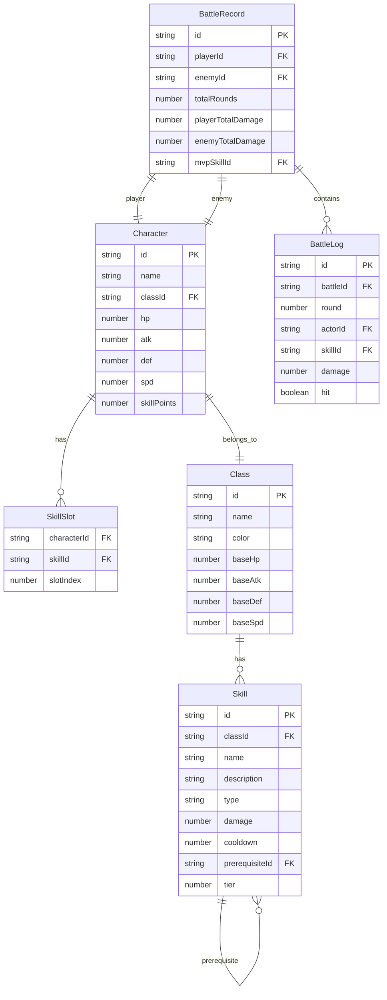

## 1. 架构设计

```mermaid
flowchart TB
    "前端 React+TypeScript" --> "Zustand 状态管理"
    "Zustand 状态管理" --> "角色数据 Store"
    "Zustand 状态管理" --> "技能树 Store"
    "Zustand 状态管理" --> "战斗记录 Store"
    "前端 React+TypeScript" --> "Framer Motion 动画引擎"
    "前端 React+TypeScript" --> "组件层"
    "组件层" --> "CharacterCreator"
    "组件层" --> "SkillTree"
    "组件层" --> "BattleSimulator"
    "组件层" --> "BattleReport"
```

纯前端应用，无后端服务。所有数据存储在 Zustand 状态管理中，战斗逻辑由前端计算引擎完成。

## 2. 技术说明

- 前端：React 18 + TypeScript + Vite
- 样式：Tailwind CSS 3 + CSS Modules（动画关键帧）
- 状态管理：Zustand
- 动画引擎：Framer Motion
- 唯一ID生成：uuid
- 初始化工具：vite-init（react-ts 模板）
- 后端：无
- 数据库：无（前端内存状态）

## 3. 路由定义

| 路由 | 用途 |
|------|------|
| / | 角色创建页，选择职业并查看初始属性 |
| /skill-tree | 技能树编辑器，分配技能点解锁技能 |
| /battle | 战斗模拟器，回合制自动对战 |
| /report | 战斗报告页，统计与图表展示 |

## 4. 数据模型

### 4.1 数据模型定义



### 4.2 数据定义语言

```typescript
interface Character {
  id: string;
  name: string;
  classId: 'warrior' | 'mage' | 'assassin';
  hp: number;
  maxHp: number;
  atk: number;
  def: number;
  spd: number;
  skillPoints: number;
  unlockedSkillIds: string[];
  equippedSkillIds: string[];
}

interface Skill {
  id: string;
  classId: 'warrior' | 'mage' | 'assassin';
  name: string;
  description: string;
  type: 'damage' | 'heal' | 'buff' | 'debuff';
  damage: number;
  cooldown: number;
  prerequisiteId: string | null;
  tier: number;
  position: { x: number; y: number };
}

interface BattleRecord {
  id: string;
  player: Character;
  enemy: Character;
  logs: BattleLog[];
  totalRounds: number;
  playerTotalDamage: number;
  enemyTotalDamage: number;
  mvpSkillId: string;
  playerSkillUsage: Record<string, number>;
  enemySkillUsage: Record<string, number>;
}

interface BattleLog {
  round: number;
  actorId: string;
  actorName: string;
  skillId: string;
  skillName: string;
  damage: number;
  hit: boolean;
  timestamp: number;
}

interface GameState {
  phase: 'creation' | 'skill-tree' | 'battle' | 'report';
  character: Character | null;
  enemy: Character | null;
  battleRecord: BattleRecord | null;
  setPhase: (phase: GameState['phase']) => void;
  createCharacter: (classId: Character['classId']) => void;
  unlockSkill: (skillId: string) => void;
  equipSkill: (skillId: string, slotIndex: number) => void;
  resetSkills: () => void;
  startBattle: () => void;
  generateEnemy: () => Character;
}
```

## 5. 职业与技能预设数据

### 战士（Warrior）
- 初始属性：HP 120, ATK 18, DEF 15, SPD 8
- 色系：红褐色 #c0392b / #a0522d
- 基础技能：猛击（单体伤害）、盾击（伤害+减攻）、战吼（增攻增益）
- 进阶技能树（3层）：劈砍→旋风斩→天崩地裂、铁壁→不屈→战神之躯

### 法师（Mage）
- 初始属性：HP 80, ATK 25, DEF 6, SPD 12
- 色系：蓝紫色 #8e44ad / #6c3483
- 基础技能：火球术（单体伤害）、冰霜新星（群体减速）、魔力护盾（减伤）
- 进阶技能树（3层）：雷电→连锁闪电→雷霆风暴、治愈→群体治愈→神圣之光

### 刺客（Assassin）
- 初始属性：HP 90, ATK 22, DEF 8, SPD 18
- 色系：墨绿色 #1a6b3c / #0d4f2b
- 基础技能：匕首连击（双段伤害）、隐身（闪避提升）、毒刃（持续伤害）
- 进阶技能树（3层）：背刺→暗影突袭→死亡标记、疾步→幻影→无影无踪

## 6. 战斗引擎设计

- 回合制：每回合速度高者先手
- 伤害公式：damage = max(1, skill.damage + atk * 0.5 - def * 0.3) * (0.85~1.15随机浮动)
- 命中判定：基础命中率90%，速度差每10点±5%
- AI策略：随机选择已装备技能，优先高伤害技能（权重60%）
- 回合间延迟：500ms
- 结束条件：一方HP降至0
