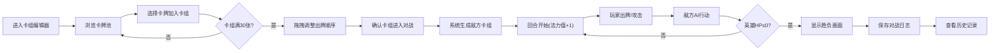

## 1. 产品概述

卡牌策略对战模拟器，为卡牌游戏玩家提供自定义卡组构建、实时对战模拟和对战数据分析的一站式工具。解决玩家难以直观测试卡组平衡性、缺少实战模拟环境的痛点。

- 核心用户：卡牌游戏爱好者、卡组设计师、竞技玩家
- 产品价值：零成本快速迭代卡组策略，可视化对战流程，数据驱动优化卡组搭配

## 2. 核心功能

### 2.1 功能模块

1. **卡组编辑器**：卡牌池浏览、卡组构建、拖拽排序、卡牌详情查看
2. **对战模拟器**：回合制对战、法力值系统、战斗动画、胜负判定
3. **对战记录**：历史记录时间线、详细日志回放、胜率统计

### 2.2 页面详情

| 页面名称 | 模块名称 | 功能描述 |
|-----------|-------------|---------------------|
| 卡组编辑器 | 卡牌池网格 | 纵向滚动网格（每行4张）展示全部卡牌，按费用段渐变配色 |
| 卡组编辑器 | 悬停预览 | 卡牌缩略图悬停上浮，磨砂玻璃背景显示全尺寸卡面 |
| 卡组编辑器 | 详情弹窗 | 点击卡牌弹出完整属性详情，响应时间<200ms |
| 卡组编辑器 | 已选卡牌栏 | 底部固定栏展示已选卡牌（≤30张），支持拖拽调整出牌顺序 |
| 对战模拟器 | 对战棋盘 | 中心对称布局，下方己方暖色光晕，上方敌方冷色光晕 |
| 对战模拟器 | 手牌区 | 显示可打出的卡牌，费用≤当前法力值的卡牌高亮 |
| 对战模拟器 | 战场区 | 双方随从展示，每回合只能攻击一次，攻击时碰撞动画+数字跳动 |
| 对战模拟器 | 状态栏 | 双方英雄生命值、法力值显示，数字变动脉冲缩放动画 |
| 对战模拟器 | 胜负画面 | 胜利金色粒子烟花，失败暗色调破碎玻璃效果 |
| 对战记录 | 时间线列表 | 历史对战按时间倒序排列，显示卡组名、胜负标签、回合数、时长 |
| 对战记录 | 日志详情 | 点击展开回合日志，淡入动画，按回合折叠分组 |

## 3. 核心流程

用户从卡组编辑器开始，选择30张卡牌组成自定义卡组并调整出牌顺序；随后进入对战页面，系统随机生成敌方卡组展开回合制对战；对战结束后自动保存记录，可在日志页面查看详细复盘和统计数据。

## 4. 用户界面设计

### 4.1 设计风格

- **主色调**：深蓝色 `#0f1923` 营造神秘厚重的竞技氛围
- **强调色**：金色 `#d4af37` 用于法力值、获胜文字等关键信息高亮
- **卡牌配色**：
  - 1-3费：青铜色渐变（`#cd7f32` → `#8b4513`）
  - 4-6费：银色渐变（`#c0c0c0` → `#808080`）
  - 7-10费：金色渐变（`#ffd700` → `#b8860b`）
- **按钮样式**：圆角8px，金色边框描边，悬停时金色光晕扩散
- **字体**：标题使用 Cinzel 装饰性衬线字体（古典卡牌感），正文使用 Noto Sans SC 清晰易读
- **布局**：对战棋盘中心对称，己方底部暖色（橙红）光晕，敌方顶部冷色（青蓝）光晕

### 4.2 页面设计概览

| 页面名称 | 模块名称 | UI元素 |
|-----------|-------------|-------------|
| 卡组编辑器 | 卡牌池网格 | 4列网格、青铜/银/金渐变背景、悬停上浮20px |
| 卡组编辑器 | 卡牌缩略图 | 120×160px、费用圆角色块、攻击/生命数值、磨砂玻璃预览层 |
| 卡组编辑器 | 底部已选栏 | 固定定位、横向滚动、拖拽占位符阴影 |
| 对战模拟器 | 棋盘布局 | 上下对称、己方橙红光晕/敌方青蓝光晕、中线金色分隔 |
| 对战模拟器 | 战斗卡牌 | 入场缩放0.8→1、位移-30→0、攻击时X轴平移碰撞 |
| 对战模拟器 | 状态栏 | 生命值脉冲缩放scale(1→1.3→1)、法力水晶金色发光 |
| 对战模拟器 | 胜负特效 | 胜利：金色粒子放射+烟花；失败：裂纹扩散+暗化滤镜 |
| 对战记录 | 时间线 | 左侧金色时间轴圆点、胜负标签圆角色块、卡片悬停金色边框 |
| 对战记录 | 日志详情 | 回合标题蓝色背景、条目淡入动画opacity(0→1) translateY(10→0) |

### 4.3 响应式

- **桌面端优先**设计（≥1024px）：卡牌每行4张，棋盘水平布局
- **平板端（768-1023px）**：卡牌每行3张，棋盘保持水平
- **移动端（<768px）**：卡牌每行2张，棋盘竖直排列（敌方在上己方在下），底部已选栏改为纵向堆叠，触摸目标≥44×44px
- 所有动画使用 GPU 加速属性（transform、opacity），保证拖拽和动画稳定 60FPS

