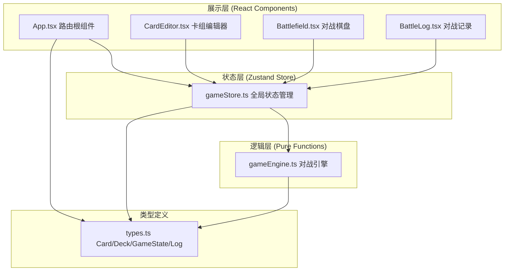
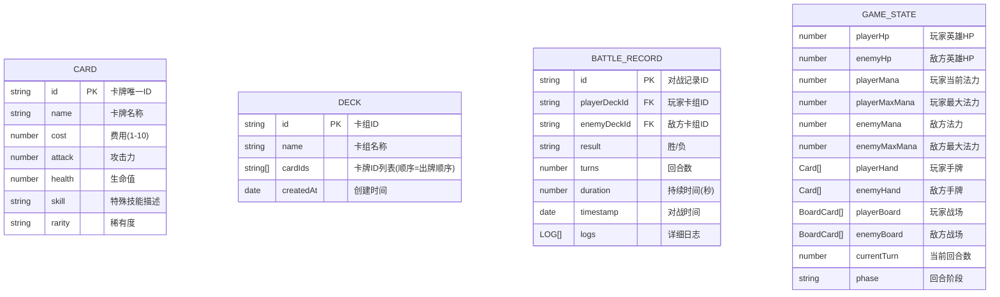

## 1. 架构设计

## 2. 技术说明

- **前端框架**：React 18 + TypeScript 5（严格模式）
- **构建工具**：Vite 5
- **状态管理**：Zustand 4（轻量、不可变更新、支持选择器优化渲染）
- **路由**：React Router DOM 6
- **拖拽交互**：react-beautiful-dnd 13（虚拟列表、无障碍支持）
- **动画库**：Framer Motion 11（声明式动画、布局动画、手势支持）
- **唯一ID**：uuid 9
- **HTTP客户端**：axios 1（预留后端接口扩展）
- **样式方案**：原生 CSS + CSS 变量（零运行时开销，动画性能最优）
- **后端服务**：无（纯前端应用，数据使用 localStorage 持久化）
- **数据库**：localStorage（模拟持久化存储卡组和对战记录）

## 3. 路由定义

| 路由路径 | 组件 | 功能用途 |
|-------|---------|-------|
| `/` | CardEditor | 默认首页，卡组编辑器页面 |
| `/editor` | CardEditor | 卡组编辑器（别名路由） |
| `/battle` | Battlefield | 对战模拟器页面 |
| `/logs` | BattleLog | 对战记录与统计页面 |
| `*` | CardEditor | 404 重定向到编辑器 |

## 4. 数据模型

### 4.1 实体关系图

### 4.2 TypeScript 核心类型

**Card（卡牌）**：`id` 唯一标识、`name` 名称、`cost` 费用(1-10)、`attack` 攻击力、`health` 生命值、`skill` 技能描述、`rarity` 稀有度（common/rare/epic/legendary）

**BoardCard（战场随从）**：继承 Card 并扩展 `instanceId` 实例ID、`currentHealth` 当前生命值、`canAttack` 是否可攻击、`hasAttacked` 本回合是否已攻击

**Deck（卡组）**：`id`、`name`、`cards` 卡牌数组（≤30张）、`createdAt`

**GameState（对战状态）**：双方英雄HP、当前/最大法力值、手牌/战场卡牌数组、当前回合数、对战阶段（playerTurn/enemyTurn/ended）、胜负结果

**TurnLog（回合日志）**：`turnNumber` 回合数、`actions` 动作数组（出牌/攻击/伤害）、`playerHpAfter`、`enemyHpAfter`

**BattleRecord（对战记录）**：`id`、`playerDeckName`、`enemyDeckName`、`result`(win/lose)、`turns`、`duration`(ms)、`timestamp`、`logs` TurnLog[]

## 5. 核心技术决策

1. **动画性能**：Framer Motion 使用 transform/opacity 硬件加速属性，拖拽启用 `useDrag` 并关闭 layout 重算以保证 60FPS
2. **状态优化**：Zustand 使用 shallow 选择器订阅精确状态片段，避免无意义重渲染；对战状态变更通过 Immer middleware 简化不可变更新
3. **响应式断点**：768px 为界，CSS Grid `auto-fill` + `minmax` 实现自适应卡牌网格
4. **数据持久化**：卡组和对战记录通过 Zustand persist middleware 写入 localStorage，键名前缀 `cardbattle_`
5. **对战引擎纯函数化**：`gameEngine.ts` 所有函数无副作用，输入当前状态+动作返回新状态，便于测试和时间旅行调试

