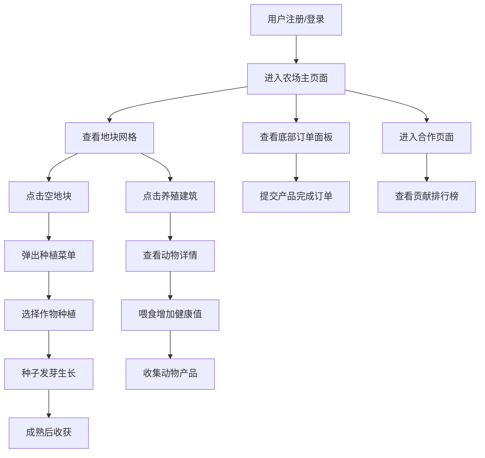

## 1. 产品概述

在线虚拟农场合作经营游戏，让多个玩家共同经营一个农场，种植作物、养殖动物、互相交易资源，并共同完成订单任务。目标是打造一个有趣的社交协作游戏体验，让玩家在休闲中享受农场经营的乐趣。

## 2. 核心功能

### 2.1 用户角色

| 角色 | 注册方式 | 核心权限 |
|------|----------|----------|
| 普通玩家 | 用户名注册 | 经营农场、种植作物、养殖动物、完成订单、查看排行榜 |

### 2.2 功能模块

1. **农场主页面**：深绿色导航栏、俯视网格化农场地图、种植菜单、生长动画、订单面板
2. **动物养殖区**：鸡舍/牛棚/羊圈建筑、动物健康状态、产品产出倒计时、喂食交互
3. **合作任务页面**：团队订单列表、进度条动画、贡献排行榜、积分变化动画

### 2.3 页面详情

| 页面名称 | 模块名称 | 功能描述 |
|-----------|-------------|---------------------|
| 农场主页面 | 导航栏 | 展示Logo和用户名，深绿色背景配浅黄色文字 |
| 农场主页面 | 地块网格 | 俯视视角，棕色泥土背景，点击空地块弹出种植菜单 |
| 农场主页面 | 种植菜单 | 展示作物名称、生长时间、收益、种子价格 |
| 农场主页面 | 生长系统 | 种子→幼苗→成长→成熟四个阶段，成熟时呼吸闪烁动画 |
| 农场主页面 | 养殖建筑 | 鸡舍/牛棚/羊圈，虚线边界，点击进入详情 |
| 农场主页面 | 养殖详情 | 动物数量、健康状况渐变条、产出倒计时、喂食按钮 |
| 农场主页面 | 订单面板 | 底部固定，显示团队订单进度，完成后金色对勾 |
| 合作任务页面 | 订单列表 | 团队订单展示，进度条渐变填充动画 |
| 合作任务页面 | 贡献排行榜 | 表格展示用户名、贡献次数、积分，积分变化飘出动画 |

## 3. 核心流程

## 4. 用户界面设计

### 4.1 设计风格

- **主色调**：暖米色 #f2e6d0
- **辅助色**：深绿色 #4a7c59，浅蓝灰 #e8f0fe，深蓝色 #1a3c64
- **导航栏**：深绿色背景，浅黄色Logo和文字
- **地块背景**：棕色泥土纹理
- **按钮样式**：圆角矩形，绿色系渐变，hover时有上浮效果
- **字体**：标题使用圆润有特色的字体，正文使用清晰易读的字体
- **布局风格**：卡片式设计，顶部导航+中部游戏区+底部订单面板
- **图标风格**：使用emoji风格的农场相关图标（🌱🌾🐔🐮🐑）

### 4.2 页面设计概述

| 页面名称 | 模块名称 | UI元素 |
|-----------|-------------|-------------|
| 农场主页面 | 导航栏 | 深绿色背景，浅黄色Logo，右侧用户名，圆角设计 |
| 农场主页面 | 地块网格 | 8x8网格，棕色泥土背景，灰色分割线，hover高亮 |
| 农场主页面 | 种植菜单 | 弹出卡片，作物图标+名称+生长时间+收益+价格 |
| 农场主页面 | 生长动画 | 种子小圆点→幼苗→成长→成熟果实，呼吸闪烁 |
| 农场主页面 | 养殖建筑 | 建筑图标，1px浅灰色虚线边界 |
| 农场主页面 | 养殖详情 | 模态框，健康条绿黄红渐变，倒计时缩放动画 |
| 农场主页面 | 喂食效果 | 绿色粒子飘散，健康条增长动画 |
| 农场主页面 | 订单面板 | 底部固定，卡片式订单，进度条绿色渐变 |
| 合作任务页面 | 订单列表 | 浅蓝灰背景，深蓝色标题，完成订单灰色+金色对勾 |
| 合作任务页面 | 排行榜 | 表格形式，行间隔底色，积分变化+1飘出动画 |

### 4.3 响应性

- Desktop-first设计，适配主要分辨率
- 地块网格自适应容器宽度
- 移动端优化触摸交互区域

## 5. 动画效果

- 页面加载：元素渐入，地块依次出现
- 种植：种子图标弹入，地块微微下陷后恢复
- 生长：阶段切换时平滑过渡
- 成熟：果实图标呼吸闪烁（轻微放大缩小+透明度变化）
- 喂食：绿色粒子从饲料槽向四周飘散
- 进度条：绿色渐变填充，从左到右平滑动画
- 积分变化：+1数字从对应行向上飘出，逐渐消失
- 订单完成：金色对勾缩放出现，卡片灰度化
