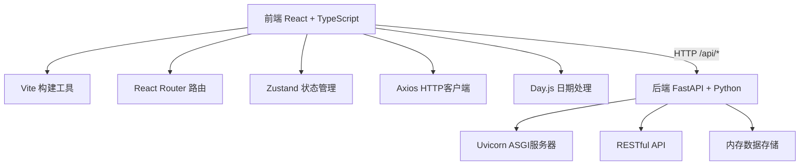
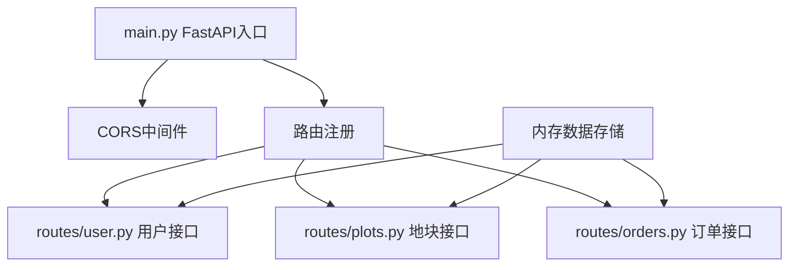
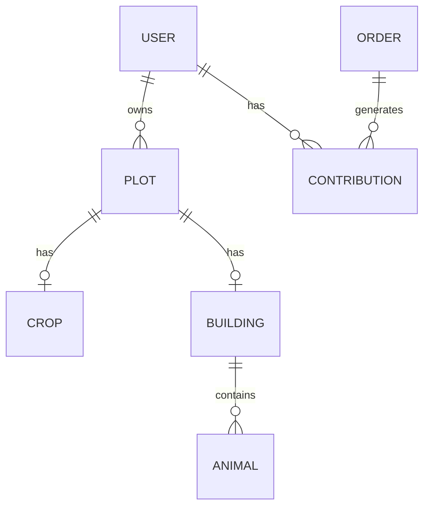

## 1. 架构设计



## 2. 技术描述

- **前端**：React@18 + TypeScript + Vite
- **路由**：react-router-dom@6
- **状态管理**：zustand
- **HTTP客户端**：axios
- **日期处理**：dayjs
- **唯一ID**：uuid
- **构建工具**：Vite@5
- **后端**：FastAPI@0.100 + Python@3.11
- **ASGI服务器**：uvicorn
- **数据存储**：内存字典（演示用）

## 3. 路由定义

| 前端路由 | 页面 | 说明 |
|-----------|------|------|
| / | 农场主页面 | 网格化农场地图、种植/养殖交互、订单面板 |
| /coop | 合作任务页面 | 团队订单、贡献排行榜 |

| 后端API路由 | 方法 | 说明 |
|-----------|------|------|
| /api/user/register | POST | 用户注册 |
| /api/user/login | POST | 用户登录 |
| /api/plots | GET | 获取所有地块 |
| /api/plots/:id/plant | POST | 种植作物 |
| /api/plots/:id/harvest | POST | 收获作物 |
| /api/plots/build | POST | 建造养殖建筑 |
| /api/animals/feed | POST | 喂食动物 |
| /api/animals/collect | POST | 收集产品 |
| /api/orders | GET | 获取团队订单 |
| /api/orders/:id/submit | POST | 提交订单产品 |
| /api/coop/contributions | GET | 获取贡献排行榜 |

## 4. API 类型定义

```typescript
// 用户
interface User {
  id: string;
  username: string;
  coins: number;
}

// 作物类型
interface CropType {
  id: string;
  name: string;
  growTime: number; // 秒
  seedPrice: number;
  harvestReward: number;
  icon: string;
}

// 地块状态
type PlotStatus = 'empty' | 'seed' | 'sprout' | 'growing' | 'mature' | 'building';

interface Plot {
  id: string;
  x: number;
  y: number;
  status: PlotStatus;
  cropId?: string;
  plantedAt?: number;
  buildingId?: string;
}

// 建筑类型
interface BuildingType {
  id: string;
  name: string;
  size: { width: number; height: number };
  cost: number;
  animalType: string;
  icon: string;
}

// 动物
interface Animal {
  id: string;
  type: string;
  health: number; // 0-100
  lastFed: number;
  productReadyAt: number;
  buildingId: string;
}

// 订单
interface Order {
  id: string;
  name: string;
  icon: string;
  targetItem: string;
  targetAmount: number;
  currentAmount: number;
  reward: number;
  completed: boolean;
}

// 贡献记录
interface Contribution {
  id: string;
  username: string;
  count: number;
  points: number;
}
```

## 5. 后端架构



## 6. 数据模型

### 6.1 ER图



### 6.2 数据结构

后端使用内存字典存储，键为ID，值为数据对象：

```python
# users: {user_id: User}
# plots: {plot_id: Plot}
# buildings: {building_id: Building}
# animals: {animal_id: Animal}
# orders: {order_id: Order}
# contributions: {contribution_id: Contribution}
```

## 7. 项目文件结构

```
auto45/
├── package.json
├── vite.config.js
├── tsconfig.json
├── index.html
├── src/
│   ├── main.tsx
│   ├── pages/
│   │   ├── Farm.tsx
│   │   └── Coop.tsx
│   ├── components/
│   │   └── Plot.tsx
│   ├── stores/
│   │   └── useGameStore.ts
│   └── api/
│       └── gameApi.ts
└── backend/
    ├── main.py
    └── routes/
        ├── plots.py
        ├── orders.py
        └── user.py
```
