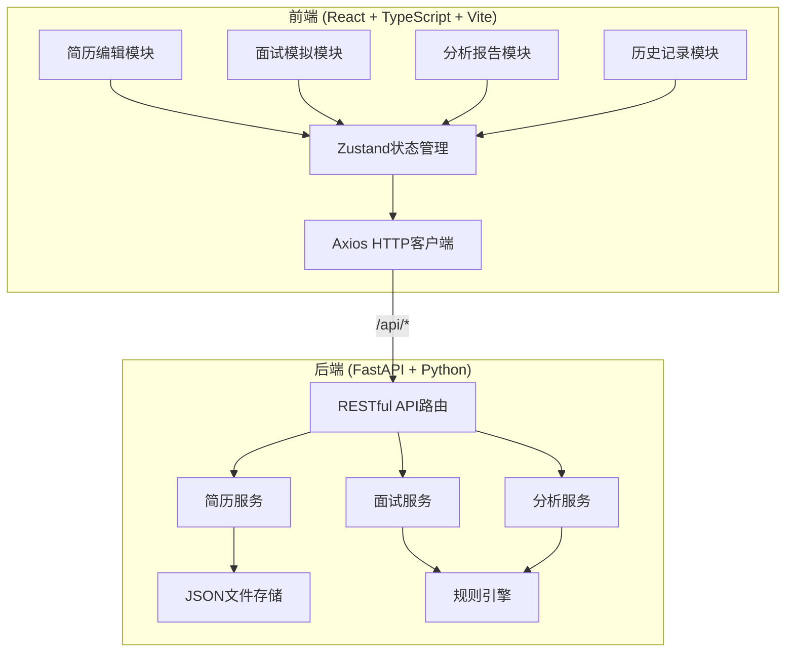
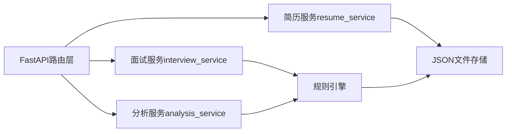
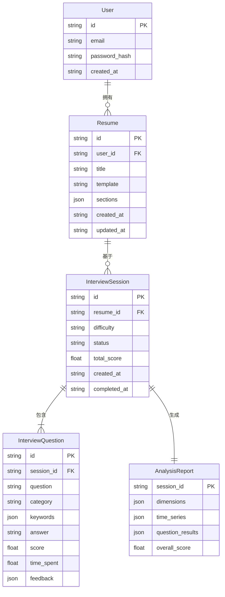

## 1. 架构设计



## 2. 技术说明

- **前端**：React@18 + TypeScript + Vite + TailwindCSS@3
- **初始化工具**：vite-init（react-ts模板）
- **状态管理**：Zustand
- **表单管理**：react-hook-form
- **拖拽**：@dnd-kit/core + @dnd-kit/sortable
- **图表**：recharts
- **HTTP客户端**：axios
- **路由**：react-router-dom
- **日期处理**：dayjs
- **ID生成**：uuid
- **后端**：FastAPI（Python）
- **数据库**：本地JSON文件存储

## 3. 路由定义

| 路由 | 用途 |
|------|------|
| /login | 用户登录/注册页面 |
| /resumes | 简历管理页面（模板选择+编辑+预览） |
| /resumes/:id | 编辑指定简历 |
| /interview | 面试模拟启动页（选择简历+难度） |
| /interview/:id | 面试进行中页面 |
| /analysis/:id | 面试分析报告页面 |
| /history | 历史面试记录列表 |

## 4. API定义

### 4.1 简历API

```typescript
interface Resume {
  id: string;
  title: string;
  template: 'business' | 'tech' | 'creative';
  sections: ResumeSection[];
  createdAt: string;
  updatedAt: string;
}

interface ResumeSection {
  id: string;
  type: 'personal' | 'work' | 'education' | 'skills' | 'projects';
  order: number;
  collapsed: boolean;
  data: PersonalInfo | WorkExperience[] | Education[] | Skill[] | Project[];
}

interface PersonalInfo {
  name: string;
  email: string;
  phone: string;
  title: string;
  summary: string;
}

interface WorkExperience {
  company: string;
  position: string;
  startDate: string;
  endDate: string;
  description: string;
}

interface Education {
  school: string;
  degree: string;
  major: string;
  startDate: string;
  endDate: string;
}

interface Skill {
  name: string;
  level: number;
}

interface Project {
  name: string;
  role: string;
  description: string;
  technologies: string[];
}
```

| 方法 | 路径 | 描述 | 请求体 | 响应 |
|------|------|------|--------|------|
| GET | /api/resumes | 获取简历列表 | - | Resume[] |
| GET | /api/resumes/:id | 获取单个简历 | - | Resume |
| POST | /api/resumes | 创建简历 | Resume | Resume |
| PUT | /api/resumes/:id | 更新简历 | Resume | Resume |
| DELETE | /api/resumes/:id | 删除简历 | - | {success: boolean} |

### 4.2 面试API

```typescript
interface InterviewSession {
  id: string;
  resumeId: string;
  difficulty: 'beginner' | 'intermediate' | 'advanced';
  questions: InterviewQuestion[];
  status: 'in_progress' | 'completed';
  totalScore: number;
  createdAt: string;
  completedAt?: string;
}

interface InterviewQuestion {
  id: string;
  question: string;
  category: string;
  keywords: string[];
  answer?: string;
  score?: number;
  timeSpent?: number;
  feedback?: QuestionFeedback;
}

interface QuestionFeedback {
  rating: number;
  keywordMatch: number;
  suggestions: string[];
}

interface GenerateQuestionsRequest {
  resumeId: string;
  difficulty: 'beginner' | 'intermediate' | 'advanced';
}

interface SubmitAnswerRequest {
  sessionId: string;
  questionId: string;
  answer: string;
  timeSpent: number;
}
```

| 方法 | 路径 | 描述 | 请求体 | 响应 |
|------|------|------|--------|------|
| POST | /api/interview/generate | 生成面试题 | GenerateQuestionsRequest | InterviewSession |
| POST | /api/interview/answer | 提交答案 | SubmitAnswerRequest | QuestionFeedback |
| GET | /api/interview/:id | 获取面试会话 | - | InterviewSession |
| GET | /api/interview/history | 获取历史记录 | - | InterviewSession[] |

### 4.3 分析API

```typescript
interface AnalysisReport {
  sessionId: string;
  dimensions: DimensionScore[];
  timeSeries: TimeDataPoint[];
  questionResults: QuestionResult[];
  overallScore: number;
}

interface DimensionScore {
  name: string;
  score: number;
}

interface TimeDataPoint {
  questionIndex: number;
  timeSpent: number;
}

interface QuestionResult {
  question: string;
  score: number;
  timeSpent: number;
  feedback: string[];
}
```

| 方法 | 路径 | 描述 | 请求体 | 响应 |
|------|------|------|--------|------|
| GET | /api/analysis/:sessionId | 获取面试分析报告 | - | AnalysisReport |

## 5. 服务端架构图



## 6. 数据模型

### 6.1 数据模型定义



### 6.2 数据存储

后端使用本地JSON文件存储，文件结构如下：
- `backend/data/users.json` — 用户数据
- `backend/data/resumes.json` — 简历数据
- `backend/data/interviews.json` — 面试会话数据
