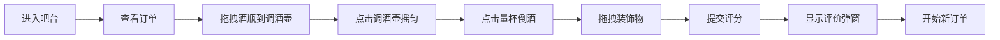

## 1. 产品概述

虚拟调酒师技能练习平台，让用户扮演调酒师在虚拟吧台根据订单调制鸡尾酒，通过精确还原配方获得评分。

- 核心功能：3D俯视吧台界面、拖拽式调酒操作、实时配方匹配、完成度评分系统
- 目标用户：调酒爱好者、酒吧从业者、游戏玩家
- 产品价值：提供沉浸式调酒练习体验，零成本学习鸡尾酒配方

## 2. 核心功能

### 2.1 用户角色
| 角色 | 注册方式 | 核心权限 |
|------|----------|----------|
| 普通用户 | 无需注册 | 进行调酒练习、查看评分、切换配方 |

### 2.2 功能模块
1. **吧台主界面**：3D俯视视角、酒瓶陈列架、操作区、订单面板
2. **调酒交互系统**：拖拽酒瓶、摇匀调酒壶、倒酒、添加装饰物
3. **评分系统**：配方匹配度计算、星级评价、庆祝动画
4. **配方库**：多种鸡尾酒配方、材料清单、标准步骤

### 2.3 页面详情
| 页面名称 | 模块名称 | 功能描述 |
|----------|----------|----------|
| 吧台主页面 | 订单面板 | 显示当前鸡尾酒名称和材料清单，已完成项打勾并绿色闪烁 |
| 吧台主页面 | 酒瓶陈列架 | 彩色SVG酒瓶图标，悬停显示酒名和酒精浓度，支持拖拽 |
| 吧台主页面 | 操作区 | 调酒壶（摇晃动画+冷凝水珠）、量杯（倒酒动画）、酒杯（液面上升） |
| 吧台主页面 | 装饰物盘 | 柠檬片、橄榄、樱桃、吸管，拖拽到酒杯边缘 |
| 吧台主页面 | 评分弹窗 | 从底部滑入，渐变色背景，星级评价，纸张飘落粒子效果 |

## 3. 核心流程

用户进入 → 查看订单 → 拖拽酒瓶到调酒壶 → 点击摇匀 → 点击量杯倒酒 → 拖拽装饰物 → 系统评分 → 显示结果

## 4. 用户界面设计

### 4.1 设计风格
- 主色调：深胡桃木色 #4a2c1a，深灰蓝背景 #1e2a35，暖黄色灯光渐变
- 按钮样式：圆角按钮，悬停有金色光晕效果
- 字体：Playfair Display（标题）+ Noto Sans SC（正文）
- 布局：3D俯视视角，左侧酒瓶架，中间吧台，右侧操作区，顶部订单
- 图标风格：彩色SVG酒瓶，金色标签，半透明效果

### 4.2 页面设计概述
| 页面名称 | 模块名称 | UI元素 |
|----------|----------|--------|
| 吧台主页面 | 酒瓶陈列架 | 深色木质背景，彩色SVG酒瓶，悬停气泡提示，拖拽时0.8倍缩放+金色拖尾粒子 |
| 吧台主页面 | 操作区 | 调酒壶摇晃动画（2秒）、冷凝水珠纹理，量杯倒酒细线动画，酒杯液面缓慢上升 |
| 吧台主页面 | 订单面板 | 半透明深色背景，材料列表，已完成项绿色闪烁打勾动画 |
| 吧台主页面 | 评分弹窗 | 金黄到橙红渐变，从底部滑入，纸张飘落粒子（3秒），星级评价 |

### 4.3 响应性
- 桌面端优先设计，保持16:9比例
- 移动端适配：自动调整布局为上下结构
- 触摸优化：拖拽区域放大，确保移动端可操作

### 4.4 3D场景指引
- 环境：深夜酒吧氛围，暖黄聚光灯效果
- 灯光：顶部暖黄主光，侧面环境光补光，酒瓶高光反射
- 相机：固定俯视45度角，轻微景深效果
- 动画：页面加载时元素错落出现，操作反馈动画流畅
- 后期处理：轻微暗角，暖色调滤镜，颗粒感叠加
- 性能预算：所有动画响应时间低于100ms
