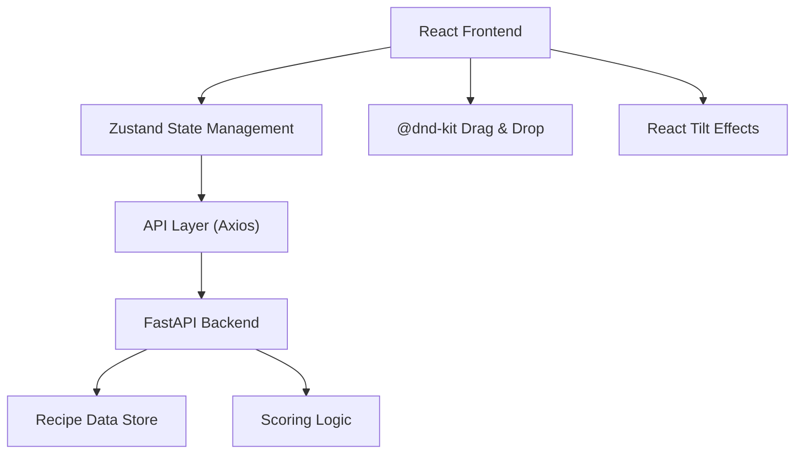
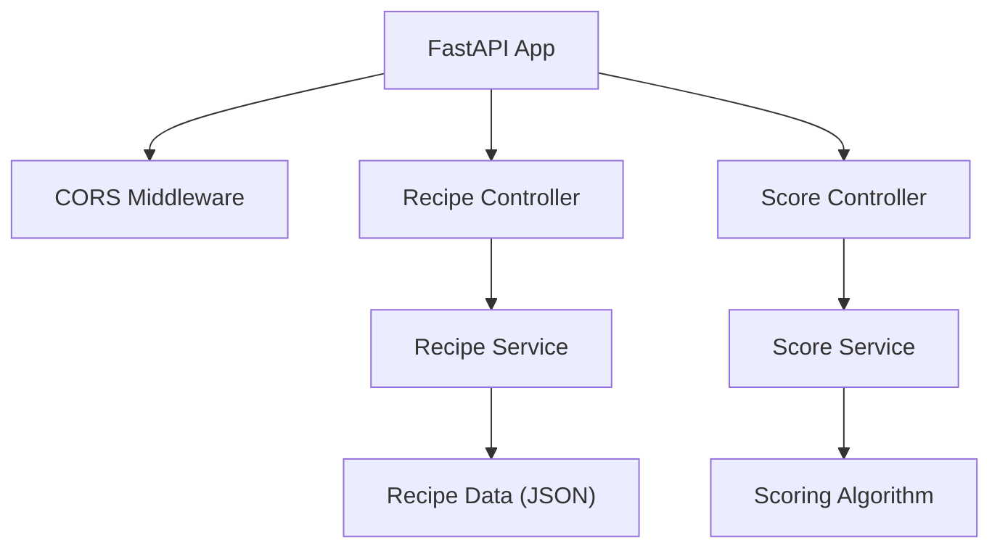
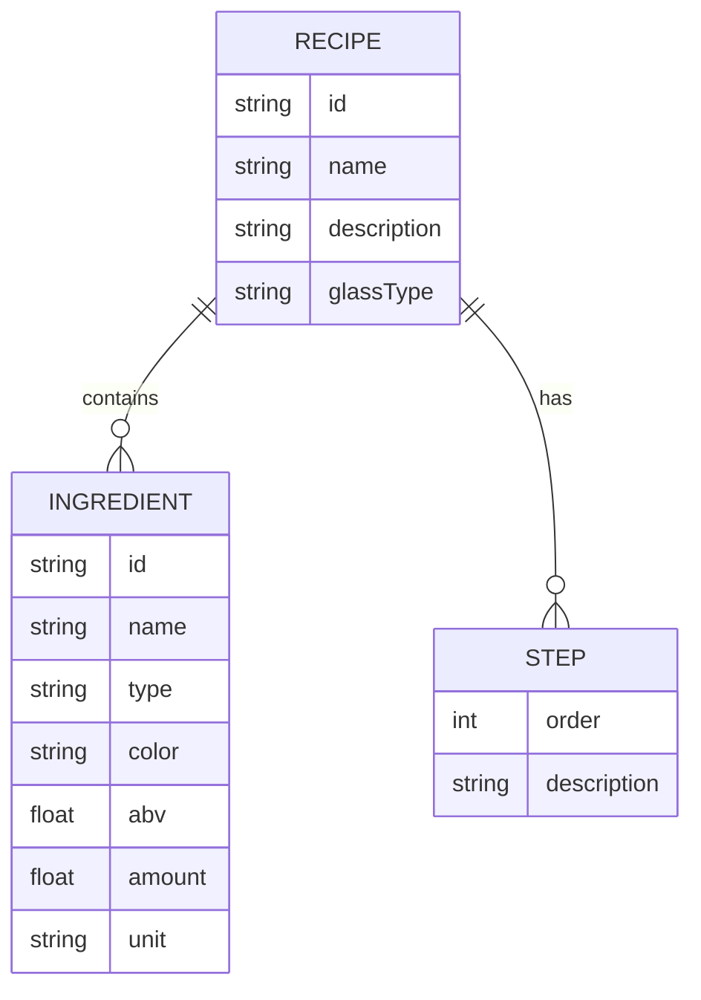

## 1. 架构设计



## 2. 技术描述
- 前端：React 18 + TypeScript + Vite
- 状态管理：Zustand
- 拖拽库：@dnd-kit/core + @dnd-kit/sortable
- 视觉效果：react-tilt
- 工具库：uuid, dayjs
- HTTP客户端：Axios
- 后端：FastAPI (Python)
- 初始化工具：vite-init

## 3. 路由定义
| 路由 | 用途 |
|------|------|
| / | 吧台主页面 |

## 4. API定义

### 类型定义
```typescript
interface Ingredient {
  id: string;
  name: string;
  type: 'base' | 'mixer' | 'garnish';
  color: string;
  abv: number;
  amount: number;
  unit: string;
}

interface Recipe {
  id: string;
  name: string;
  description: string;
  ingredients: Ingredient[];
  steps: string[];
  glassType: string;
}

interface MixStep {
  ingredientId: string;
  timestamp: number;
  order: number;
}

interface ScoreResult {
  accuracy: number;
  stars: 1 | 2 | 3 | 4 | 5;
  starColor: 'gold' | 'silver' | 'bronze';
  feedback: string;
  timeBonus: number;
}
```

### API接口
- `GET /api/recipes` - 获取所有配方列表
- `GET /api/recipes/:id` - 获取单个配方详情
- `GET /api/recipes/random` - 获取随机配方
- `POST /api/score` - 提交调制步骤获取评分

## 5. 服务器架构图



## 6. 数据模型

### 6.1 数据模型定义


### 6.2 初始数据
- 预置5种经典鸡尾酒配方：莫吉托、威士忌酸、曼哈顿、马天尼、长岛冰茶
- 每种配方包含3-6种材料和标准操作步骤
