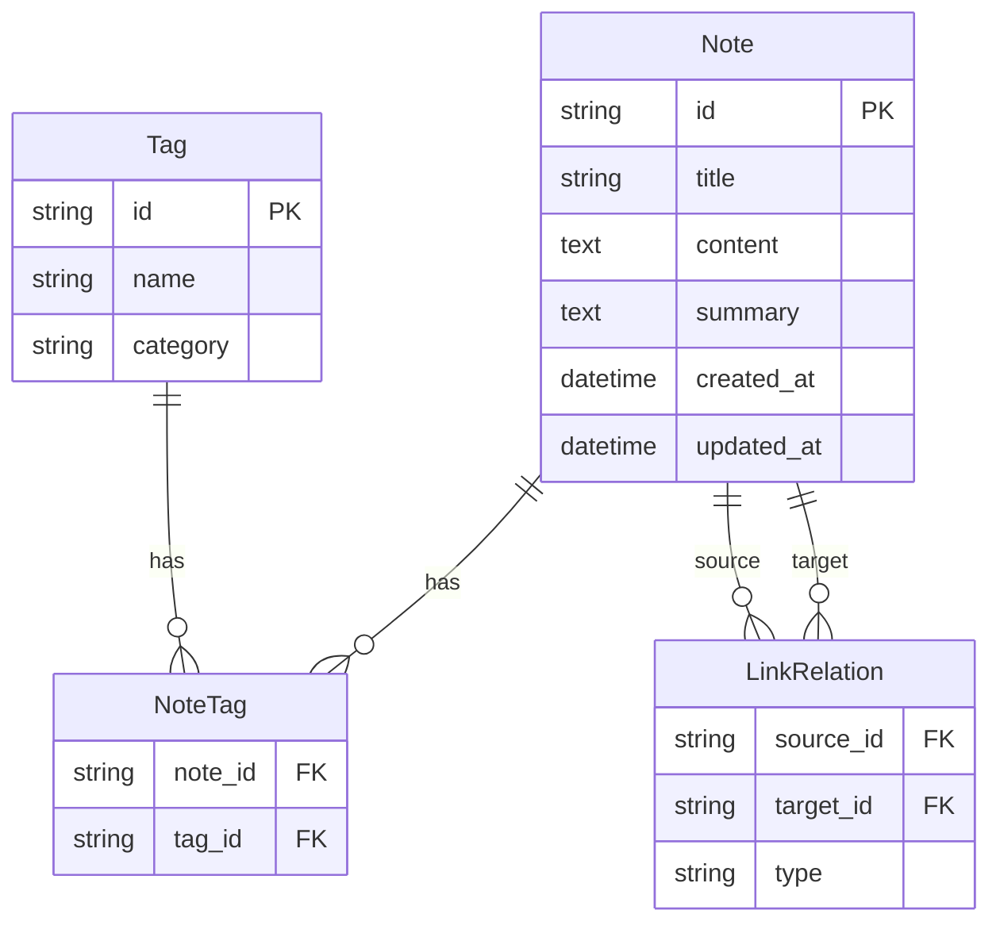

## 1. 架构设计

```mermaid
flowchart TB
    subgraph "前端层"
        "React + TypeScript"
        "Zustand 状态管理"
        "D3 Force 图谱"
        "React Router 路由"
    end
    subgraph "后端层"
        "FastAPI REST API"
        "笔记 CRUD"
        "链接解析"
        "搜索服务"
    end
    subgraph "数据层"
        "SQLite 数据库"
        "笔记表"
        "标签表"
        "链接关系表"
    end
    "React + TypeScript" --> "FastAPI REST API"
    "FastAPI REST API" --> "SQLite 数据库"
```

## 2. 技术说明

- **前端**：React@18 + TypeScript + Vite + TailwindCSS@3
- **初始化工具**：vite-init (react-ts 模板)
- **后端**：FastAPI (Python)，提供 RESTful API
- **数据库**：SQLite（轻量级本地存储）
- **状态管理**：Zustand
- **图谱可视化**：d3-force
- **富文本编辑**：react-quill（支持Markdown）
- **路由**：react-router-dom
- **HTTP客户端**：axios
- **日期处理**：dayjs
- **唯一标识**：uuid

## 3. 路由定义

| 路由 | 用途 |
|------|------|
| / | 笔记列表主页，展示所有笔记卡片和浮动操作按钮 |
| /editor/:id | 笔记编辑器页面，支持富文本编辑和双向链接 |
| /graph | 知识图谱页面，力导向图可视化 |
| /search | 搜索页面，模糊搜索和组合筛选 |

## 4. API 定义

### 4.1 TypeScript 类型定义

```typescript
interface Note {
  id: string;
  title: string;
  content: string;
  summary: string;
  tags: Tag[];
  createdAt: string;
  updatedAt: string;
  referenceIds: string[];
}

interface Tag {
  id: string;
  name: string;
  category: 'tech' | 'life' | 'study';
}

interface LinkRelation {
  sourceId: string;
  targetId: string;
  type: 'reference' | 'tag';
}

interface GraphNode {
  id: string;
  title: string;
  tags: Tag[];
  radius: number;
}

interface GraphEdge {
  source: string;
  target: string;
  type: 'reference' | 'tag';
}
```

### 4.2 API 端点

| 方法 | 路径 | 请求体 | 响应 | 描述 |
|------|------|--------|------|------|
| GET | /api/notes | - | Note[] | 获取所有笔记 |
| GET | /api/notes/:id | - | Note | 获取单个笔记 |
| POST | /api/notes | { title, content, tags } | Note | 创建笔记 |
| PUT | /api/notes/:id | { title, content, tags } | Note | 更新笔记 |
| DELETE | /api/notes/:id | - | { success: boolean } | 删除笔记 |
| GET | /api/notes/:id/backlinks | - | { noteId, title, snippet }[] | 获取反向引用 |
| GET | /api/graph | - | { nodes: GraphNode[], edges: GraphEdge[] } | 获取图谱数据 |
| GET | /api/search?q=keyword&tags=tag1,tag2&from=date&to=date | - | Note[] | 搜索笔记 |

## 5. 服务器架构图

```mermaid
flowchart LR
    "Controller" --> "Service"
    "Service" --> "Repository"
    "Repository" --> "SQLite"
```

## 6. 数据模型

### 6.1 数据模型定义



### 6.2 数据定义语言

```sql
CREATE TABLE notes (
    id TEXT PRIMARY KEY,
    title TEXT NOT NULL,
    content TEXT NOT NULL DEFAULT '',
    summary TEXT NOT NULL DEFAULT '',
    created_at TEXT NOT NULL DEFAULT (datetime('now')),
    updated_at TEXT NOT NULL DEFAULT (datetime('now'))
);

CREATE TABLE tags (
    id TEXT PRIMARY KEY,
    name TEXT NOT NULL UNIQUE,
    category TEXT NOT NULL DEFAULT 'tech'
);

CREATE TABLE note_tags (
    note_id TEXT NOT NULL REFERENCES notes(id) ON DELETE CASCADE,
    tag_id TEXT NOT NULL REFERENCES tags(id) ON DELETE CASCADE,
    PRIMARY KEY (note_id, tag_id)
);

CREATE TABLE link_relations (
    source_id TEXT NOT NULL REFERENCES notes(id) ON DELETE CASCADE,
    target_id TEXT NOT NULL REFERENCES notes(id) ON DELETE CASCADE,
    type TEXT NOT NULL DEFAULT 'reference',
    PRIMARY KEY (source_id, target_id, type)
);

CREATE INDEX idx_notes_title ON notes(title);
CREATE INDEX idx_notes_updated_at ON notes(updated_at);
CREATE INDEX idx_note_tags_note_id ON note_tags(note_id);
CREATE INDEX idx_note_tags_tag_id ON note_tags(tag_id);
CREATE INDEX idx_link_relations_source ON link_relations(source_id);
CREATE INDEX idx_link_relations_target ON link_relations(target_id);
```
