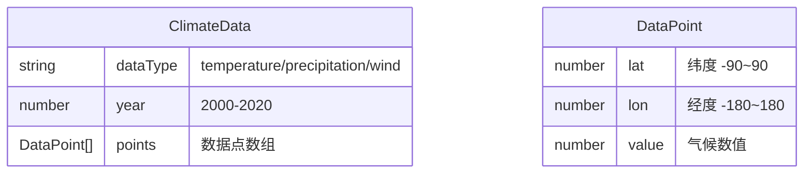

## 1. 架构设计

```mermaid
graph TD
    "用户交互层" --> "React UI组件层"
    "React UI组件层" --> "Zustand全局状态"
    "Zustand全局状态" --> "3D渲染层"
    "3D渲染层" --> "Three.js / R3F"
    "数据层" --> "数据加载工具"
    "数据加载工具" --> "Zustand全局状态"
    "颜色映射工具" --> "气候图层组件"
    "气候图层组件" --> "大气效果组件"
    "气候图层组件" --> "地球渲染组件"
```

**各层说明：**
- **用户交互层**：鼠标拖拽、滚轮缩放、按钮点击、时间轴拖拽
- **React UI组件层**：ControlBar、Timeline、InfoPanel 等UI组件
- **Zustand全局状态**：当前年份、数据类型、播放状态、相机位置
- **3D渲染层**：Earth、ClimateLayer、AtmosphereEffect、Stars
- **数据层**：模拟JSON气候数据（2000-2020年，温度/降水/风速）
- **工具层**：dataLoader、colorScale

## 2. 技术选型说明
- **前端框架**：React@18 + TypeScript
- **构建工具**：Vite
- **3D渲染**：three + @react-three/fiber + @react-three/drei
- **数据处理**：d3-scale + d3-geo
- **状态管理**：zustand
- **样式方案**：TailwindCSS 3 + 原生CSS（动画与渐变）
- **数据请求**：axios（预留API扩展，当前使用本地mock数据）
- **调试工具**：dat.gui（可选开发调试）

## 3. 路由定义
| 路由 | 用途 |
|------|------|
| / | 主界面，3D地球气候可视化 |

## 4. 文件结构与调用关系

```
d:\P\tasks\auto50
├── package.json
├── vite.config.js          # 代理 /api 到后端数据服务
├── tsconfig.json           # 严格模式 + paths 映射
├── index.html              # 入口页面，包含 loading 提示
├── public/
│   └── data/
│       └── climate.json    # 模拟气候数据（2000-2020年）
└── src/
    ├── main.tsx            # 应用入口
    ├── App.tsx             # 根组件，组合所有子组件
    ├── index.css           # 全局样式与Tailwind
    ├── components/
    │   ├── Earth.tsx              # 3D地球核心渲染，耦合ClimateLayer
    │   ├── ClimateLayer.tsx       # 气候图层，调用colorScale，输出到AtmosphereEffect
    │   ├── AtmosphereEffect.tsx   # 大气发光层与云层粒子动画
    │   ├── Stars.tsx              # 星空粒子背景
    │   ├── ControlBar.tsx         # 顶部控制栏（数据类型+视角切换）
    │   ├── Timeline.tsx           # 底部时间轴滑块
    │   ├── InfoPanel.tsx          # 右下角图例与信息面板
    │   └── LoadingScreen.tsx      # 加载中全屏提示
    ├── store/
    │   └── useClimateStore.ts     # zustand全局状态
    └── utils/
        ├── dataLoader.ts          # 从JSON读取并格式化气候数据
        └── colorScale.ts          # d3-scale颜色映射工具
```

**数据流向：**
1. `App.tsx` → 调用 `dataLoader.ts` 加载气候数据 → 存入 `useClimateStore.ts`
2. `ControlBar.tsx` / `Timeline.tsx` → 更新 `useClimateStore.ts` 状态
3. `ClimateLayer.tsx` → 从 `useClimateStore.ts` 读取年份/数据类型 → 调用 `colorScale.ts` → 输出颜色数据
4. `AtmosphereEffect.tsx` → 接收 `ClimateLayer.tsx` 的颜色数据 → 生成粒子与发光层
5. `Earth.tsx` → 组合纹理地球 + `ClimateLayer.tsx`
6. `InfoPanel.tsx` → 从 `useClimateStore.ts` + `colorScale.ts` 读取并渲染图例

## 5. 数据模型

### 5.1 气候数据结构



### 5.2 全局状态类型

```typescript
type DataType = 'temperature' | 'precipitation' | 'wind';
type ViewPreset = 'global' | 'northPole' | 'equator';

interface ClimateState {
  currentYear: number;           // 2000-2020
  targetYear: number;            // 插值目标年份
  dataType: DataType;            // 当前数据类型
  isPlaying: boolean;            // 是否播放动画
  autoRotate: boolean;           // 地球是否自转
  viewPreset: ViewPreset;        // 当前视角预设
  climateData: ClimateDataMap;   // 已加载的气候数据
  isLoading: boolean;            // 数据加载状态
  
  setYear: (year: number) => void;
  setDataType: (type: DataType) => void;
  togglePlaying: () => void;
  toggleAutoRotate: () => void;
  setViewPreset: (preset: ViewPreset) => void;
  loadData: () => Promise<void>;
}
```

## 6. 性能优化策略
- **粒子LOD**：粒子数 > 2000 时自动降低几何精度与透明度
- **实例化渲染**：使用 InstancedMesh 渲染气候数据粒子，减少Draw Call
- **帧节流**：时间轴插值动画 requestAnimationFrame 驱动，避免不必要的重渲染
- **纹理优化**：使用压缩纹理格式，地球纹理分辨率控制在 2K
- **状态订阅**：zustand 选择器精确订阅，避免组件全量重渲染
