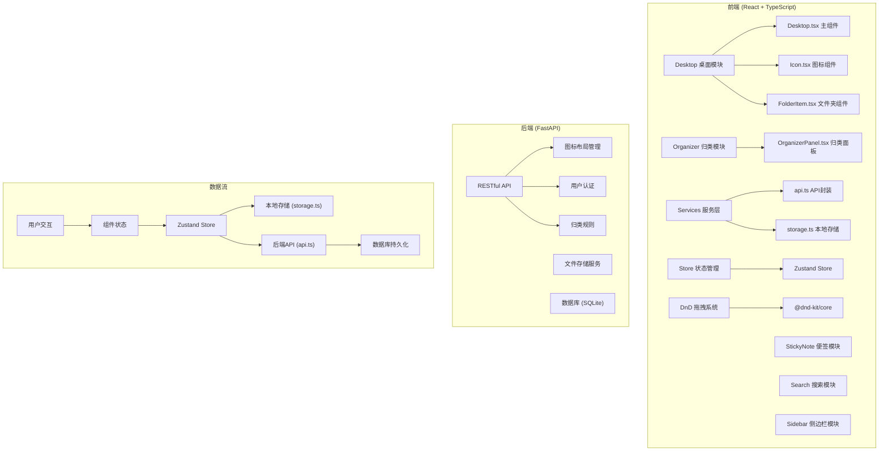
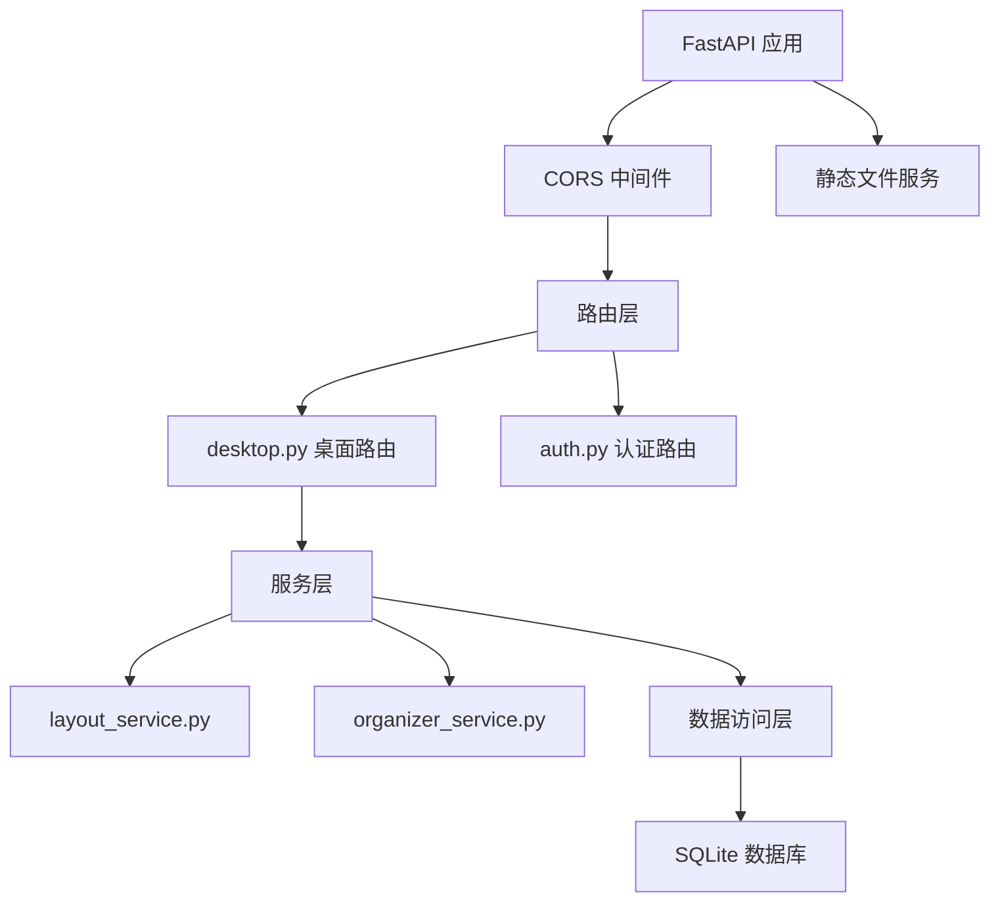

## 1. 架构设计



## 2. 技术描述

- **前端框架**：React@18 + TypeScript
- **构建工具**：Vite@5
- **状态管理**：Zustand
- **路由管理**：React Router DOM@6
- **拖拽库**：@dnd-kit/core + @dnd-kit/sortable
- **HTTP客户端**：Axios
- **UI组件**：原生CSS + CSS Modules（无需额外UI库）
- **图表库**：Recharts（用于统计展示）
- **日期处理**：Day.js
- **ID生成**：uuid
- **后端**：FastAPI@0.100+ (Python)
- **后端API代理**：Vite proxy 配置 /api → 后端服务
- **数据库**：SQLite（开发环境）

## 3. 项目目录结构

```
auto52/
├── .trae/documents/          # 项目文档
├── package.json              # 前端依赖配置
├── vite.config.js            # Vite构建配置
├── tsconfig.json             # TypeScript配置
├── index.html                # 入口HTML
├── src/
│   ├── main.tsx              # 应用入口
│   ├── App.tsx               # 根组件
│   ├── modules/
│   │   ├── desktop/          # 桌面模块
│   │   │   ├── components/
│   │   │   │   ├── Desktop.tsx
│   │   │   │   ├── Icon.tsx
│   │   │   │   ├── FolderItem.tsx
│   │   │   │   └── ContextMenu.tsx
│   │   │   ├── types.ts
│   │   │   └── store.ts
│   │   ├── organizer/        # 自动归类模块
│   │   │   ├── OrganizerPanel.tsx
│   │   │   └── utils.ts
│   │   ├── notes/            # 便签模块
│   │   │   ├── StickyNote.tsx
│   │   │   └── NoteEditor.tsx
│   │   ├── search/           # 搜索模块
│   │   │   └── SearchBar.tsx
│   │   └── sidebar/          # 侧边栏模块
│   │       └── Sidebar.tsx
│   ├── services/             # 服务层
│   │   ├── api.ts
│   │   └── storage.ts
│   ├── store/                # 全局状态
│   │   └── useStore.ts
│   ├── types/                # 类型定义
│   │   └── index.ts
│   ├── utils/                # 工具函数
│   │   ├── drag.ts
│   │   └── organizer.ts
│   └── styles/               # 全局样式
│       ├── index.css
│       └── variables.css
└── backend/                  # 后端服务（FastAPI）
    ├── main.py
    ├── requirements.txt
    └── routers/
        ├── desktop.py
        └── auth.py
```

## 4. 路由定义

| 路由 | 用途 |
|------|------|
| / | 桌面主界面 |
| /folder/:folderId | 文件夹详情视图 |
| /organizer | 自动归类面板 |
| /settings | 设置页面 |

## 5. 核心数据类型定义

```typescript
// 图标类型
type IconType = 'app' | 'folder' | 'document' | 'link' | 'note';

// 桌面图标
interface DesktopIcon {
  id: string;
  type: IconType;
  name: string;
  label: string;
  x: number;
  y: number;
  width: number;
  height: number;
  parentId: string | null; // 文件夹ID，null表示在桌面
  color?: string;
  metadata?: Record<string, any>;
  createdAt: number;
  updatedAt: number;
}

// 文件夹
interface Folder {
  id: string;
  name: string;
  iconIds: string[];
  viewMode: 'grid' | 'list';
  expanded: boolean;
}

// 便签
interface StickyNote {
  id: string;
  title: string;
  content: string; // 富文本HTML
  color: 'yellow' | 'blue' | 'pink' | 'green';
  x: number;
  y: number;
  zIndex: number;
  createdAt: number;
  updatedAt: number;
}

// 归类建议
interface OrganizeSuggestion {
  folderName: string;
  iconIds: string[];
  reason: string;
}

// 桌面布局
interface DesktopLayout {
  icons: DesktopIcon[];
  folders: Folder[];
  notes: StickyNote[];
  gridSize: { cols: number; rows: number };
  locked: boolean;
  lastSyncedAt?: number;
}
```

## 6. API 定义

```typescript
// GET /api/desktop/layout - 获取桌面布局
interface GetLayoutResponse {
  success: boolean;
  data: DesktopLayout;
}

// POST /api/desktop/layout - 保存桌面布局
interface SaveLayoutRequest {
  layout: DesktopLayout;
}
interface SaveLayoutResponse {
  success: boolean;
  syncedAt: number;
}

// GET /api/organizer/rules - 获取归类规则
interface GetRulesResponse {
  success: boolean;
  data: {
    categories: Array<{
      name: string;
      extensions: string[];
      keywords: string[];
    }>;
  };
}

// POST /api/auth/login - 用户登录
interface LoginRequest {
  username: string;
  password: string;
}
interface LoginResponse {
  success: boolean;
  token: string;
  user: {
    id: string;
    username: string;
  };
}
```

## 7. 状态管理设计

使用 Zustand 管理全局状态，按模块划分：

```typescript
interface DesktopState {
  // 数据
  icons: DesktopIcon[];
  folders: Folder[];
  notes: StickyNote[];
  selectedIconId: string | null;
  contextMenu: { visible: boolean; x: number; y: number; iconId: string } | null;
  locked: boolean;
  searchQuery: string;
  sidebarVisible: boolean;
  
  // 操作
  addIcon: (icon: Omit<DesktopIcon, 'id' | 'createdAt' | 'updatedAt'>) => void;
  updateIcon: (id: string, updates: Partial<DesktopIcon>) => void;
  deleteIcon: (id: string) => void;
  moveIcon: (id: string, x: number, y: number) => void;
  createFolder: (name: string, iconIds: string[]) => void;
  addNote: (note: Omit<StickyNote, 'id' | 'createdAt' | 'updatedAt'>) => void;
  updateNote: (id: string, updates: Partial<StickyNote>) => void;
  deleteNote: (id: string) => void;
  toggleLock: () => void;
  setContextMenu: (menu: any) => void;
  generateOrganizeSuggestions: () => OrganizeSuggestion[];
  applyOrganizeSuggestions: (suggestions: OrganizeSuggestion[]) => void;
}
```

## 8. 性能优化策略

1. **拖拽性能**：使用 @dnd-kit 的硬件加速变换，避免 layout thrashing
2. **搜索优化**：使用 useMemo 缓存搜索结果，防抖处理输入
3. **重渲染控制**：使用 React.memo 包裹组件，拆分细粒度组件
4. **动画优化**：使用 transform 和 opacity 实现动画，避免触发布局
5. **本地存储**：使用 debounce 保存状态，避免频繁写入
6. **虚拟列表**：图标数量超过50个时使用虚拟滚动（按需）

## 9. 后端服务架构（FastAPI）


