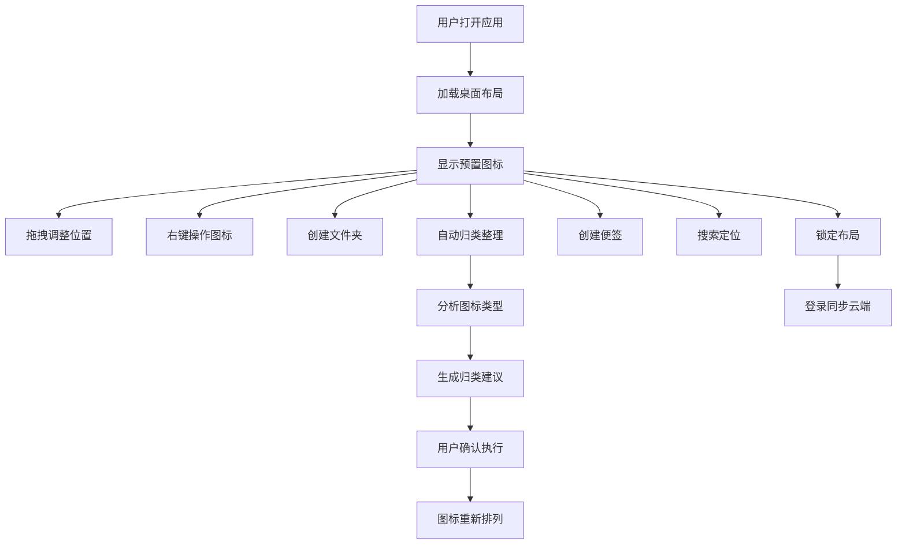

## 1. 产品概述

虚拟桌面收纳整理与效率工具是一款帮助用户管理数字桌面的Web应用，通过模拟真实桌面的交互体验，提供图标拖拽、文件夹管理、自动归类、便签记录等功能，提升用户的数字工作效率。

- 核心目的：解决桌面图标杂乱无章、文件查找困难的问题，提供直观的虚拟桌面管理体验
- 目标用户：需要处理大量数字文件和应用的办公人群、学生、创意工作者
- 产品价值：通过直观的拖拽交互和智能归类，大幅提升桌面整理效率，减少查找时间

## 2. 核心功能

### 2.1 用户角色
| 角色 | 注册方式 | 核心权限 |
|------|---------|----------|
| 游客用户 | 无需注册 | 使用本地存储，体验基础桌面功能 |
| 注册用户 | 账号密码登录 | 云端同步布局，多设备访问 |

### 2.2 功能模块
1. **桌面主界面**：图标渲染、拖拽布局、右键菜单、搜索栏、锁定功能
2. **文件夹系统**：文件夹创建、图标移入移出、嵌套文件夹、网格/列表视图
3. **自动归类助手**：图标类型分析、归类建议生成、一键归类执行
4. **便签功能**：彩色便签创建、富文本编辑、拖拽定位、工具栏交互
5. **快捷搜索**：实时搜索图标和便签、结果定位高亮
6. **布局同步**：本地存储、云端同步、多设备恢复

### 2.3 页面详情
| 页面名称 | 模块名称 | 功能描述 |
|---------|---------|----------|
| 桌面主界面 | 图标管理 | 8个预置图标，拖拽排列，右键菜单（打开、重命名、删除、移动到文件夹） |
| 桌面主界面 | 搜索栏 | 磨砂玻璃效果，实时搜索，结果高亮定位 |
| 桌面主界面 | 侧边栏 | 边缘滑出，自动归类、便签创建、设置入口 |
| 文件夹视图 | 文件夹管理 | 展开显示内部内容，角标显示数量，名称编辑 |
| 自动归类面板 | 智能归类 | 图标类型分析，归类建议，一键确认或逐项调整 |
| 便签编辑 | 便签管理 | 4种颜色，富文本编辑，悬停显示工具栏 |

## 3. 核心流程

用户打开应用 → 桌面加载预置图标和布局 → 拖拽图标调整位置 → 右键操作图标 → 创建文件夹收纳图标 → 使用自动归类助手整理 → 创建便签记录事项 → 搜索快速定位 → 锁定布局防止误操作 → 登录同步到云端

## 4. 用户界面设计

### 4.1 设计风格
- **主色调**：暖灰色渐变背景（#ece8e1 到 #d6d1c6）
- **图标色块**：
  - 应用图标：浅蓝 #6b9ac4
  - 文件夹：浅绿 #8fb98f
  - 文档：浅橙 #e6b87d
  - 便签：淡黄 #f5e68c
- **交互效果**：毛玻璃效果（backdrop-filter: blur(8px)），圆角20px
- **动画**：200-300ms缓动（cubic-bezier(0.25, 0.1, 0.25, 1)）
- **字体**：优雅的无衬线字体组合，标题使用Playfair Display，正文使用Inter

### 4.2 页面设计概述
| 页面名称 | 模块名称 | UI元素 |
|---------|---------|--------|
| 桌面主界面 | 图标区域 | 圆角矩形图标，色块背景，白色标签，拖拽放大阴影效果 |
| 桌面主界面 | 右键菜单 | 圆角卡片，缩放淡入动画，毛玻璃背景 |
| 桌面主界面 | 搜索栏 | 半透明磨砂玻璃，聚焦展开加深 |
| 桌面主界面 | 侧边栏 | 深色半透明，250px宽度，左侧边缘滑入 |
| 文件夹视图 | 文件夹内容 | 网格布局，顶部返回按钮和名称编辑框 |
| 自动归类面板 | 建议列表 | 归类卡片，逐项勾选，一键确认按钮 |
| 便签组件 | 便签卡片 | 4色可选，悬停不透明，右上角齿轮滑入工具栏 |

### 4.3 响应式设计
- **桌面端**：网格布局，图标自由拖拽，侧边栏边缘滑出
- **平板端**（<1024px）：图标间距调整，侧边栏可配置默认展开
- **移动端**（<768px）：垂直列表布局，小卡片+标签形式，禁用拖拽改用长按操作

### 4.4 动画与交互细节
- **拖拽动画**：图标放大1.1倍，添加阴影，半透明占位指示
- **右键菜单**：从右下角到左上角的缩放淡入动画
- **搜索栏**：聚焦时背景从半透明变为不透明，宽度展开
- **侧边栏**：从左侧边缘平滑滑入（translateX）
- **归类动画**：图标平滑移动到新位置，带有缓动效果
- **便签交互**：悬停时透明度从0.85变为1，工具栏从左向右滑入
