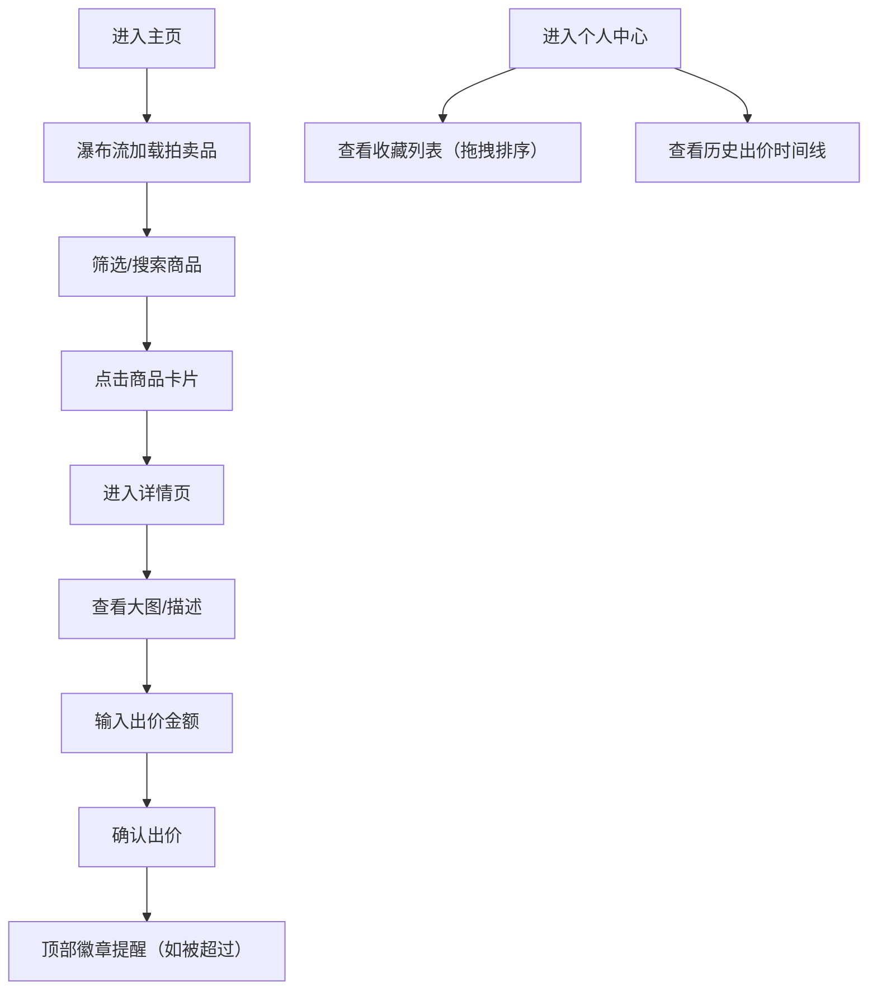

## 1. 产品概述

在线商品拍卖与收藏品浏览应用，解决用户难以直观浏览拍卖品、模拟出价竞拍并管理个人收藏的问题。面向收藏爱好者和竞拍用户，提供沉浸式的拍卖浏览与竞拍体验。

- 核心价值：奢华沉浸式的拍卖体验，便捷的收藏管理
- 目标用户：收藏爱好者、竞拍参与者、艺术品投资者

## 2. 核心功能

### 2.1 用户角色

| 角色 | 注册方式 | 核心权限 |
|------|----------|----------|
| 普通用户 | 模拟登录（无需注册） | 浏览拍卖品、出价竞拍、管理收藏、查看历史出价 |

### 2.2 功能模块

1. **主页**：筛选栏、瀑布流拍卖品网格、卡片悬停动画、收藏按钮
2. **详情页**：大图展示、点击放大、商品描述、出价输入、实时出价状态
3. **个人中心**：收藏列表（水平滚动拖拽排序）、历史出价时间线

### 2.3 页面详情

| 页面名称 | 模块名称 | 功能描述 |
|----------|----------|----------|
| 主页 | 筛选栏 | 按类别（古董、艺术品、电子产品）和价格范围筛选，筛选后卡片淡入过渡重排 |
| 主页 | 瀑布流网格 | 卡片从底部淡入上升，时间间隔0.05s形成阶梯感，展示商品名、当前出价、倒计时、缩略图 |
| 主页 | 拍卖品卡片 | 缩略图悬停上浮放大1.08倍+柔和阴影，右下角红色爱心收藏按钮，点击后填满并弹跳动画 |
| 详情页 | 大图展示 | 左侧大图，点击弹出黑色半透明蒙层居中放大，点击蒙层任意处关闭 |
| 详情页 | 出价面板 | 显示当前最高出价、出价人数，输入框输入金额，点击出价按钮发送 |
| 详情页 | 出价提醒 | 出价被超过时顶部导航栏红色数字徽章+轻微闪烁动画 |
| 个人中心 | 收藏列表 | 水平滚动式卡片展示，支持拖拽排序 |
| 个人中心 | 历史出价 | 纵向时间线，显示商品名、出价金额、时间、竞拍状态（绿色领先中/红色已出局），状态变化时脉冲动画 |

## 3. 核心流程

用户打开应用进入主页，瀑布流加载拍卖品卡片，可通过筛选条件过滤商品。点击卡片进入详情页查看大图和详细信息，输入出价金额参与竞拍。在个人中心查看已收藏商品和历史出价记录，可拖拽调整收藏顺序。

## 4. 用户界面设计

### 4.1 设计风格

- **主色调**：深灰蓝背景 `#1a2332`，金色标题 `#c9a84c`，浅灰正文 `#ccc`
- **卡片背景**：半透明白色 `rgba(255,255,255,0.08)`
- **按钮风格**：金色渐变 `#c9a84c` 到 `#a58b34`，圆角，悬停时上移2px+变亮，0.2s过渡
- **导航栏**：左侧深色毛玻璃效果 `backdrop-filter: blur(16px)`，宽度220px，菜单项悬停左侧金色竖线动画
- **字体**：标题使用 Playfair Display（奢华衬线字体），正文使用 Inter（清晰易读）
- **动效**：framer-motion 实现淡入上升、阶梯动画、弹跳、脉冲等微交互

### 4.2 页面设计概述

| 页面名称 | 模块名称 | UI 元素 |
|----------|----------|----------|
| 主页 | 筛选栏 | 类别下拉菜单、价格范围滑块、金色渐变按钮 |
| 主页 | 瀑布流卡片 | 商品缩略图、金色价格标签、倒计时徽章、红色爱心收藏按钮 |
| 详情页 | 大图区域 | 左侧大图、点击放大蒙层、关闭动画 |
| 详情页 | 信息面板 | 金色标题、浅灰描述、当前出价、出价人数、出价输入框 |
| 个人中心 | 收藏列表 | 水平滚动容器、可拖拽卡片、拖拽占位符 |
| 个人中心 | 时间线 | 纵向时间轴线、圆形节点、彩色状态标签、出价信息 |

### 4.3 响应式

- 桌面端（>768px）：左侧220px导航栏+主内容区，瀑布流多列布局
- 移动端（≤768px）：顶部导航栏，全宽卡片单列布局，筛选栏折叠

### 4.4 性能要求

- 首屏渲染时间 ≤ 1.5秒
- 瀑布流滚动保持 60fps
- 图片懒加载，使用合适尺寸的缩略图
