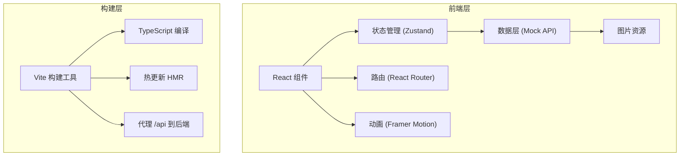

## 1. 架构设计



## 2. 技术描述

- **前端框架**：React 18 + TypeScript
- **构建工具**：Vite 5
- **路由管理**：react-router-dom 6
- **状态管理**：zustand 4
- **动画库**：framer-motion 11
- **HTTP 客户端**：axios 1
- **日期处理**：dayjs 1
- **唯一标识**：uuid 9
- **数据来源**：Mock 数据（内置商品列表）

## 3. 路由定义

| 路由 | 用途 |
|------|------|
| `/` | 主页 - 拍卖品瀑布流展示与筛选 |
| `/detail/:id` | 详情页 - 商品大图与出价功能 |
| `/profile` | 个人中心 - 收藏列表与历史出价 |

## 4. 数据模型

### 4.1 类型定义

```typescript
interface AuctionItem {
  id: string;
  name: string;
  description: string;
  category: 'antique' | 'art' | 'electronics';
  thumbnail: string;
  image: string;
  currentPrice: number;
  startPrice: number;
  bidCount: number;
  endTime: string;
  highestBidder: string;
}

interface BidRecord {
  id: string;
  itemId: string;
  itemName: string;
  amount: number;
  time: string;
  status: 'leading' | 'outbid';
}

interface FavoriteItem {
  id: string;
  itemId: string;
  order: number;
  addedAt: string;
}
```

### 4.2 Store 状态

```typescript
interface AuctionState {
  items: AuctionItem[];
  loading: boolean;
  filter: {
    category: string;
    minPrice: number;
    maxPrice: number;
  };
  favorites: FavoriteItem[];
  bidHistory: BidRecord[];
  notifications: number;
  currentUser: string;
  // actions
  fetchItems: () => Promise<void>;
  setFilter: (filter: Partial<Filter>) => void;
  placeBid: (itemId: string, amount: number) => boolean;
  toggleFavorite: (itemId: string) => void;
  reorderFavorites: (fromIndex: number, toIndex: number) => void;
  clearNotifications: () => void;
}
```

## 5. 文件结构

```
d:\P\tasks\auto53\
├── package.json
├── vite.config.js
├── tsconfig.json
├── index.html
└── src/
    ├── main.tsx
    ├── types/
    │   └── index.ts
    ├── stores/
    │   └── auctionStore.ts
    ├── components/
    │   ├── AuctionCard.tsx
    │   ├── Navbar.tsx
    │   ├── FilterBar.tsx
    │   ├── ImageModal.tsx
    │   ├── BidInput.tsx
    │   ├── FavoriteCard.tsx
    │   └── TimelineItem.tsx
    ├── pages/
    │   ├── HomePage.tsx
    │   ├── DetailPage.tsx
    │   └── ProfilePage.tsx
    ├── utils/
    │   ├── mockData.ts
    │   └── formatters.ts
    └── styles/
        └── global.css
```

## 6. 性能优化

- 使用 `React.memo` 优化卡片组件重渲染
- 瀑布流使用 `IntersectionObserver` 实现懒加载
- 图片使用 `loading="lazy"` 延迟加载
- Framer Motion 使用 `will-change` 优化动画性能
- Zustand 状态使用 selector 避免不必要重渲染
- 使用 CSS `contain: layout paint;` 优化滚动性能
