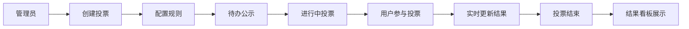

## 1. 产品概述

在线社群投票与意见收集应用，为社群组织者提供灵活的投票创建工具和直观的结果展示。支持多种投票类型（单选、多选、排名、评分），自定义投票规则，以及实时数据看板展示。

- 解决社群投票工具功能单一、规则不灵活、结果展示不直观的问题
- 目标用户：社群运营者、活动组织者、团队管理者
- 核心价值：多类型投票支持 + 灵活规则配置 + 实时可视化结果

## 2. 核心功能

### 2.1 用户角色

| 角色 | 说明 | 核心权限 |
|------|------|----------|
| 管理员 | 投票创建者 | 创建、编辑、删除投票；查看所有投票结果 |
| 普通用户 | 投票参与者 | 浏览投票、参与投票、查看已结束投票结果 |

### 2.2 功能模块

1. **看板主页**：三列看板布局（待办、进行中、已结束），投票卡片展示，搜索筛选
2. **投票创建**：表单配置投票信息，设置投票规则（匿名/实名、截止时间、人数上限）
3. **投票参与**：按类型展示投票选项，规则校验，提交投票
4. **结果看板**：柱状图、雷达图、表格视图，时间轴滑动切换
5. **通知系统**：投票结果通知，未读数量提示，通知列表

### 2.3 页面详情

| 页面名称 | 模块名称 | 功能描述 |
|---------|---------|----------|
| 看板主页 | 顶部导航栏 | 磨砂玻璃效果，滚动透明度变化，通知气泡 |
| 看板主页 | 搜索筛选区 | 搜索框（聚焦动画），类型/状态/时间筛选器 |
| 看板主页 | 三列看板 | 待办/进行中/已结束三列，投票卡片拖拽，平滑动画 |
| 看板主页 | 投票卡片 | 类型图标标签，悬停阴影提升，编辑删除按钮 |
| 投票创建页 | 表单配置 | 标题、描述、选项列表、投票类型选择 |
| 投票创建页 | 规则配置 | 匿名开关、截止时间、最大投票人数 |
| 投票详情页 | 投票信息 | 标题、进度条（人数/上限，渐变色）、倒计时 |
| 投票详情页 | 选项区 | 单选/多选/排名/评分四种类型的交互组件 |
| 投票详情页 | 提交区 | 规则校验、错误提示、成功动画 |
| 结果看板页 | 图表切换 | 柱状图/雷达图/表格视图切换 |
| 结果看板页 | 时间轴 | 左右滑动切换时间段，平滑滚动动画 |
| 通知组件 | 通知浮层 | 毛玻璃效果，5秒自动消失，手动关闭 |
| 通知组件 | 通知列表 | 点击气泡展开，未读标记 |

## 3. 核心流程

### 3.1 创建投票流程
管理员在看板页面点击创建投票 → 填写标题、描述、选项 → 选择投票类型 → 配置投票规则（匿名、截止时间、人数上限）→ 提交创建 → 投票卡片出现在"待办"列

### 3.2 参与投票流程
用户点击投票卡片进入投票页 → 查看投票信息和进度 → 按类型选择/排序/评分 → 提交投票 → 规则校验 → 成功/失败反馈 → 返回看板

### 3.3 结果查看流程
投票结束后卡片移入"已结束"列 → 点击卡片查看结果 → 切换图表类型（柱状图/雷达图/表格）→ 时间轴滑动查看不同时间段投票

## 4. 用户界面设计

### 4.1 设计风格
- **主色调**：深蓝 #1a1f36（背景）
- **点缀色**：柔和浅蓝 #4a90d9（主色），亮橙 #ff7b54（强调色）
- **卡片背景**：半透明浅色 #2a2f4a
- **整体风格**：极简深色系，磨砂玻璃质感，科技感
- **卡片样式**：圆角矩形（12px），浅阴影，悬停上浮动画
- **字体**：现代无衬线字体，清晰易读
- **图标风格**：线性简约图标，类型标识用几何图形（圆/方/阶梯/星）

### 4.2 页面设计概览

| 页面名称 | 模块名称 | UI 元素 |
|---------|---------|---------|
| 看板主页 | 导航栏 | 半透明磨砂玻璃，滚动透明度0.8→0.95，通知气泡红点 |
| 看板主页 | 搜索框 | 浅灰边框，聚焦变主色深蓝，下划线动画 |
| 看板主页 | 三列看板 | 等宽自适应列，列标题居中白色粗体，卡片间距16px |
| 看板主页 | 投票卡片 | 12px圆角，类型标签图标，悬停translateY(-4px) 0.2s ease |
| 投票详情页 | 进度条 | 人数/上限显示，颜色绿→红渐变 |
| 投票详情页 | 单选组件 | 圆形单选按钮组 |
| 投票详情页 | 多选组件 | 方形复选框组 |
| 投票详情页 | 排名组件 | 可拖拽排序列表，影子跟随动画 |
| 投票详情页 | 评分组件 | 1-5星评分，闪亮动画 |
| 结果看板 | 柱状图 | recharts渲染，各选项得票数对比 |
| 结果看板 | 雷达图 | 多维度评分对比 |
| 结果看板 | 表格 | 详细投票记录 |
| 通知组件 | 浮层 | 毛玻璃效果，右下角弹出，5秒消失 |

### 4.3 响应式设计
- **桌面端**：三列网格布局，等宽自适应
- **平板端**：两列布局，适当缩小卡片尺寸
- **移动端**（<768px）：单列滚动，每列占满宽度，卡片字体和图标缩小
- **触摸优化**：增大点击区域，滑动手势支持

### 4.4 动画与交互
- 所有交互反馈 0.2-0.3s 平滑过渡
- 卡片悬停：阴影加深 + translateY(-4px)
- 搜索结果：淡入动画更新
- 时间轴切换：平滑水平滚动动画
- 投票成功：绿色对勾动画
- 通知浮层：右下角滑入 + 毛玻璃背景
