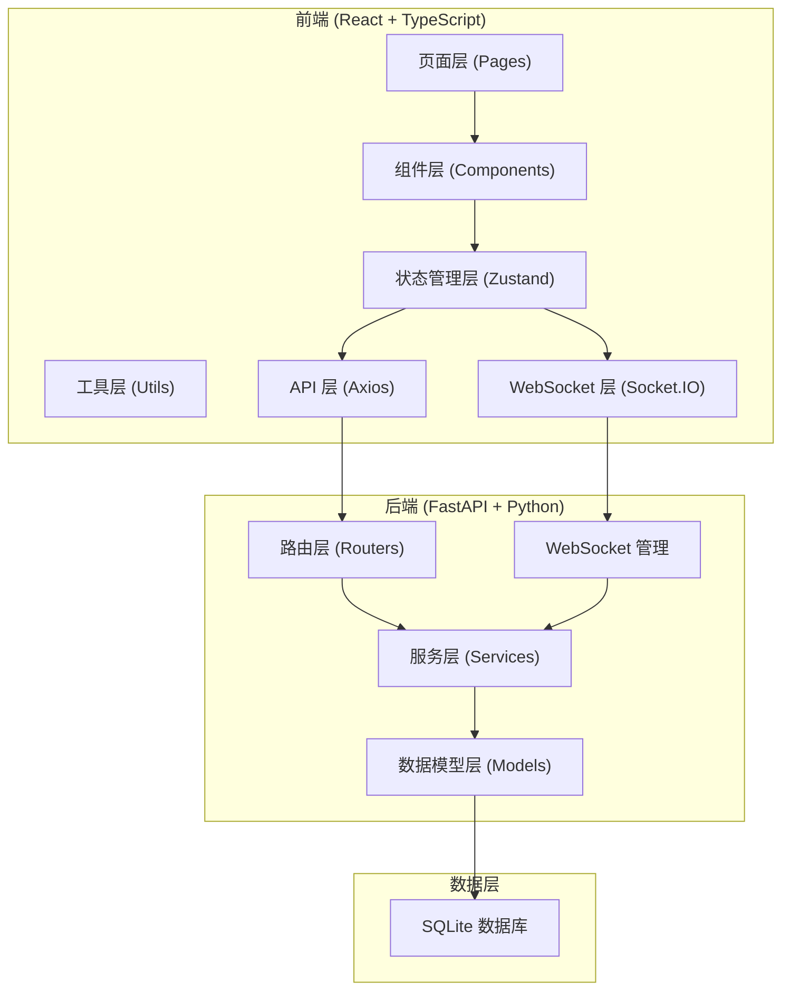
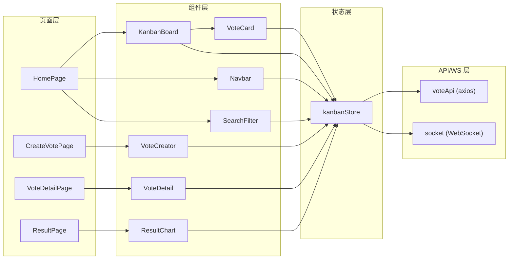

## 1. 架构设计



## 2. 技术栈说明

### 2.1 前端技术
- **框架**：React 18 + TypeScript
- **构建工具**：Vite
- **路由**：react-router-dom v6
- **状态管理**：zustand
- **HTTP 客户端**：axios
- **实时通信**：socket.io-client
- **UI 组件库**：@mui/material + @emotion/react + @emotion/styled
- **图表库**：recharts
- **工具库**：uuid, dayjs
- **代码风格**：严格 TypeScript 模式，路径别名 @/

### 2.2 后端技术
- **框架**：FastAPI
- **实时通信**：WebSocket (FastAPI 内置)
- **数据库**：SQLite (开发环境)
- **ORM**：SQLAlchemy
- **数据验证**：Pydantic

### 2.3 开发配置
- **前端开发服务器**：Vite dev server (端口 5173)
- **后端服务器**：FastAPI + uvicorn (端口 8000)
- **代理配置**：Vite 代理 /api 和 /ws 到后端 8000 端口

## 3. 路由定义

| 路由路径 | 页面组件 | 说明 |
|---------|---------|------|
| / | KanbanBoard | 看板主页，三列投票展示 |
| /vote/create | VoteCreator | 创建新投票 |
| /vote/:id | VoteDetail | 投票详情/参与页 |
| /vote/:id/result | VoteResult | 投票结果看板页 |

## 4. 数据模型定义

### 4.1 投票 (Vote)
```typescript
interface Vote {
  id: string;
  title: string;
  description: string;
  type: 'single' | 'multiple' | 'ranking' | 'rating';
  options: VoteOption[];
  isAnonymous: boolean;
  deadline: string; // ISO datetime
  maxVoters: number;
  currentVoters: number;
  status: 'todo' | 'active' | 'ended';
  createdAt: string;
  createdBy: string;
}

interface VoteOption {
  id: string;
  text: string;
  votes: number;
  rank?: number;
  rating?: number;
}
```

### 4.2 投票记录 (VoteRecord)
```typescript
interface VoteRecord {
  id: string;
  voteId: string;
  userId: string;
  userName: string;
  selections: VoteSelection[];
  submittedAt: string;
}

interface VoteSelection {
  optionId: string;
  rank?: number;
  rating?: number;
}
```

### 4.3 通知 (Notification)
```typescript
interface Notification {
  id: string;
  type: 'vote_created' | 'vote_ended' | 'vote_result';
  title: string;
  message: string;
  voteId?: string;
  read: boolean;
  createdAt: string;
}
```

## 5. API 定义

### 5.1 投票相关 API

| 方法 | 路径 | 说明 | 请求体 | 响应 |
|-----|------|------|--------|------|
| GET | /api/votes | 获取投票列表（支持筛选） | query: status, type, sort | Vote[] |
| GET | /api/votes/:id | 获取投票详情 | - | Vote |
| POST | /api/votes | 创建投票 | CreateVoteRequest | Vote |
| PUT | /api/votes/:id | 更新投票 | UpdateVoteRequest | Vote |
| DELETE | /api/votes/:id | 删除投票 | - | { success: boolean } |
| POST | /api/votes/:id/submit | 提交投票 | SubmitVoteRequest | { success: boolean, message: string } |
| GET | /api/votes/:id/results | 获取投票结果 | - | VoteResult |
| GET | /api/votes/:id/records | 获取投票记录列表 | - | VoteRecord[] |

### 5.2 WebSocket 事件

| 事件名 | 方向 | 说明 | 数据 |
|-------|------|------|------|
| vote_updated | Server → Client | 投票数据更新 | voteId, updateData |
| vote_submitted | Server → Client | 新投票提交 | voteId, record |
| vote_ended | Server → Client | 投票结束通知 | voteId |
| notification | Server → Client | 通用通知 | Notification |

## 6. 状态管理 (Zustand)

### 6.1 Store 结构
```typescript
interface VoteStore {
  votes: Vote[];
  currentVote: Vote | null;
  notifications: Notification[];
  unreadCount: number;
  filters: {
    search: string;
    type: string | null;
    status: string | null;
    sortBy: string;
  };
  
  // Actions
  fetchVotes: () => Promise<void>;
  fetchVote: (id: string) => Promise<Vote>;
  createVote: (data: CreateVoteRequest) => Promise<Vote>;
  updateVote: (id: string, data: UpdateVoteRequest) => Promise<Vote>;
  deleteVote: (id: string) => Promise<void>;
  submitVote: (id: string, data: SubmitVoteRequest) => Promise<void>;
  setFilters: (filters: Partial<Filters>) => void;
  addNotification: (notification: Notification) => void;
  markAsRead: (id: string) => void;
  markAllAsRead: () => void;
}
```

### 6.2 数据流
1. 组件从 Store 获取数据（useStore 钩子）
2. 组件触发 Store 中的 action
3. Action 调用 API 层请求后端
4. API 返回数据后更新 Store 状态
5. Store 状态变化触发组件 re-render
6. WebSocket 推送的实时数据直接更新 Store

## 7. 文件结构

### 7.1 前端文件结构
```
src/
├── components/
│   ├── KanbanBoard.tsx      # 看板主组件
│   ├── VoteCard.tsx         # 投票卡片组件
│   ├── VoteCreator.tsx      # 投票创建组件
│   ├── VoteDetail.tsx       # 投票详情组件
│   ├── ResultChart.tsx      # 结果图表组件
│   ├── Navbar.tsx           # 导航栏组件
│   ├── SearchFilter.tsx     # 搜索筛选组件
│   ├── NotificationToast.tsx # 通知浮层组件
│   └── NotificationList.tsx  # 通知列表组件
├── store/
│   └── kanbanStore.ts       # Zustand 状态仓库
├── pages/
│   ├── HomePage.tsx         # 首页（看板）
│   ├── CreateVotePage.tsx   # 创建投票页
│   ├── VoteDetailPage.tsx   # 投票详情页
│   └── ResultPage.tsx       # 结果看板页
├── api/
│   └── voteApi.ts           # API 请求封装
├── utils/
│   ├── socket.ts            # WebSocket 封装
│   ├── helpers.ts           # 工具函数
│   └── constants.ts         # 常量定义
├── types/
│   └── index.ts             # TypeScript 类型定义
├── App.tsx
├── main.tsx
└── index.css
```

### 7.2 后端文件结构
```
backend/
├── main.py                  # FastAPI 入口
├── models/
│   └── vote.py              # 数据模型
├── routers/
│   └── vote.py              # 投票路由
├── schemas/
│   └── vote.py              # Pydantic 模式
├── services/
│   └── vote_service.py      # 业务逻辑
├── websocket/
│   └── manager.py           # WebSocket 管理
├── database.py              # 数据库配置
└── requirements.txt         # Python 依赖
```

## 8. 性能优化策略

### 8.1 前端性能
- **虚拟列表**：看板卡片过多时使用虚拟滚动
- **组件懒加载**：图表组件按需加载
- **状态选择器**：使用 zustand 选择器避免不必要 re-render
- **防抖搜索**：搜索输入 300ms 防抖
- **图片导出**：图表导出使用 html2canvas 异步处理

### 8.2 渲染性能
- **拖拽优化**：使用 transform 而非 top/left，保证 60FPS
- **CSS 动画**：优先使用 transform 和 opacity 属性动画
- **图表优化**：数据量大时启用数据降采样
- **内存管理**：组件卸载时清理 WebSocket 监听

### 8.3 API 性能
- **分页加载**：投票列表分页
- **缓存策略**：静态数据缓存
- **WebSocket**：实时更新避免轮询
- **数据库索引**：常用查询字段加索引

## 9. 模块调用关系


