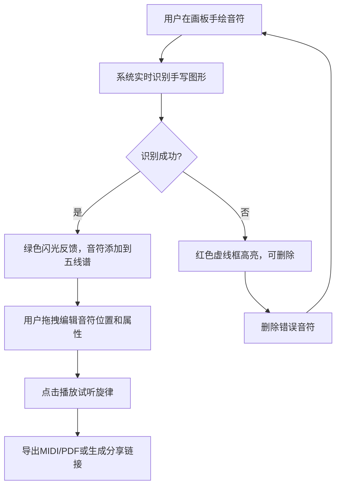

## 1. 产品概述

手写音符识别与乐谱生成应用，帮助音乐爱好者将手写旋律片段快速转换为数字乐谱格式，支持编辑、播放和导出。解决传统手写乐谱无法数字化、难以分享和回放的问题，让音乐创作更高效、更直观。

- 目标用户：音乐爱好者、作曲初学者、音乐教师
- 核心价值：手写→识别→编辑→播放→导出的一站式乐谱数字化工作流

## 2. 核心功能

### 2.1 用户角色

| 角色 | 注册方式 | 核心权限 |
|------|----------|----------|
| 普通用户 | 无需注册 | 画板绘制、音符识别、乐谱编辑、播放、导出 |
| 分享访问者 | 短链接访问 | 只读查看乐谱、播放控件 |

### 2.2 功能模块

1. **主工作台页面**：手写画板、五线谱编辑器、工具栏、播放控件
2. **分享页面**：只读乐谱展示、播放控件

### 2.3 页面详情

| 页面名称 | 模块名称 | 功能描述 |
|----------|----------|----------|
| 主工作台 | 手写画板 | 仿羊皮纸纹理画板，支持鼠标/触控笔绘制音符，实时坐标采集与笔迹渲染，笔迹保留作为对照 |
| 主工作台 | 音符识别 | 手写图形转换为标准音符（全音符、二分音符、四分音符、八分音符），识别成功绿色闪光反馈，错误红色虚线框高亮 |
| 主工作台 | 五线谱编辑器 | 识别后音符自动排列在五线谱上，支持拖拽调整音高和节拍顺序，点击音符弹出属性浮层 |
| 主工作台 | 播放控制 | Web Audio API生成简单音色试听，播放时当前音符淡黄色脉冲光环 |
| 主工作台 | 工具栏 | 圆形图标（铅笔、橡皮、选中、播放），悬停渐变动画，点击缩放反馈 |
| 主工作台 | 导出功能 | 导出MIDI文件、PDF格式，生成短链接分享 |
| 分享页面 | 只读乐谱 | 五线谱只读展示与播放控件 |

## 3. 核心流程

用户在画板上手绘音符 → 系统实时识别手写图形 → 识别结果自动排列在五线谱上 → 用户拖拽编辑音符位置和属性 → 点击播放试听旋律 → 导出MIDI/PDF或生成分享链接

## 4. 用户界面设计

### 4.1 设计风格

- 主色调：深棕色（#3e2723）作为工具栏和强调色，仿羊皮纸（#f5ead0）作为画板背景
- 辅助色：浅棕色（#8d6e63）用于悬停状态，浅灰色（#b0bec5）用于五线谱谱线，深灰色用于音符填充
- 按钮风格：圆形图标按钮，悬停时从深棕色渐变至浅棕色，点击时缩小0.95再恢复
- 字体：选用具有乐谱手写感的字体（如 Cormorant Garamond 作为标题字体，Source Sans 3 作为UI字体）
- 布局：桌面端左侧画板60%/右侧乐谱40%，暖色调乡村风格
- 图标风格：线性图标（Lucide Icons），圆角柔和

### 4.2 页面设计概述

| 页面名称 | 模块名称 | UI元素 |
|----------|----------|--------|
| 主工作台 | 顶部工具栏 | 深棕色背景，圆形图标按钮（铅笔/橡皮/选中/播放），悬停渐变，点击缩放 |
| 主工作台 | 左侧画板区域 | 仿羊皮纸纹理背景（#f5ead0），手写笔迹保留区域，识别结果区域 |
| 主工作台 | 右侧五线谱区域 | 白色背景，浅灰色谱线（#b0bec5），深灰色音符，当前播放音符淡黄色脉冲光环 |
| 主工作台 | 音符属性浮层 | 浮层卡片，包含音名/音高/时值/力度编辑 |
| 主工作台 | 导出/分享栏 | 导出按钮（MIDI/PDF）、分享按钮 |
| 分享页面 | 只读乐谱展示 | 居中五线谱展示，底部播放控件 |

### 4.3 响应式适配

- 桌面端：左侧画板60% + 右侧乐谱40% 并排布局
- 平板端（≤1024px）：上下堆叠布局，画板在上、乐谱在下
- 手机端（≤640px）：上下堆叠，工具栏变为底部浮动栏，画板和乐谱区域等高

### 4.4 3D场景指导

不适用
