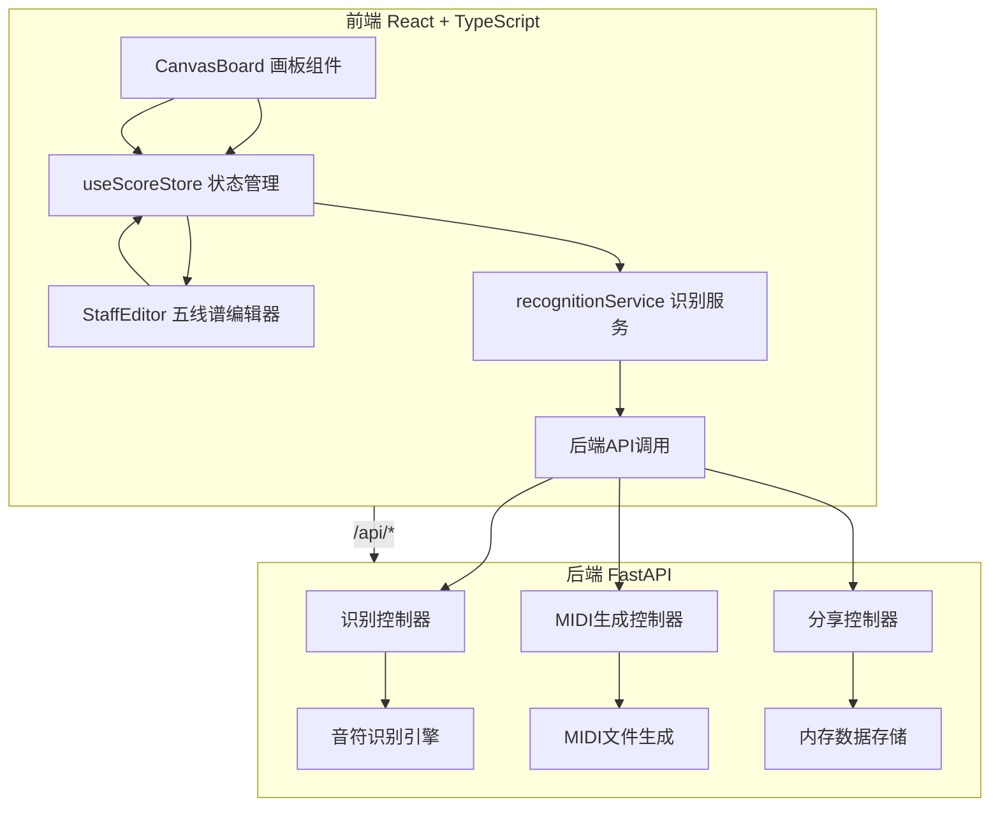
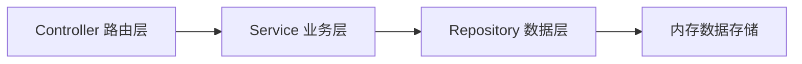
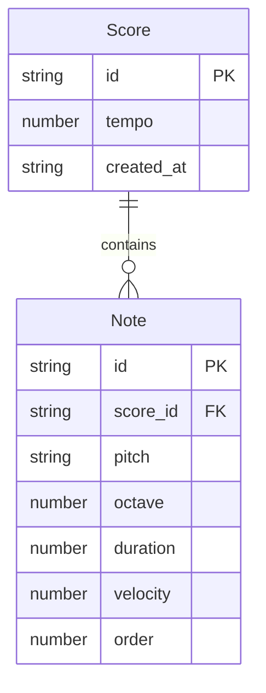

## 1. 架构设计



## 2. 技术说明

- 前端：React@18 + TypeScript + Vite + Tailwind CSS + Zustand
- 初始化工具：vite-init（react-ts模板）
- 后端：FastAPI（Python），提供RESTful API和MIDI生成服务
- 数据库：无持久化数据库，使用内存数据存储（分享链接数据）
- 音频引擎：Web Audio API（前端播放）
- 识别引擎：前端基础笔迹分析 + 后端增强识别API

## 3. 路由定义

| 路由 | 用途 |
|------|------|
| / | 主工作台页面（画板+编辑器） |
| /share/:id | 分享页面（只读乐谱+播放） |

## 4. API定义

### 4.1 音符识别

```typescript
// POST /api/recognize
interface RecognizeRequest {
  strokes: Array<{
    points: Array<{ x: number; y: number; timestamp: number }>;
  }>;
}

interface RecognizeResponse {
  notes: Array<{
    type: "whole" | "half" | "quarter" | "eighth";
    pitch: string;
    octave: number;
    confidence: number;
  }>;
}
```

### 4.2 MIDI生成

```typescript
// POST /api/export/midi
interface MidiExportRequest {
  notes: Array<{
    pitch: string;
    octave: number;
    duration: number;
    velocity: number;
    order: number;
  }>;
  tempo: number;
}

interface MidiExportResponse {
  file_url: string;
}
```

### 4.3 分享

```typescript
// POST /api/share
interface ShareRequest {
  notes: Array<{
    pitch: string;
    octave: number;
    duration: number;
    velocity: number;
    order: number;
  }>;
  tempo: number;
}

interface ShareResponse {
  share_id: string;
  share_url: string;
}

// GET /api/share/:id
interface ShareDetailResponse {
  notes: Array<{
    pitch: string;
    octave: number;
    duration: number;
    velocity: number;
    order: number;
  }>;
  tempo: number;
  created_at: string;
}
```

## 5. 服务端架构图



## 6. 数据模型

### 6.1 数据模型定义



### 6.2 数据定义语言

前端Store数据结构（Zustand）：

```typescript
interface NoteData {
  id: string;
  pitch: string;
  octave: number;
  duration: number;
  velocity: number;
  order: number;
  type: "whole" | "half" | "quarter" | "eighth";
  x: number;
  y: number;
  isValid: boolean;
}

interface ScoreState {
  notes: NoteData[];
  tempo: number;
  isPlaying: boolean;
  currentPlayIndex: number;
  addNote: (note: NoteData) => void;
  removeNote: (id: string) => void;
  updateNote: (id: string, partial: Partial<NoteData>) => void;
  setPlaying: (playing: boolean) => void;
  setCurrentPlayIndex: (index: number) => void;
  reorderNotes: (fromIndex: number, toIndex: number) => void;
}
```
