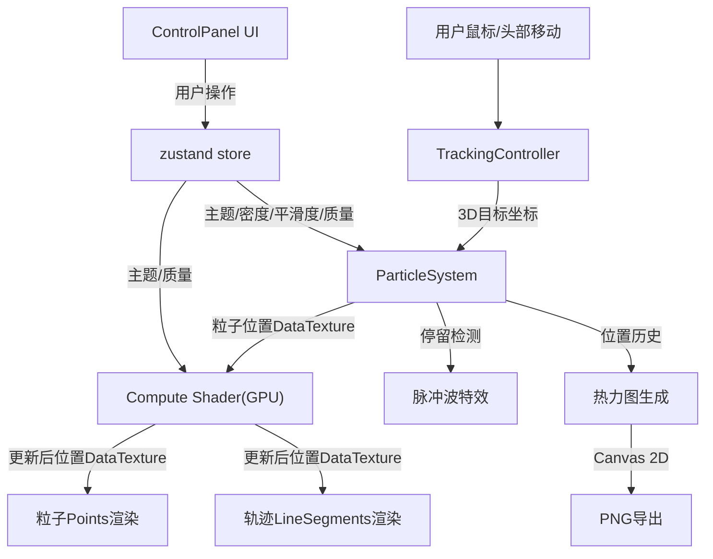

## 1. 产品概述

基于视线交互的3D粒子追随可视化应用，用于自闭症儿童视觉追踪康复训练。用户通过鼠标/头部移动引导8000+粒子在三维空间中形成动态轨迹，系统使用WebGL2 Compute Shader实现高性能粒子位置计算，实时渲染粒子流动路径并提供脉冲波、主题切换、热力图导出等视觉反馈。

- 目标用户：自闭症儿童康复治疗师及患儿
- 核心价值：将传统平面视觉追踪游戏升级为沉浸式3D交互体验，通过GPU计算突破性能瓶颈

## 2. 核心功能

### 2.1 功能模块

1. **主场景页**：3D粒子渲染、轨迹渲染、脉冲波特效、雾化景深、控制面板、数据导出

### 2.2 页面详情

| 页面名称 | 模块名称 | 功能描述 |
|----------|----------|----------|
| 主场景 | 粒子系统 | 8000+粒子通过GPU Compute Shader更新位置，跟随视线目标点平滑移动，每个粒子带随机偏移 |
| 主场景 | 轨迹渲染 | 每个粒子记录最近200个位置，使用LineSegments + 渐变颜色 + 低不透明度(0.3-0.5)渲染 |
| 主场景 | 脉冲波特效 | 视线停留1.5秒触发20个同心圆环扩散，使用互补色，背景饱和度上浮5% |
| 主场景 | 主题切换 | 6种预设主题，HSL插值0.5秒平滑过渡 |
| 主场景 | 性能模式 | 低(4000)/中(6000)/高(8000)，300ms内动态切换，低质量关轨迹，中质量限制100帧轨迹 |
| 主场景 | 热力图导出 | 视线移动热力图，暖色=密集/冷色=稀疏，叠加俯视图，PNG导出 |
| 主场景 | 控制面板 | 毛玻璃效果，密度/主题/平滑度/性能模式控件，移动端右侧滑动抽屉 |
| 主场景 | 雾化景深 | 近处粒子锐利，远处粒子降低不透明度和模糊度 |

## 3. 核心流程



### 数据流向详解

```
TrackingController (监听DOM事件 → 平滑阻尼计算 → 输出3D目标坐标)
    ↓ targetPosition
ParticleSystem (接收目标坐标 → 设置uniform → GPU计算粒子受力)
    ↓ DataTexture (position/velocity)
Compute Shader (GPU并行计算 → 更新位置/速度纹理)
    ↓ 读回纹理到BufferAttribute
RenderEngine (粒子Points + 轨迹LineSegments + 脉冲波 → 场景图)
    ↓ Scene
PostProcessing (辉光 + 动态模糊 + 颜色校正 + 雾化景深)
    ↓ 最终画面
Canvas
```

## 4. 界面设计

### 4.1 设计风格

- 主色调：#0a0a0f（深黑背景），粒子颜色根据主题突出发光
- 控制面板：rgba(255,255,255,0.08) 半透明磨砂背景，backdrop-filter: blur(12px)
- 圆角卡片风格，控件悬停白色柔光指示条
- 性能模式：圆角胶囊按钮，激活态发光边框动画
- 字体：系统字体栈，轻量级无衬线

### 4.2 页面设计概览

| 页面名称 | 模块名称 | UI元素 |
|----------|----------|--------|
| 主场景 | 控制面板(左上) | 毛玻璃卡片，密度滑块(10-100步长10)，主题下拉(圆形色块)，平滑度滑块(1-10)，性能模式胶囊按钮组 |
| 主场景 | 导出按钮(右下) | 圆形图标按钮，点击弹出时长选择弹窗(10/30/60秒)，淡入+缩放动画 |
| 主场景 | 移动端抽屉 | 右侧滑动抽屉，底部箭头按钮展开 |

### 4.3 响应式

- 桌面端：左上角固定控制面板
- 移动端(<768px)：控制面板收起为右侧滑动抽屉，底部箭头按钮触发

### 4.4 3D场景指引

- 环境：纯黑深空(#0a0a0f)，无HDRI
- 灯光：无传统灯光，粒子自发光 + 辉光后处理
- 相机：透视相机，FOV 60°，距离15，俯视角度约30°
- 后处理：Bloom(辉光) + 雾化景深(远近不透明度衰减) + 颜色校正
- 交互：鼠标移动映射3D目标点，粒子跟随，停留触发脉冲波
- 性能预算：高质量30fps+, 低质量60fps+, GPU Compute Shader计算粒子位置

## 5. 技术约束（关键修复点）

| 编号 | 问题 | 解决方案 |
|------|------|----------|
| 1 | 粒子位置CPU更新 | 使用DataTexture + 自定义ShaderMaterial，GPU端读取/写入纹理实现粒子位置计算 |
| 2 | 无轨迹渲染 | 每粒子200位置环形缓冲区，LineSegments + vertexColors渐变 + 0.3-0.5透明度 |
| 3 | 无脉冲波 | TrackingController停留1.5s检测，20个RingGeometry同心圆扩散动画，互补色着色 |
| 4 | 颜色直接替换 | HSL空间插值，0.5秒lerp过渡 |
| 5 | 粒子数无动态调整 | DataTexture动态resize，300ms过渡期逐步增减activeCount |
| 6 | 无热力图导出 | 记录视线位置历史，Canvas 2D热力图渲染，叠加3D俯视图截图，toDataURL导出PNG |
| 7 | 无毛玻璃/响应式 | backdrop-filter: blur(12px) + 移动端右侧滑动抽屉 |
| 8 | 无雾化景深 | ShaderMaterial中根据gl_FragCoord.z或距离计算fogFactor，衰减alpha |
