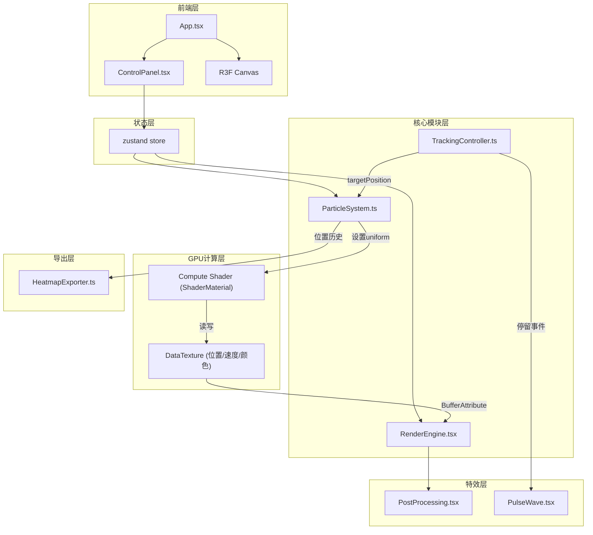

## 1. 架构设计



## 2. 技术说明

- 前端：React@18 + TypeScript + Vite
- 初始化工具：vite-init (react-ts模板)
- 3D渲染：Three.js + @react-three/fiber + @react-three/drei + @react-three/postprocessing
- 状态管理：zustand
- 无后端

## 3. 路由定义

| 路由 | 用途 |
|------|------|
| / | 主场景（全屏3D粒子应用） |

## 4. GPU Compute Shader 方案（核心架构）

### 4.1 DataTexture 计算架构

由于WebGL2不支持Compute Shader（需WebGPU），采用**GPGPU via DataTexture + 全屏Quad**方案：

```
每帧流程：
1. TrackingController 更新 targetPosition → 设置为 uniform
2. 渲染全屏Quad到RenderTarget（fragment shader = 粒子计算逻辑）
   - 输入纹理：positionTexture(上一帧位置), velocityTexture(上一帧速度)
   - Uniform: targetPosition, deltaTime, smoothness, themeColors, activeCount
   - 输出纹理：positionTexture(新位置), velocityTexture(新速度)
3. 使用输出纹理作为粒子Points和轨迹LineSegments的BufferAttribute数据源
```

### 4.2 纹理布局

```
positionTexture: RGBA32F, width=N/textureHeight, height=textureHeight
  - R: x, G: y, B: z, A: 随机种子

velocityTexture: RGBA32F, 同尺寸
  - R: vx, G: vy, B: vz, A: 生命周期

colorTexture: RGBA32F, 同尺寸
  - R: r, G: g, B: b, A: alpha
```

### 4.3 文件职责与数据流向

| 文件 | 职责 | 输入 | 输出 |
|------|------|------|------|
| TrackingController.ts | 监听鼠标/触摸事件，映射3D坐标，停留检测 | DOM事件 | targetPosition (Vec3), dwellEvent |
| ParticleSystem.ts | 管理DataTexture，执行GPGPU计算，轨迹缓冲区 | targetPosition, store配置 | 更新后的positionTexture, velocityTexture, trailBuffer |
| RenderEngine.tsx | R3F Canvas组件，粒子Points/轨迹LineSegments渲染 | ParticleSystem数据 | 3D场景到Canvas |
| PostProcessing.tsx | Bloom + 雾化景深 + 颜色校正 | R3F场景 | 后处理画面 |
| ControlPanel.tsx | UI控件，毛玻璃面板 | 用户操作 | zustand store更新 |
| PulseWave.tsx | 脉冲波同心圆环动画 | dwellEvent | 脉冲波Mesh |
| HeatmapExporter.ts | 热力图生成与PNG导出 | 视线位置历史 | PNG文件下载 |

## 5. 关键模块接口定义

```typescript
interface ParticleSystemAPI {
  positionTexture: THREE.DataTexture
  velocityTexture: THREE.DataTexture
  trailPositions: Float32Array
  trailColors: Float32Array
  activeCount: number
  update(deltaTime: number, target: THREE.Vector3): void
  resize(count: number): void
  setTheme(from: ThemeColors, to: ThemeColors, duration: number): void
}

interface TrackingControllerAPI {
  targetPosition: THREE.Vector3
  isDwelling: boolean
  dwellPosition: THREE.Vector3 | null
  update(): void
}

interface StoreState {
  density: number
  theme: string
  smoothness: number
  quality: 'low' | 'medium' | 'high'
  setDensity: (v: number) => void
  setTheme: (v: string) => void
  setSmoothness: (v: number) => void
  setQuality: (v: 'low' | 'medium' | 'high') => void
}
```
