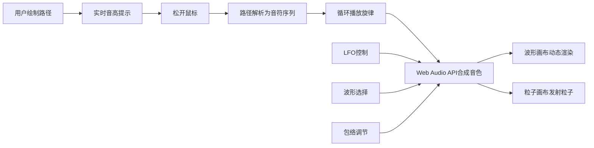

## 1. 产品概述

在线交互式音乐节奏可视化与音效合成应用，用户通过在画布上绘制路径即可创作旋律，实时听到合成音色并观察动态波形与粒子效果的联动反馈。

- 主要目的：让用户以直观的可视化方式创作音乐，降低音乐创作门槛
- 目标用户：音乐爱好者、创意设计师、教育工作者
- 产品价值：将抽象的音乐创作转化为具象的视觉交互，提供沉浸式的音画联动体验

## 2. 核心功能

### 2.1 功能模块

1. **主画布区域**：路径绘制、音高提示、旋律生成与循环播放
2. **波形预览模块**：四种波形选择（正弦、方波、锯齿、三角）、波形周期可视化
3. **包络编辑器**：ADSR四个控制点拖拽调节、包络曲线实时预览
4. **LFO控制模块**：频率旋钮调节（0.1Hz-20Hz）、目标选择（音量/音高/波形宽度）
5. **粒子特效模块**：音符触发粒子发射、颜色随音高渐变、尺寸随力度变化
6. **动态波形模块**：实时音频波形渲染、波峰波谷粒子发射点

### 2.2 页面详情

| 页面名称 | 模块名称 | 功能描述 |
|---------|---------|----------|
| 主应用 | 主画布 | 鼠标拖拽绘制路径，横向映射时间轴，纵向映射音高，实时显示音高提示，松开后自动播放生成的旋律 |
| 主应用 | 波形选择器 | 四种波形按钮切换，点击后更新合成音色，波形预览图0.3秒淡入过渡 |
| 主应用 | 包络编辑器 | 四个可拖动控制点调节Attack、Decay、Sustain、Release，实时更新ADSR曲线预览 |
| 主应用 | LFO模块 | 刻度盘形式的频率旋钮，下拉框选择调制目标，开启后音频效果周期性变化 |
| 主应用 | 粒子画布 | 音符演奏时从波峰波谷发射彩色粒子，颜色从蓝紫到橙红渐变，尺寸和数量由力度决定 |
| 主应用 | 波形画布 | 实时绘制音频波形动态效果，显示当前演奏的波形形态 |

## 3. 核心流程

用户在主画布上按住鼠标拖动绘制路径 → 系统实时显示光标位置对应的音高提示（半透明圆形内含音高值）→ 用户松开鼠标 → 系统根据路径横向坐标映射时间轴、纵向坐标映射音高 → 生成旋律序列 → 循环播放旋律 → 每次音符触发时波形画布显示动态波形 → 粒子画布从波峰波谷位置发射彩色粒子 → LFO开启时同步调制音频效果和粒子发射频率/颜色。

## 4. 用户界面设计

### 4.1 设计风格
- **主色调**：深空蓝 #0b0e14（背景）、亮蓝 #8ab4f8（波形线条）、蓝紫到橙红渐变（粒子颜色）
- **辅助色**：#2a3a5a（边框/内发光）、#1a1f2f（控件容器背景）
- **字体**：使用现代无衬线字体，标题使用 Orbitron 或类似科技感字体，正文使用 Inter
- **布局**：左右分栏，左侧70%主画布区域，右侧300px控制面板
- **视觉效果**：磨砂玻璃背景、内发光边框、圆角矩形、平滑过渡动画

### 4.2 页面设计概述

| 页面名称 | 模块名称 | UI元素 |
|---------|---------|--------|
| 主应用 | 主画布 | 圆角矩形容器、内发光边框、半透明音高提示圆、绘制路径轨迹 |
| 主应用 | 控制面板 | 磨砂玻璃背景（backdrop-filter: blur(12px)）、暗色圆角容器分组 |
| 主应用 | 波形选择器 | 四个圆角按钮，选中高亮，悬停缩放效果 |
| 主应用 | 包络编辑器 | Canvas绘制网格背景、四个可拖动圆形控制点、ADSR曲线 |
| 主应用 | LFO旋钮 | 圆形刻度盘、旋转动画、数值实时显示、悬停高亮 |
| 主应用 | 粒子画布 | 彩色粒子、渐变光晕、随机扰动运动轨迹 |
| 主应用 | 波形画布 | 深色网格背景、亮色波形线条、波峰波谷标记 |

### 4.3 响应式设计
- **桌面端**：左侧70%主画布，右侧300px控制面板，最小宽度1280px
- **平板横向**：保持左右布局，主画布比例调整为65%，控制面板280px
- **触控优化**：按钮和可交互元素最小尺寸44px，支持触摸拖拽绘制

### 4.4 动画与交互
- 所有交互元素悬停高亮（0.2s ease过渡）
- 波形切换0.3秒淡入过渡
- 旋钮旋转动画
- 粒子扩散并逐渐透明消失
- 包络控制点拖拽反馈
- LFO开启时的脉动效果
