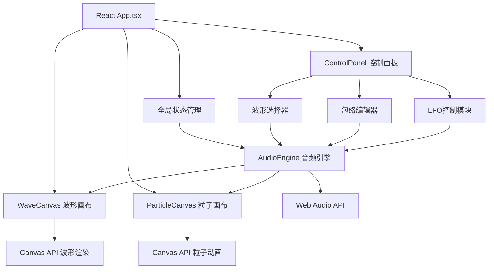

## 1. 架构设计

## 2. 技术描述

- **前端框架**：React@18 + TypeScript@5
- **构建工具**：Vite@5
- **音频处理**：Web Audio API（原生浏览器API）
- **图形渲染**：Canvas 2D API
- **状态管理**：React useState/useRef（轻量应用无需额外状态库）
- **样式方案**：CSS Modules + 内联样式（针对Canvas和动画）
- **性能优化**：requestAnimationFrame 动画循环、粒子池复用、离屏Canvas预处理

## 3. 文件结构

| 文件路径 | 用途 |
|---------|------|
| `package.json` | 项目依赖与脚本配置 |
| `vite.config.js` | Vite构建配置（React + TypeScript） |
| `tsconfig.json` | TypeScript严格模式配置 |
| `index.html` | 入口HTML页面 |
| `src/App.tsx` | 主应用容器，全局状态管理，模块组合 |
| `src/AudioEngine.ts` | 音频引擎，封装Web Audio API |
| `src/WaveCanvas.tsx` | 波形绘制组件，实时渲染音频波形 |
| `src/ParticleCanvas.tsx` | 粒子动画组件，音符触发粒子效果 |
| `src/ControlPanel.tsx` | 控制面板组件，波形选择/包络/LFO控制 |
| `src/types.ts` | 类型定义（可选，用于共享类型） |

## 4. 核心模块设计

### 4.1 AudioEngine 音频引擎

**主要方法**：
- `playNote(frequency: number, velocity: number, startTime?: number): void` - 播放单个音符
- `stopNote(): void` - 停止所有音符
- `setWaveform(type: OscillatorType): void` - 设置波形类型
- `setEnvelope(adsr: { attack: number; decay: number; sustain: number; release: number }): void` - 设置包络
- `startLFO(frequency: number, target: 'volume' | 'pitch' | 'width'): void` - 启动LFO
- `stopLFO(): void` - 停止LFO
- `getWaveformData(): Float32Array` - 获取波形数据用于可视化
- `getFrequencyData(): Uint8Array` - 获取频谱数据

**内部实现**：
- AudioContext 单例管理
- OscillatorNode + GainNode 音色合成
- BiquadFilterNode 可选滤波
- AnalyserNode 数据采集
- 定时音符调度（基于AudioContext.currentTime）

### 4.2 WaveCanvas 波形画布

**主要方法**：
- `clearCanvas(): void` - 清空画布
- `paintFrame(waveformData: Float32Array): void` - 绘制单帧波形

**功能**：
- 深色网格背景
- 动态波形线条（#8ab4f8）
- 波峰波谷位置标记
- 绘制路径轨迹显示

### 4.3 ParticleCanvas 粒子画布

**主要方法**：
- `emitParticle(x: number, y: number, pitch: number, velocity: number): void` - 发射单个粒子
- `animate(): void` - 粒子动画更新

**粒子系统**：
- 最大1500个粒子上限
- 对象池复用避免频繁GC
- 粒子属性：位置、速度、颜色、生命周期、透明度
- 颜色映射：音高 → HSL色相（蓝紫270°到橙红30°）

### 4.4 ControlPanel 控制面板

**子组件**：
- WaveformSelector：四种波形按钮
- EnvelopeEditor：ADSR四个控制点拖拽
- LFOKnob：频率旋钮+目标选择
- NoteButtons：快捷音符按钮

**交互回调**：
- `onWaveformChange(type: OscillatorType)`
- `onEnvelopeChange(adsr: ADSRParams)`
- `onLFOChange(enabled: boolean, freq: number, target: LFOTarget)`
- `onNotePlay(freq: number)`

## 5. 性能指标

| 指标 | 目标值 |
|------|--------|
| 粒子数量上限 | 1500个 |
| 音频生成延迟 | < 10ms |
| 画布重绘帧率 | 稳定60fps |
| 内存占用 | < 200MB |
| 响应时间 | 交互反馈 < 50ms |

## 6. 关键实现要点

### 6.1 路径到音符的映射
- 路径采样：按时间轴均匀采样路径点
- 音高映射：Y坐标 → MIDI音高（范围A2-C6）
- 力度计算：鼠标移动速度 → 力度值（0-1）
- 时间映射：X坐标 → 音符起始时间

### 6.2 LFO调制实现
- 使用单独的OscillatorNode作为LFO源
- 通过GainNode控制调制深度
- 连接到目标参数的AudioParam
- 同时通知粒子系统同步调制效果

### 6.3 动画循环优化
- 单一requestAnimationFrame循环驱动所有Canvas更新
- 使用deltaTime计算确保动画速度一致
- 粒子更新使用批量处理减少函数调用
- Canvas状态最小化save/restore调用

### 6.4 音频调度
- 使用AudioContext.currentTime进行精确时间调度
- 预调度未来100ms内的音符
- 音符结束事件触发粒子发射
- 循环播放使用调度队列实现无缝衔接
