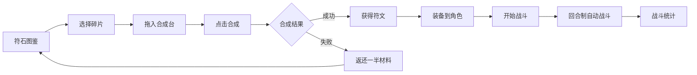

# 符石符文合成与战斗模拟 - 产品需求文档

## 1. 产品概述

符石符文合成与战斗模拟是一款在线互动小游戏，用户通过收集不同属性的符石碎片，在合成台上组合成完整符文，并装备到角色上进行战斗测试，观察不同符文组合对战斗结果的影响。

- **目标用户**：喜欢收集养成、策略搭配类游戏的玩家
- **核心价值**：提供沉浸式的符文合成体验与战斗策略探索乐趣

## 2. 核心功能

### 2.1 用户角色
| 角色 | 注册方式 | 核心权限 |
|------|----------|----------|
| 普通用户 | 无需注册，直接体验 | 浏览符石图鉴、合成符文、进行战斗模拟 |

### 2.2 功能模块
1. **符石图鉴**：碎片卡片网格展示、稀有度过滤、悬停交互、详情浮层
2. **合成台**：六芒星槽位、拖拽合成、合成动画、结果展示
3. **战斗模拟**：角色装备、3D战斗场景、回合制战斗、伤害统计

### 2.3 页面详情
| 页面名称 | 模块名称 | 功能描述 |
|----------|----------|----------|
| 主界面 | 符石图鉴 | 5x5网格展示符石碎片卡片，支持稀有度过滤，悬停浮起效果，点击弹出详情浮层 |
| 主界面 | 合成台 | 六芒星排列的6个槽位，拖拽碎片放入，合成按钮发光脉冲，粒子爆发特效 |
| 主界面 | 战斗模拟 | 角色立绘居中，6个装备位围绕，3D战斗场景，回合制自动战斗，伤害数值飘出 |

## 3. 核心流程

### 3.1 符石收集与合成流程
用户进入符石图鉴 → 浏览碎片 → 选择碎片拖入合成台六芒星槽位 → 点击合成按钮 → 播放粒子爆发动画 → 成功获得新符文 / 失败返还一半材料 → 符文收入收藏栏

### 3.2 战斗模拟流程
用户从收藏栏拖拽符文到装备栏 → 装备后角色显示对应颜色光环 → 点击开始战斗 → 系统随机抽取对手 → 3D场景中回合制自动战斗 → 显示伤害数值与特效 → 战斗结束展示详细统计

## 4. 用户界面设计

### 4.1 设计风格
- **主色调**：深色背景 #1a1a2e、金色点缀 #c9a34a、羊皮纸纹理 #2c1f0e
- **元素色彩**：火红、水蓝、雷黄、风绿、暗紫
- **按钮风格**：毛玻璃效果，圆角设计，悬停微放大
- **字体**：衬线体为主标题，无衬线体为正文，营造奇幻史诗感
- **布局**：三栏式布局（图鉴-合成台-战斗区），卡片式组件
- **图标风格**：元素符号化图标（火焰、水滴、闪电、旋风、漩涡）

### 4.2 页面设计概述
| 页面名称 | 模块名称 | UI 元素 |
|----------|----------|---------|
| 主界面 | 符石图鉴 | 5x5卡片网格、元素图标、星级稀有度、悬停浮起、详情浮层从底部滑入 |
| 主界面 | 合成台 | 六芒星槽位、拖拽飞入动画、合成按钮脉冲发光、粒子爆发特效、收藏栏 |
| 主界面 | 战斗模拟 | 角色立绘、光环效果、装备槽位、3D场景、伤害飘字、统计面板 |

### 4.3 响应式
- 桌面端优先设计，适配 768px 以上屏幕
- 移动端采用垂直堆叠布局
- 触摸优化：增大点击区域，长按触发详情

### 4.4 3D 场景指引
- **环境**：深色魔幻风格，粒子漂浮效果
- **光照**：主光源 + 补光，营造神秘氛围
- **相机**：固定视角，战斗时轻微跟随动画
- **构图**：角色与对手分居两侧，对称布局
- **交互**：自动战斗动画，攻击时位移与特效
- **后期处理**：辉光效果、轻微泛光
- **性能**：60FPS 稳定运行，合成动画不低于 45FPS
