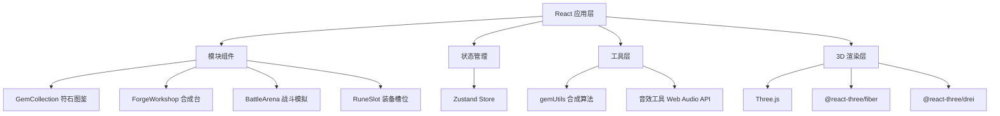

# 符石符文合成与战斗模拟 - 技术架构文档

## 1. 架构设计



## 2. 技术描述

- **前端框架**：React 18 + TypeScript
- **构建工具**：Vite
- **状态管理**：Zustand
- **3D 渲染**：Three.js + @react-three/fiber + @react-three/drei
- **样式方案**：CSS Modules / 内联样式（动画为主）
- **音效**：Web Audio API
- **数据**：本地 Mock 数据 + 前端计算

## 3. 模块划分

| 模块 | 文件路径 | 职责 |
|------|----------|------|
| 符石图鉴 | `src/modules/gem/GemCollection.tsx` | 碎片卡片网格、稀有度过滤、悬停交互、详情浮层 |
| 合成台 | `src/modules/gem/ForgeWorkshop.tsx` | 六芒星槽位、拖拽合成、合成动画、结果展示 |
| 战斗模拟 | `src/modules/battle/BattleArena.tsx` | Three.js 3D场景、角色模型、攻击动画、伤害统计 |
| 装备槽位 | `src/modules/battle/RuneSlot.tsx` | 六个装备位、符文拖拽与显示 |
| 合成算法 | `src/utils/gemUtils.ts` | 属性组合概率、稀有度判定、粒子颜色映射 |
| 全局状态 | `src/stores/gameStore.ts` | 碎片库存、符文收藏、装备配置、战斗记录 |
| 数据服务 | `src/services/FragmentService.ts` | 碎片数据获取（Mock） |

## 4. 数据模型

### 4.1 符石碎片 (Fragment)
```typescript
interface Fragment {
  id: string;
  name: string;
  element: 'fire' | 'water' | 'thunder' | 'wind' | 'dark';
  rarity: 1 | 2 | 3 | 4 | 5;
  baseStats: {
    attack?: number;
    defense?: number;
    health?: number;
    critRate?: number;
  };
  count: number;
  lore: string;
  craftableRunes: string[];
  dropLocations: string[];
}
```

### 4.2 符文 (Rune)
```typescript
interface Rune {
  id: string;
  name: string;
  element: string;
  rarity: number;
  slotType: 'weapon' | 'offhand' | 'helmet' | 'chest' | 'bracers' | 'ring';
  stats: {
    attack?: number;
    defense?: number;
    health?: number;
    critRate?: number;
    specialEffect?: string;
  };
  effectChance: number;
  description: string;
}
```

### 4.3 角色 (Character)
```typescript
interface Character {
  id: string;
  name: string;
  baseHealth: number;
  baseAttack: number;
  baseDefense: number;
  equippedRunes: {
    weapon: Rune | null;
    offhand: Rune | null;
    helmet: Rune | null;
    chest: Rune | null;
    bracers: Rune | null;
    ring: Rune | null;
  };
}
```

### 4.4 战斗记录 (BattleRecord)
```typescript
interface BattleRecord {
  id: string;
  timestamp: number;
  opponent: string;
  totalDamage: number;
  effectsTriggered: number;
  turns: number;
  victory: boolean;
}
```

## 5. 核心算法

### 5.1 合成算法
- 根据放入碎片的元素组合计算可能的符文结果
- 稀有度由碎片平均稀有度 + 随机波动决定
- 成功率与碎片稀有度正相关
- 失败时返还 50% 材料

### 5.2 战斗引擎
- 回合制：玩家与对手轮流攻击
- 伤害公式：基础攻击 × 属性加成 - 防御减免
- 符文特效按概率触发
- 血量归零判定胜负

## 6. 性能优化

- 3D 场景使用 instanced mesh 优化粒子
- CSS 动画使用 transform 和 opacity 保证 GPU 加速
- 状态更新最小化重渲染范围
- 图片资源懒加载
- 60FPS 帧率监控与动态调整
