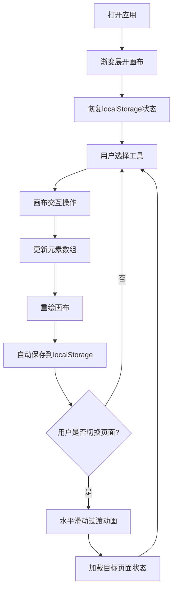

## 1. 产品概述

灵感画板（InspireBoard）是一款面向个人创意工作者的在线概念草图与视觉灵感板应用，帮助用户快速将头脑中的概念转化为可视化的创意面板。通过拖拽拼贴、手绘涂鸦和文字标签等功能，用户无需专业绘图技能即可构建高质量的视觉灵感板。

- 目标用户：设计师、产品经理、内容创作者、学生等需要快速可视化创意的人群
- 产品价值：降低创意可视化门槛，提升头脑风暴效率，打造个人灵感素材库

## 2. 核心功能

### 2.1 功能模块

1. **自由画布**：无限滚动画布、基础形状绘制、文本标签、图片上传与粘贴
2. **元素管理**：选中、拖拽、缩放、旋转、层级调整、多选操作
3. **灵感素材库**：内置20+高分辨率矢量素材、素材分类浏览、拖拽添加到画布
4. **多面板管理**：创建/切换/删除多个灵感板页面、页面切换过渡动画
5. **主题系统**：暖白/暗色主题切换、自定义网格颜色与透明度
6. **历史操作**：无限撤销/重做、自动保存到localStorage、状态恢复

### 2.2 页面详情

| 页面名称 | 模块名称 | 功能描述 |
|-----------|-------------|---------------------|
| 主画布页 | 顶部工具栏 | 工具选择（画笔/形状/文本/橡皮擦）、颜色选择器、撤销/重做、主题切换、面板管理 |
| 主画布页 | 无限画布区域 | 元素绘制、拖拽、缩放、旋转、网格吸附、棋盘格纹理背景 |
| 主画布页 | 右侧属性面板 | 位置/大小/颜色/透明度调整、层级操作、元素删除（默认隐藏） |
| 主画布页 | 底部素材库面板 | 素材分类浏览、缩略图展示、拖拽添加到画布 |
| 主画布页 | 页面切换器 | 灵感板页面列表、添加/删除页面、水平滑动过渡 |

## 3. 核心流程

用户打开应用后，画布从中心向外渐变展开，自动恢复上次保存的状态。用户选择工具后在画布上进行创作，每次操作自动保存。点击元素时右侧属性面板滑入，支持属性实时调整。素材库中的素材可直接拖拽到画布，自动吸附网格并显示扩散波纹。切换页面时以水平滑动动画过渡。

## 4. 用户界面设计

### 4.1 设计风格

- **主色调**：暖白色（#fef9f0）背景 + 蓝色主题（#2196F3）+ 橙色强调（#ff6f00）
- **暗色模式**：深紫灰背景（#1a1a2e），保持蓝色主题
- **按钮风格**：圆角方形（8px圆角），悬停半透明蓝色，选中蓝色背景+弹跳动画
- **玻璃质感**：工具栏半透明磨砂玻璃效果（backdrop-filter: blur(10px)）
- **字体**：标题使用优雅衬线字体，正文使用现代无衬线字体
- **微交互**：悬停缩放1.05x，点击缩放0.95x，撤销/重做按钮旋转反馈
- **动画**：画布加载渐变展开、素材拖拽圆形扩散波纹、页面水平滑动、元素淡入淡出

### 4.2 页面设计概述

| 页面名称 | 模块名称 | UI元素 |
|-----------|-------------|-------------|
| 主画布页 | 顶部工具栏 | 56px高度、磨砂白背景、工具按钮组、颜色选择器、操作按钮组 |
| 主画布页 | 画布区域 | 无限滚动、棋盘格纹理、网格吸附、元素蓝色控制点边框 |
| 主画布页 | 右侧属性面板 | 280px宽度、磨砂白背景、从右滑入动画、属性编辑表单 |
| 主画布页 | 素材库面板 | 底部弹出式、网格缩略图、分类标签、拖拽预览 |
| 主画布页 | 页面切换器 | 横向排列页面标签、添加按钮、滑动过渡指示器 |

### 4.3 响应式设计

- **桌面端**：顶部工具栏+画布+右侧滑入面板+底部素材库
- **移动端**：工具栏下沉底部（64px高度）、画布全屏、属性面板改为底部弹出浮层（占屏幕40%高度）、素材库全屏模态
- **触摸优化**：增大触摸热区、支持双指缩放旋转、长按选中元素
