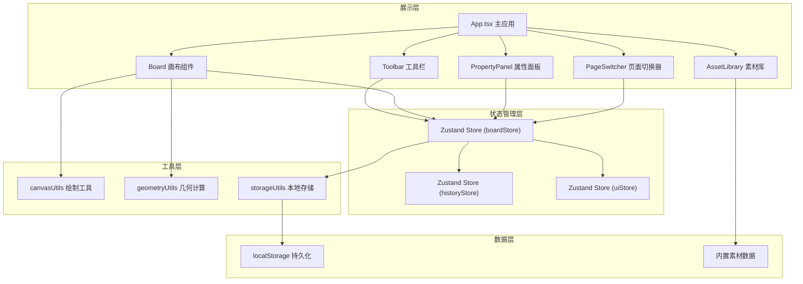
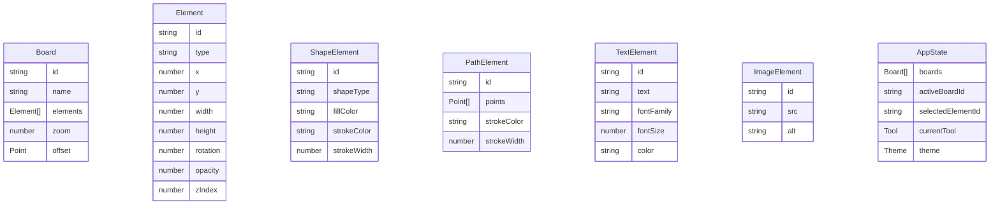

## 1. 架构设计



## 2. 技术描述

- **前端框架**：React@18 + TypeScript@5
- **构建工具**：Vite@5
- **状态管理**：Zustand@4
- **图形绘制**：Canvas API（原生2D上下文）
- **拖拽交互**：HTML5 Drag and Drop API + 自定义鼠标事件处理
- **唯一ID生成**：uuid@9
- **图标库**：lucide-react
- **样式方案**：原生CSS + CSS变量（不使用Tailwind，保持极简设计的精确控制）
- **数据持久化**：浏览器 localStorage

## 3. 文件结构与调用关系

```
src/
├── App.tsx                    # 主应用组件，组装所有子组件，管理全局布局
├── main.tsx                   # 应用入口
├── index.css                  # 全局样式与CSS变量
├── types/
│   └── board.ts               # 类型定义：元素、工具、页面、主题等
├── store/
│   ├── boardStore.ts          # 画布状态：元素列表、选中元素、当前页面
│   ├── historyStore.ts        # 历史记录：撤销/重做栈
│   └── uiStore.ts             # UI状态：当前工具、颜色、主题、面板可见性
├── components/
│   ├── Board.tsx              # 画布组件：Canvas渲染、交互处理
│   ├── Toolbar.tsx            # 工具栏：工具选择、颜色、撤销重做
│   ├── PropertyPanel.tsx      # 属性面板：元素属性编辑
│   ├── AssetLibrary.tsx       # 素材库：内置素材浏览与拖拽
│   └── PageSwitcher.tsx       # 页面切换器：多页面管理
├── hooks/
│   ├── useCanvas.ts           # Canvas上下文与渲染循环Hook
│   ├── useDragDrop.ts         # 拖拽操作处理Hook
│   └── useHistory.ts          # 撤销重做Hook
├── utils/
│   ├── canvasUtils.ts         # 绘制函数：形状、文本、图片、控制点
│   ├── geometryUtils.ts       # 几何计算：碰撞检测、坐标转换、吸附
│   └── storageUtils.ts        # 本地存储：保存/恢复状态
└── data/
    └── assets.ts              # 内置素材数据（SVG编码）
```

**数据流向**：
1. 用户交互（鼠标/触摸）→ Board组件 → boardStore更新元素数组
2. Toolbar/PropertyPanel → uiStore/boardStore → Board重渲染
3. boardStore变更 → historyStore记录快照 → storageUtils持久化到localStorage
4. AssetLibrary拖拽 → HTML5 DnD → Board接收 → boardStore添加元素
5. 页面切换 → boardStore切换当前页面状态 → Board水平滑动动画

## 4. 数据模型

### 4.1 核心类型定义



### 4.2 状态接口

```typescript
// 工具类型
type Tool = 'select' | 'pen' | 'rectangle' | 'ellipse' | 'text' | 'eraser';

// 主题类型
interface Theme {
  name: 'light' | 'dark';
  backgroundColor: string;
  gridColor: string;
  gridOpacity: number;
  textColor: string;
}

// 元素基础接口
interface BaseElement {
  id: string;
  type: 'shape' | 'path' | 'text' | 'image';
  x: number;
  y: number;
  width: number;
  height: number;
  rotation: number;
  opacity: number;
  zIndex: number;
}

// 历史快照
interface HistorySnapshot {
  boards: Board[];
  activeBoardId: string;
}
```

## 5. 性能优化策略

1. **Canvas分层渲染**：静态元素与交互元素分离到不同Canvas层，减少重绘区域
2. **requestAnimationFrame循环**：统一渲染循环，合并多次状态变更为单次绘制
3. **离屏Canvas缓存**：复杂元素预渲染到离屏Canvas，直接位图复制
4. **脏矩形标记**：仅重绘变化区域，而非全画布重绘
5. **Web Worker计算**：几何计算（碰撞检测、坐标转换）移至Worker线程
6. **素材预加载与懒加载**：启动时预加载缩略图，详情图按需加载
7. **localStorage批量写入**：使用防抖机制，避免频繁IO操作
