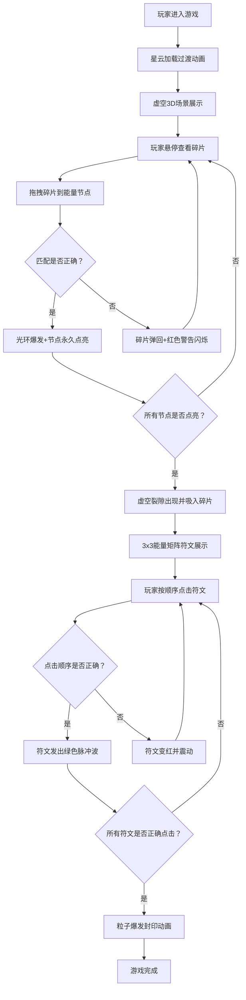

## 1. 产品概述
虚空遗物收集与能量连接解谜游戏 - 玩家在虚空场景中收集遗物碎片，通过拖拽连接能量节点解锁传送门，最终完成能量矩阵封印。
- 核心目标：提供沉浸式的3D太空解谜体验，通过拖拽交互和序列解谜双重玩法带来丰富的游戏感受
- 目标用户：喜欢探索解谜、视觉体验导向的休闲游戏玩家

## 2. 核心功能

### 2.1 功能模块
1. **虚空3D场景模块**：深空背景、漂浮星云粒子、悬浮岩石平台、发光能量节点
2. **碎片收集与拖拽模块**：碎片悬停效果、拖拽跟随、粒子拖尾、节点匹配检测
3. **节点交互反馈模块**：成功点亮动画、失败红色警告、音效反馈
4. **能量矩阵解谜模块**：3x3符文矩阵生成、序列验证、封印动画
5. **游戏UI模块**：顶部导航栏、底部进度条、设置弹窗、加载过渡动画

### 2.2 页面详情
| 页面名称 | 模块名称 | 功能描述 |
|-----------|-------------|---------------------|
| 游戏主场景 | 虚空3D场景 | 深蓝色到紫黑色渐变背景，漂浮星云粒子动画，悬浮岩石平台分布 |
| 游戏主场景 | 能量节点系统 | 发光圆形节点，0.8秒脉动光晕，匹配成功点亮，失败闪烁警告 |
| 游戏主场景 | 碎片拖拽系统 | 不规则几何碎片，元素颜色辉光，悬停旋转放大，拖拽粒子拖尾 |
| 游戏主场景 | 能量矩阵 | 虚空裂隙触发，3x3符文矩阵，序列点击验证，成功粒子爆发 |
| UI层 | 顶部导航栏 | 关卡名称显示，重新开始按钮，设置按钮，磨砂玻璃效果 |
| UI层 | 底部进度条 | 深色半透明背景，金色发光进度，碎片数量显示 |
| UI层 | 加载过渡 | 全屏星云消散动画，持续1.5秒 |
| UI层 | 设置弹窗 | 音量控制、画质调节、重新开始选项 |

## 3. 核心流程
玩家进入游戏 → 星云加载过渡动画完成 → 虚空场景展示（平台、节点、碎片分布）→ 玩家悬停查看碎片（旋转放大效果）→ 拖拽碎片到匹配节点 → 匹配成功（光环爆发+音效+节点点亮）或失败（碎片弹回+红色警告）→ 所有节点点亮 → 虚空裂隙出现 → 能量矩阵3x3符文展示 → 按正确顺序点击符文 → 验证成功（绿色脉冲）或失败（红色震动）→ 全部正确 → 粒子爆发封印动画 → 游戏完成

## 4. 用户界面设计

### 4.1 设计风格
- **主色调**：深紫色(#1a0a2e)、暗蓝色(#0a1628)、金色(#d4af37)、元素辉光色(青蓝#00d4ff、紫粉#ff00ff、橙金#ff9500)
- **按钮风格**：柔和弧角(12px)、磨砂玻璃效果(backdrop-filter: blur(8px))、半透明深色背景、金色边框高光
- **字体**：标题使用 Cinzel（衬线神秘风格），正文使用 Noto Sans SC（清晰易读）
- **布局**：全屏沉浸式3D场景 + 顶部导航栏 + 底部进度条的叠加式布局
- **视觉氛围**：深空科幻、神秘虚空、魔法能量感

### 4.2 页面设计概览
| 页面名称 | 模块名称 | UI元素 |
|-----------|-------------|-------------|
| 游戏主场景 | 虚空3D场景 | 深蓝→紫黑径向渐变背景，缓慢漂浮星云雾粒子(2000个以内)，悬浮岩石平台(低多边形风格) |
| 游戏主场景 | 能量节点 | 圆形发光符号，外圈脉动光环(0.8s周期)，内圈符文图案，金色/彩色辉光 |
| 游戏主场景 | 碎片 | 不规则八面体几何体，元素颜色自发光，悬停旋转(3°/s)放大1.1倍，拖拽拖尾粒子 |
| 游戏主场景 | 能量矩阵 | 3x3网格发光符文，每个符文独立呼吸动画(缩放+透明度脉冲) |
| UI层 | 顶部导航栏 | 渐变背景(#0a1628aa→#1a0a2eaa)，磨砂玻璃8px，左侧关卡名(Cinzel 18px金色)，右侧按钮组 |
| UI层 | 底部进度条 | 深色半透明背景(#0a162880)，圆角12px，内部金色发光渐变条，右侧白色数字显示进度 |
| UI层 | 设置弹窗 | 居中模态框，磨砂玻璃背景，音量滑块、画质选项、关闭/重启按钮 |
| UI层 | 加载过渡 | 全屏覆盖，星云粒子从中心向外扩散消散，1.5秒后自动隐藏 |

### 4.3 响应式
- Desktop优先设计，Canvas自适应窗口大小
- 支持鼠标拖拽交互，触摸设备兼容
- UI元素使用百分比和flex布局自适应

### 4.4 3D场景指导
- **环境与氛围**：深空背景，无外部HDRI，使用自定义渐变着色器，紫色雾气氛围
- **灯光设置**：AmbientLight(0.2强度) + PointLight(多个节点位置，彩色，带距离衰减) + DirectionalLight(主光源，蓝紫色调，0.4强度)
- **相机设置**：PerspectiveCamera(60° FOV)，初始位置(0, 5, 15)，轻微轨道浮动动画，OrbitControls有限旋转
- **构图与焦点**：平台分散布置在半径10单位的圆形区域，节点在平台中央略高位置，碎片在平台边缘
- **交互与动画**：碎片悬停微动，节点脉动，拖拽实时跟随，成功光环扩大消散，矩阵符文呼吸
- **后期效果**：Bloom泛光(发光节点/碎片/矩阵)、轻微Vignette暗角、ColorGrading增强对比度
- **性能预算**：总粒子数≤2000，Draw Call≤50，60FPS目标，响应时间<100ms
