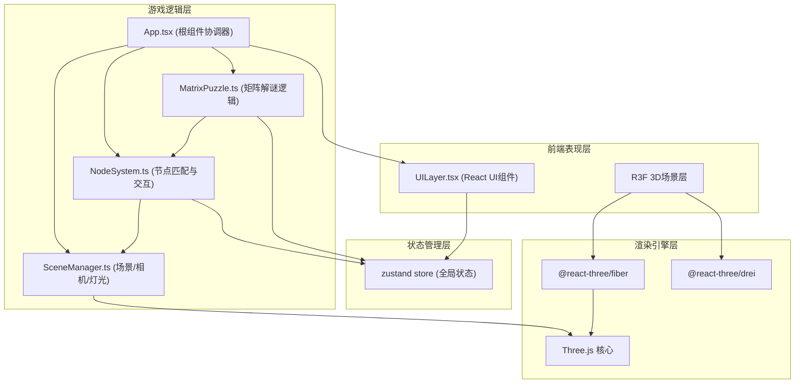

## 1. 架构设计



## 2. 技术描述
- **前端框架**：React@18 + TypeScript@5
- **构建工具**：Vite@5
- **3D渲染**：Three@0.160 + @react-three/fiber@8 + @react-three/drei@9
- **状态管理**：zustand@4
- **辅助工具**：uuid@9
- **UI绘制**：React组件 + Canvas API (辅助粒子效果) + CSS (磨砂玻璃、动画)

## 3. 文件结构

```
src/
├── App.tsx                    # 根组件，协调所有模块
├── game/
│   ├── SceneManager.ts        # Three.js场景、相机、灯光管理
│   ├── NodeSystem.ts          # 节点匹配检测、交互逻辑
│   └── MatrixPuzzle.ts        # 3x3矩阵符文序列解谜
├── ui/
│   ├── UILayer.tsx            # UI层(导航栏、进度条、弹窗)
│   ├── NavBar.tsx             # 顶部导航栏组件
│   ├── ProgressBar.tsx        # 底部进度条组件
│   ├── SettingsModal.tsx      # 设置弹窗组件
│   └── LoadingOverlay.tsx     # 加载过渡动画组件
├── store/
│   └── useGameStore.ts        # zustand全局状态
├── components/
│   ├── VoidScene.tsx          # 3D虚空场景R3F组件
│   ├── FloatingPlatform.tsx   # 悬浮岩石平台
│   ├── EnergyNode.tsx         # 能量节点组件
│   ├── RelicFragment.tsx      # 遗物碎片组件(可拖拽)
│   ├── VoidRift.tsx           # 虚空裂隙组件
│   ├── EnergyMatrix.tsx       # 能量矩阵组件
│   ├── ParticleField.tsx      # 星云粒子场
│   └── ParticleTrail.tsx      # 拖拽粒子拖尾
├── hooks/
│   └── useAnimationFrame.ts   # 动画帧hook
├── utils/
│   ├── audio.ts               # Web Audio音效生成
│   └── colors.ts              # 颜色常量
├── main.tsx
└── index.css
```

## 4. 数据模型

```typescript
// 碎片类型
interface Fragment {
  id: string;
  position: [number, number, number];
  elementColor: string;
  matchedNodeId: string;
  isMatched: boolean;
  isDragging: boolean;
}

// 能量节点类型
interface EnergyNode {
  id: string;
  position: [number, number, number];
  acceptElement: string;
  isLit: boolean;
  pulsePhase: number;
}

// 矩阵符文类型
interface MatrixRune {
  id: number;
  symbol: string;
  correctOrder: number;
  isActivated: boolean;
  isError: boolean;
}

// 全局游戏状态
interface GameState {
  phase: 'loading' | 'playing' | 'matrix' | 'complete';
  fragments: Fragment[];
  nodes: EnergyNode[];
  runes: MatrixRune[];
  currentRuneIndex: number;
  collectedCount: number;
  totalCount: number;
  levelName: string;
  showSettings: boolean;
}
```

## 5. 核心模块数据流向

### 5.1 碎片匹配流程
1. 用户鼠标悬停 RelicFragment → 触发旋转放大动画
2. 用户按下鼠标开始拖拽 → 碎片 position 跟随鼠标射线投影
3. 拖拽移动中 → ParticleTrail 生成拖尾粒子
4. 用户释放鼠标 → NodeSystem.checkMatch(fragmentId, position) 被调用
5. 距离检测成功 → 节点 isLit=true，触发光环动画 + 音效
6. 距离检测失败 → 碎片 position tween 回原位，节点红色闪烁

### 5.2 矩阵解谜流程
1. 所有节点 isLit=true → NodeSystem 触发 riftActive 状态
2. VoidRift 出现并播放吸入动画 → 进入 matrix 阶段
3. MatrixPuzzle.generateRunes() → 随机生成3x3符文及正确序列
4. 用户点击符文 → MatrixPuzzle.validateClick(runeId)
5. 正确 → rune.isActivated=true，绿色脉冲波，currentRuneIndex++
6. 错误 → rune.isError=true，震动动画
7. 全部正确 → 触发粒子爆发动画，phase 进入 complete

## 6. 性能优化策略
- 粒子系统使用 InstancedMesh / BufferGeometry，单Draw Call
- 碎片拖拽射线检测使用 BVH 加速（drei 提供）
- 节点脉动使用 ShaderMaterial，GPU计算
- UI 层通过 zustand selector 精确订阅，避免不必要重渲染
- R3F frameloop="demand" 按需渲染 + 手动 invalidate 触发
- 纹理使用 KTX2 压缩格式（如用到）
