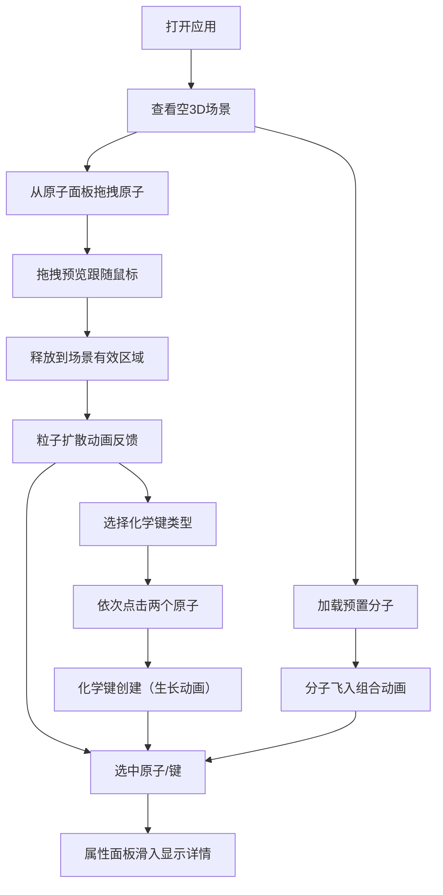

## 1. 产品概述
在线交互式分子结构3D可视化与手动组装模拟应用，面向化学学习者、研究人员和爱好者，提供直观的分子建模和可视化体验。
- 主要目的：让用户通过拖拽、旋转和连接操作手动组装原子和化学键，实时查看分子的3D结构和属性信息
- 目标价值：降低分子结构学习门槛，提供沉浸式的化学分子交互体验

## 2. 核心功能

### 2.1 功能模块
1. **主视图页面**：3D分子场景渲染、原子面板、化学键工具条、属性面板、预置分子菜单

### 2.2 页面详情
| 页面名称 | 模块名称 | 功能描述 |
|-----------|-------------|---------------------|
| 主视图 | 3D分子场景 | Three.js渲染原子和化学键，支持鼠标交互（旋转/平移/缩放），选中高亮显示 |
| 主视图 | 原子面板 | 左侧垂直滚动列表，展示可拖拽原子（C/H/O/N/S），悬停放大发光效果 |
| 主视图 | 化学键工具条 | 顶部居中，单键/双键/三键选择，选中时彩色下划线动画 |
| 主视图 | 属性面板 | 右侧滑入，显示选中原子/键信息、分子统计数据 |
| 主视图 | 预置分子菜单 | 一键加载H2O/CO2/CH4/C6H6，带飞入组合动画 |
| 主视图 | 拖拽预览 | 跟随鼠标的原子预览球体，场景区域绿色高亮、外部红色提示 |
| 主视图 | 放置反馈 | 原子放置成功后0.5秒粒子扩散动画 |

## 3. 核心流程
用户从左侧原子面板拖拽原子到3D场景放置，通过顶部工具条选择化学键类型后点击两个原子创建连接，可从菜单加载预置分子查看，选中原子或键查看属性详情。

## 4. 用户界面设计

### 4.1 设计风格
- 主色：深色科技感背景 #0d1117，面板半透明毛玻璃 #1a1f2e/80
- 原子配色：碳=#404040 深灰、氢=#ffffff 白色、氧=#ff4444 红色、氮=#4488ff 蓝色、硫=#ffdd44 黄色
- 按钮样式：圆角方形，悬停亮度+10%，点击scale 0.95（0.1秒）
- 字体：monospace等宽字体
- 布局：桌面端三栏布局（左12% + 中75% + 右13%），移动端抽屉式折叠

### 4.2 页面设计概览
| 页面名称 | 模块名称 | UI元素 |
|-----------|-------------|-------------|
| 主视图 | 3D场景 | 全屏Canvas，OrbitControls交互，原子半透明光晕浮动动画 |
| 主视图 | 原子面板 | 垂直滚动列表，每个原子=发光小球+名称，悬停scale 1.2+光晕，拖拽时跟随预览 |
| 主视图 | 工具条 | 三个键类型按钮，选中底部彩色下划线动画 |
| 主视图 | 属性面板 | 滑入动画0.4s ease-out，未选中时收缩为细线，显示原子属性/键长/分子量统计 |
| 主视图 | 拖拽预览 | 跟随鼠标球体，有效区绿色边框，无效区红色边框 |
| 主视图 | 粒子反馈 | 放置原子时向外扩散的粒子，持续0.5秒 |

### 4.3 响应式设计
- 桌面端（>768px）：三栏固定布局
- 移动端（≤768px）：原子面板左侧抽屉，属性面板底部抽屉，3D场景全屏
- 触摸优化：支持触摸拖拽旋转/缩放

### 4.4 3D场景指导
- 环境：深色渐变背景，添加雾效增强空间感
- 光照：环境光+方向光+点光源组合，确保原子立体感
- 相机：透视相机，初始距离适中，支持OrbitControls
- 后处理：Bloom发光效果（选中原子/键），SSR可选
- 动画：原子浮动、化学键生长、分子飞入、粒子扩散
- 性能：≤200原子完整渲染，>200原子切换低模（发光圆点）
