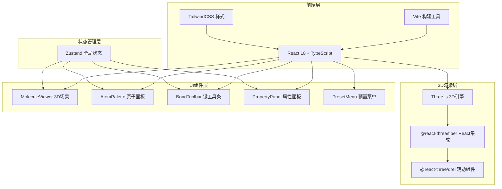

## 1. 架构设计



## 2. 技术选型说明
- 前端框架：React 18 + TypeScript（严格模式）
- 构建工具：Vite 5（React + TypeScript模板）
- 样式方案：TailwindCSS 3 + CSS Modules/内联样式
- 3D渲染：Three.js + @react-three/fiber + @react-three/drei
- 状态管理：Zustand
- 图标库：lucide-react

## 3. 数据模型定义

### 3.1 原子数据结构
```typescript
interface Atom {
  id: string;
  element: ElementType; // 'C' | 'H' | 'O' | 'N' | 'S'
  position: [number, number, number];
  color: string;
  radius: number;
  selected?: boolean;
}
```

### 3.2 化学键数据结构
```typescript
interface Bond {
  id: string;
  atomA: string; // atom id
  atomB: string; // atom id
  type: BondType; // 'single' | 'double' | 'triple'
  length: number; // Å
  selected?: boolean;
}
```

### 3.3 元素配置
```typescript
const ELEMENT_CONFIG = {
  C: { color: '#404040', radius: 0.7, name: '碳', atomicWeight: 12.011 },
  H: { color: '#ffffff', radius: 0.35, name: '氢', atomicWeight: 1.008 },
  O: { color: '#ff4444', radius: 0.6, name: '氧', atomicWeight: 15.999 },
  N: { color: '#4488ff', radius: 0.65, name: '氮', atomicWeight: 14.007 },
  S: { color: '#ffdd44', radius: 0.8, name: '硫', atomicWeight: 32.06 },
};
```

## 4. 核心组件划分
| 组件路径 | 职责 |
|----------|------|
| src/App.tsx | 主布局，三栏/响应式结构，整体状态协调 |
| src/components/MoleculeViewer.tsx | R3F Canvas场景，原子/键渲染，拖拽放置交互，粒子效果 |
| src/components/AtomPalette.tsx | 左侧原子列表面板，HTML5拖拽源，悬停发光效果 |
| src/components/BondToolbar.tsx | 顶部化学键类型选择工具条 |
| src/components/PropertyPanel.tsx | 右侧属性面板，滑入动画，显示选中项信息和统计 |
| src/components/PresetMenu.tsx | 预置分子加载菜单 |
| src/components/DragPreview.tsx | 全局拖拽跟随预览球体（DOM层） |
| src/store/moleculeStore.ts | Zustand store：原子、键、选中状态、拖拽状态 |
| src/utils/moleculePresets.ts | 预置分子数据（H2O/CO2/CH4/C6H6） |
| src/utils/physics.ts | 距离计算、分子量计算等工具函数 |

## 5. 关键交互实现方案

### 5.1 拖拽放置流程
1. AtomPalette中原子项绑定HTML5 draggable，dragstart设置dataTransfer并更新store的draggingElement
2. 全局DragPreview组件监听draggingElement，跟随鼠标显示预览球体
3. MoleculeViewer的Canvas容器监听dragover/dragleave，更新store的isOverScene（控制绿/红色高亮）
4. drop事件触发：通过raycaster将屏幕坐标转为3D世界坐标，调用store.addAtom创建原子，触发粒子动画

### 5.2 粒子扩散动画
- 原子放置成功后，在同一位置创建8-12个小球粒子
- 每个粒子沿随机方向以衰减速度向外扩散
- 0.5秒内透明度从1降到0并自动销毁
- 使用useFrame帧循环更新粒子位置

### 5.3 原子悬停放大发光
- AtomPalette中每个原子项使用CSS transform: scale(1.2) + box-shadow光晕
- transition: all 0.2s ease 实现平滑过渡

### 5.4 化学键创建
1. BondToolbar选择键类型后更新store.selectedBondType
2. MoleculeViewer中点击第一个原子 → 暂存firstAtomId并高亮
3. 点击第二个原子 → 创建Bond，触发从0到1的生长动画（0.3s）

### 5.5 性能优化
- 原子数量>200时，原子Mesh替换为Points（发光圆点）
- 尽量使用InstancedMesh批量渲染相同元素原子
- 动画使用requestAnimationFrame/useFrame，避免不必要的重渲染
