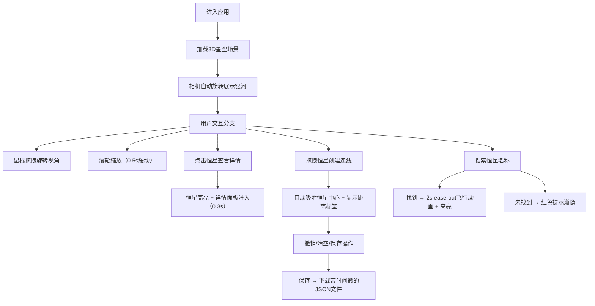

## 1. 产品概述
在线3D星图探索与星座连接可视化应用，让用户沉浸式浏览银河系内的恒星分布，了解恒星物理属性，并通过交互绘制自定义星座图案。
- 面向天文爱好者和教育用户，提供直观的恒星数据可视化和交互式学习体验
- 实现专业的天文色温渲染、流畅的3D交互和个性化星座创作功能

## 2. 核心功能

### 2.1 用户角色
| 角色 | 注册方式 | 核心权限 |
|------|----------|----------|
| 访客用户 | 无需注册 | 浏览星图、查看恒星详情、绘制和保存星座 |

### 2.2 功能模块
1. **3D星空场景**：恒星粒子系统、银河背景、相机控制与缩放
2. **恒星交互系统**：点击查看详情、搜索定位、高亮动画
3. **星座编辑器**：拖拽连线、距离标签显示、撤销/清空/保存管理
4. **性能监控系统**：帧率监控、动态粒子数量调整、移动端触控适配

### 2.3 页面详情
| 页面名称 | 模块名称 | 功能描述 |
|----------|----------|------------|
| 主界面 | 3D星空渲染 | 基于色温的恒星颜色渲染、8000颗以内粒子系统、银河旋臂背景 |
| 主界面 | 恒星详情面板 | 右侧滑入式毛玻璃面板，显示恒星名称、光谱类型、星等、距离、温度 |
| 主界面 | 星座绘制图层 | Canvas 2D叠加层，渲染半透明发光连线和距离标签 |
| 主界面 | 搜索栏 | 顶部中央搜索框，支持恒星名称搜索与平滑飞行动画 |
| 主界面 | 控制按钮组 | 左下角圆形按钮组，支持撤销、清空、保存操作 |

## 3. 核心流程

## 4. 用户界面设计

### 4.1 设计风格
- **主色调**：纯黑背景 (#000000)，深紫渐变背景，恒星色温渐变（3500K橙红 → 5000K蓝白）
- **强调色**：银白色文字 (#e8e8f0)，柔和蓝色光晕 (#4a9eff)，操作成功绿色 (#22c55e)
- **按钮样式**：圆形半透明按钮 (rgba(0,0,0,0.6))，悬停亮色边框过渡，移动端40px触控区域
- **字体**：monospace字体用于数据显示，行距1.4
- **布局**：全屏沉浸式布局，无滚动条，控制元素浮动在3D场景之上

### 4.2 页面设计概述
| 页面名称 | 模块名称 | UI元素 |
|----------|----------|--------|
| 主界面 | 3D星空 | 粒子系统闪烁动画、银河旋臂纹理、平滑相机动画 |
| 主界面 | 详情面板 | rgba(15,15,40,0.85)毛玻璃、1px rgba(255,255,255,0.2)边框、滑入/滑出动画 |
| 主界面 | 星座连线 | 白色半透明曲线、外发光效果、中点距离标签 |
| 主界面 | 搜索框 | 300px×40px圆角、rgba(0,0,0,0.6)背景、蓝色光晕焦点态 |
| 主界面 | 控制按钮 | 圆形组、8px间距、图标悬停变亮、碎块清空动画 |

### 4.3 响应式设计
- **桌面端**：完整功能布局，320px详情面板，标准按钮尺寸
- **移动端**：触控拖拽旋转、双指缩放、控制按钮缩小为40px圆形触控区域、媒体查询适配

### 4.4 3D场景设计
- **环境**：纯黑到深紫径向渐变背景，叠加银河旋臂纹理
- **光照**：无外部光源，恒星自发光粒子系统
- **相机**：PerspectiveCamera，初始距离可观察全局星图，支持平滑轨道控制
- **动画**：恒星微弱闪烁、相机自动旋转（无交互时）、缩放0.5s缓动、飞行2s ease-out
- **后处理**：辉光效果增强恒星亮度，适当的抗锯齿
- **性能**：最多8000颗恒星，帧率监控动态调整粒子数，目标60FPS

## 5. 技术修复要点（核心实现保障）

### 5.1 色温映射
- 使用天文色温转RGB公式（Tanner Helland算法），范围3500K-5000K
- 替代简单RGB插值，实现物理正确的恒星颜色

### 5.2 距离计算
- 基于三维坐标欧氏距离计算光年距离
- 连线中点渲染动态文本标签

### 5.3 飞行动画
- 相机位置和目标点双插值，2秒ease-out缓动
- 使用requestAnimationFrame实现平滑过渡

### 5.4 动态文件名
- 使用时间戳（Date.now()）生成唯一文件名
- 格式：constellation_${timestamp}.json

### 5.5 触控支持
- touchstart/touchmove/touchend事件处理
- 双指捏合缩放计算，touch-action优化
- @media (max-width: 768px) 响应式样式

### 5.6 性能监控
- requestAnimationFrame时间戳计算FPS
- 滑动窗口平均帧率，低于50FPS时减少粒子数
- 渐进式降级策略

### 5.7 状态管理
- 连线添加前校验（起点+终点组合唯一性）
- 坐标自动对齐恒星中心（使用恒星ID关联而非自由坐标）
