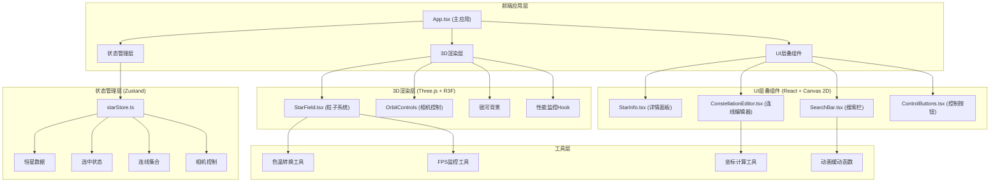

## 1. 架构设计



## 2. 技术描述

- **前端框架**：React 18 + TypeScript 5
- **构建工具**：Vite 5（ES模块、HMR、生产优化）
- **3D引擎**：Three.js 0.160 + @react-three/fiber 8 + @react-three/drei 9
- **状态管理**：Zustand 4
- **样式方案**：原生CSS + CSS变量（无Tailwind依赖，按需求精确控制样式）
- **图标库**：lucide-react（轻量级SVG图标）
- **后端**：无（纯前端应用，使用Mock数据）
- **数据来源**：内置恒星Mock数据（8000颗以内，包含真实恒星名称和物理属性）

## 3. 项目文件结构

```
auto67/
├── package.json
├── vite.config.js
├── tsconfig.json
├── index.html
└── src/
    ├── App.tsx                          # 主应用组件
    ├── main.tsx                         # 应用入口
    ├── index.css                        # 全局样式
    ├── store/
    │   └── starStore.ts                 # Zustand状态管理
    ├── components/
    │   ├── StarField.tsx                # 3D恒星粒子系统
    │   ├── StarInfo.tsx                 # 恒星详情面板
    │   ├── ConstellationEditor.tsx      # 星座连线编辑器
    │   ├── SearchBar.tsx                # 搜索栏组件
    │   └── ControlButtons.tsx           # 控制按钮组
    ├── hooks/
    │   ├── useFpsMonitor.ts             # FPS监控Hook
    │   └── useCameraFlight.ts           # 相机飞行动画Hook
    ├── utils/
    │   ├── colorTemperature.ts          # 色温转RGB算法
    │   ├── starData.ts                  # 恒星Mock数据生成
    │   ├── easing.ts                    # 缓动函数
    │   └── coordinates.ts               # 坐标计算工具
    └── types/
        └── index.ts                     # TypeScript类型定义
```

## 4. 核心数据模型

### 4.1 类型定义

```typescript
// 恒星数据结构
interface Star {
  id: string;
  name: string;
  x: number;      // 三维坐标
  y: number;
  z: number;
  temperature: number;  // 色温（开尔文），3500K-5000K
  magnitude: number;    // 绝对星等
  distance: number;     // 距地距离（光年）
  spectralType: string; // 光谱类型
  size: number;         // 粒子大小
}

// 星座连线结构
interface ConstellationLine {
  id: string;
  startStarId: string;
  endStarId: string;
  distance: number;     // 计算得出的距离（光年）
  createdAt: number;
}

// 相机状态
interface CameraState {
  position: [number, number, number];
  target: [number, number, number];
  zoom: number;
}

// 全局状态
interface StarStore {
  stars: Star[];
  visibleStarCount: number;  // 当前可见粒子数（性能动态调整）
  selectedStarId: string | null;
  constellationLines: ConstellationLine[];
  isDragging: boolean;
  dragStartStarId: string | null;
  cameraState: CameraState;
  
  // Actions
  selectStar: (id: string | null) => void;
  addConstellationLine: (startId: string, endId: string) => boolean;
  removeLastLine: () => void;
  clearAllLines: () => void;
  setVisibleStarCount: (count: number) => void;
  setCameraState: (state: Partial<CameraState>) => void;
  flyToStar: (starId: string) => void;
}
```

## 5. 关键技术实现方案

### 5.1 色温转RGB算法（Tanner Helland）
```typescript
// 基于色温计算RGB值，输入范围：3500K - 5000K
function kelvinToRGB(kelvin: number): [number, number, number] {
  const temp = kelvin / 100;
  let r, g, b;
  
  // 红色计算
  if (temp <= 66) {
    r = 255;
  } else {
    r = temp - 60;
    r = 329.698727446 * Math.pow(r, -0.1332047592);
    r = Math.max(0, Math.min(255, r));
  }
  
  // 绿色计算
  if (temp <= 66) {
    g = temp;
    g = 99.4708025861 * Math.log(g) - 161.1195681661;
  } else {
    g = temp - 60;
    g = 288.1221695283 * Math.pow(g, -0.0755148492);
  }
  g = Math.max(0, Math.min(255, g));
  
  // 蓝色计算
  if (temp >= 66) {
    b = 255;
  } else if (temp <= 19) {
    b = 0;
  } else {
    b = temp - 10;
    b = 138.5177312231 * Math.log(b) - 305.0447927307;
    b = Math.max(0, Math.min(255, b));
  }
  
  return [r / 255, g / 255, b / 255];
}
```

### 5.2 连线唯一性校验
```typescript
// 生成连线唯一键（无向）
function getLineKey(startId: string, endId: string): string {
  return [startId, endId].sort().join('-');
}

// 校验并添加连线
function addConstellationLine(startId: string, endId: string): boolean {
  if (startId === endId) return false;
  const key = getLineKey(startId, endId);
  const exists = lines.some(l => getLineKey(l.startStarId, l.endStarId) === key);
  if (exists) return false;
  // 添加新连线，自动使用恒星中心坐标
  return true;
}
```

### 5.3 相机飞行动画
```typescript
// ease-out缓动函数
function easeOutCubic(t: number): number {
  return 1 - Math.pow(1 - t, 3);
}

// 2秒飞行动画
function flyToStar(targetPosition: Vector3, currentPosition: Vector3) {
  const duration = 2000;
  const startTime = performance.now();
  const startPos = currentPosition.clone();
  const offset = new Vector3(5, 3, 5); // 目标偏移量
  const endPos = targetPosition.clone().add(offset);
  
  function animate() {
    const elapsed = performance.now() - startTime;
    const progress = Math.min(elapsed / duration, 1);
    const eased = easeOutCubic(progress);
    
    camera.position.lerpVectors(startPos, endPos, eased);
    controls.target.lerp(targetPosition, eased);
    
    if (progress < 1) requestAnimationFrame(animate);
  }
  animate();
}
```

### 5.4 FPS监控与动态调整
```typescript
// 滑动窗口平均FPS计算
const frameTimes: number[] = [];
const windowSize = 30;

function measureFPS(): number {
  const now = performance.now();
  frameTimes.push(now);
  if (frameTimes.length > windowSize) frameTimes.shift();
  
  if (frameTimes.length < 2) return 60;
  const avgFrameTime = (frameTimes[frameTimes.length - 1] - frameTimes[0]) / (frameTimes.length - 1);
  return 1000 / avgFrameTime;
}

// 动态调整策略
if (avgFPS < 50 && visibleCount > 2000) {
  setVisibleStarCount(Math.max(2000, visibleCount - 1000));
} else if (avgFPS > 58 && visibleCount < maxStars) {
  setVisibleStarCount(Math.min(maxStars, visibleCount + 500));
}
```

### 5.5 移动端触控支持
```typescript
// 双指缩放计算
let initialPinchDistance = 0;

function handleTouchStart(e: TouchEvent) {
  if (e.touches.length === 2) {
    const dx = e.touches[0].clientX - e.touches[1].clientX;
    const dy = e.touches[0].clientY - e.touches[1].clientY;
    initialPinchDistance = Math.sqrt(dx * dx + dy * dy);
  }
}

function handleTouchMove(e: TouchEvent) {
  if (e.touches.length === 2) {
    e.preventDefault();
    const dx = e.touches[0].clientX - e.touches[1].clientX;
    const dy = e.touches[0].clientY - e.touches[1].clientY;
    const currentDistance = Math.sqrt(dx * dx + dy * dy);
    const scale = initialPinchDistance / currentDistance;
    // 应用缩放到相机
  }
}
```

## 6. 性能优化策略

1. **粒子系统优化**：使用BufferGeometry而非Geometry，开启frustumCulling
2. **实例化渲染**：使用Points而非多个Mesh
3. **LOD策略**：根据距离动态调整粒子大小和可见性
4. **状态批处理**：Zustand状态更新使用批量更新减少重渲染
5. **组件memo**：使用React.memo包装纯渲染组件
6. **requestAnimationFrame**：所有动画使用RAF而非setTimeout
7. **内存管理**：组件卸载时清理事件监听和Three.js资源

## 7. 依赖版本锁定

```json
{
  "react": "^18.2.0",
  "react-dom": "^18.2.0",
  "typescript": "^5.3.0",
  "vite": "^5.0.0",
  "three": "^0.160.0",
  "@types/three": "^0.160.0",
  "@react-three/fiber": "^8.15.0",
  "@react-three/drei": "^9.92.0",
  "zustand": "^4.4.0",
  "lucide-react": "^0.294.0"
}
```
