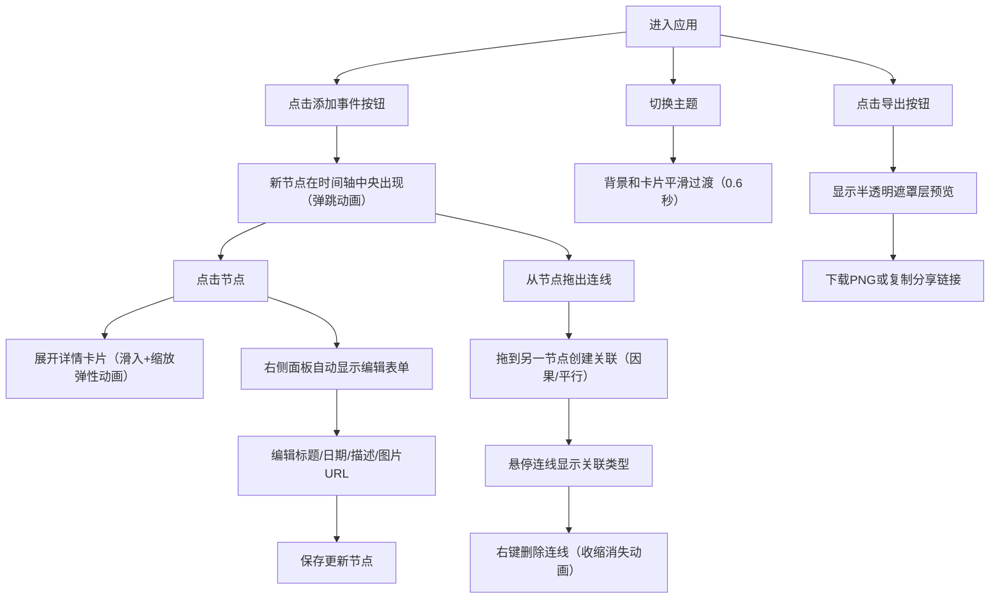

## 1. 产品概述

交互式时间线故事编辑器与可视化展示应用，为历史爱好者和内容创作者提供直观、生动的方式来组织和呈现按时间顺序发生的事件、人物关系和背景资料。

- 核心目标：解决历史事件组织难、呈现形式单一枯燥的问题
- 目标用户：历史爱好者、内容创作者、教育工作者
- 产品价值：将复杂的时间线事件以可视化、可交互的方式呈现，支持节点关联、主题切换、导出分享

## 2. 核心功能

### 2.1 功能模块

1. **时间线编辑器**：空白时间线上添加事件节点，支持点击展开详情卡片
2. **事件关联与分支**：节点间拖拽创建因果/平行关系连线，支持右键删除
3. **视觉主题切换**：三种主题（古典羊皮纸、赛博朋克、极简现代）平滑切换
4. **导出与分享**：导出为 PNG 图片，支持下载和复制分享链接
5. **属性面板**：选中节点后编辑标题、日期、描述、图片URL
6. **事件计数**：底部实时显示事件总数

### 2.2 页面详情

| 页面名称 | 模块名称 | 功能描述 |
|---------|---------|---------|
| 主页面 | 时间线编辑区（70%） | 渲染事件节点、处理拖拽连线、节点点击展开、底部事件计数、添加事件按钮 |
| 主页面 | 属性面板（30%） | 选中节点时自动展开编辑表单，包含标题、日期、描述、图片URL字段 |
| 主页面 | 主题切换器 | 三种主题平滑切换动画（0.6秒） |
| 主页面 | 导出弹窗 | 半透明遮罩层、中央预览、下载按钮、复制分享链接按钮 |

## 3. 核心流程

### 3.1 用户主要操作流程

用户进入应用后，可通过"添加事件"按钮在时间轴中央创建新节点（带弹跳动画），点击节点展开详情卡片（滑入+缩放弹性动画），选中节点后右侧面板自动显示编辑表单，可从节点拖出连线到另一节点创建关联，切换主题时背景和卡片平滑过渡，点击导出按钮显示预览遮罩层进行下载或分享。

## 4. 用户界面设计

### 4.1 设计风格

- **品牌色**：#4a90d9
- **节点卡片**：背景 #ffffff，标题 #333333，日期品牌色粗体
- **悬停效果**：放大 1.05 倍，阴影 rgba(0,0,0,0.15)
- **三种主题**：
  - 古典羊皮纸：背景 #f5e6c8，衬线体字体
  - 赛博朋克：背景 #0d1117，霓虹色调，无衬线体
  - 极简现代：纯白背景，扁平图标，浅灰分割线
- **事件计数**：#999 浅灰色，12px，靠右对齐

### 4.2 动画效果

- 新节点添加：轻微弹跳动画，定位到时间轴中央
- 卡片展开：从上往下滑入 + 弹性动画 + 缩放（0.95→1.0），0.3秒
- 连线删除：曲线收缩消失动画
- 主题切换：背景和节点卡片平滑渐变过渡 0.6秒
- 节点悬停：放大1.05倍 + 阴影投射

### 4.3 布局结构

| 页面名称 | 模块名称 | UI 元素 |
|---------|---------|---------|
| 主页面 | 左右两栏布局 | 左侧70%编辑区 + 右侧30%属性面板 |
| 主页面 | 时间线编辑区 | 圆形节点标记、详情卡片、贝塞尔曲线连线、添加按钮、底部事件计数 |
| 主页面 | 属性面板 | 编辑表单（标题/日期/描述/图片URL）、选中即显示编辑状态 |
| 主页面 | 主题切换器 | 三个主题选项按钮 |
| 主页面 | 导出遮罩层 | 半透明背景、中央预览区、下载按钮、复制分享链接按钮 |

### 4.4 响应式

- Desktop-first 设计
- 屏幕宽度 < 768px 时：右侧面板收起为底部悬浮抽屉，点击图标展开
- 支持触屏交互优化

### 4.5 性能要求

- 50 个事件节点时，拖拽和展开动画帧率不低于 50fps
- 使用 useMemo、React.memo 等优化手段
