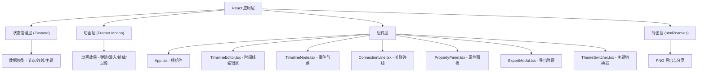
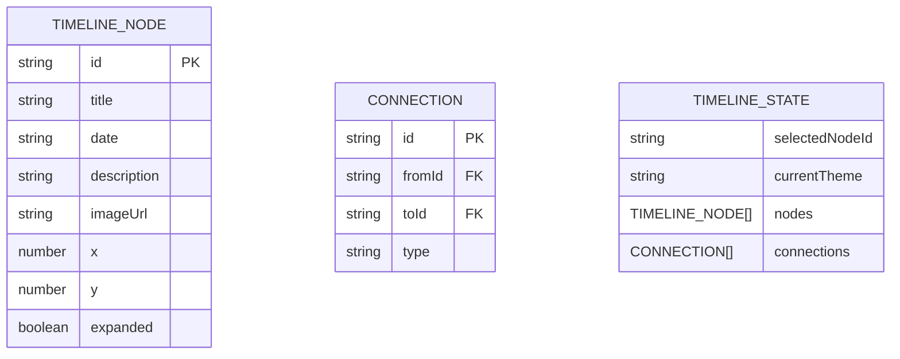

## 1. 架构设计



## 2. 技术描述

- **前端框架**：React 18 + TypeScript
- **构建工具**：Vite
- **状态管理**：Zustand
- **动画库**：Framer Motion
- **导出功能**：html2canvas
- **唯一 ID**：uuid
- **样式方案**：CSS Modules + CSS 变量（主题化）
- **初始化工具**：vite-init react-ts 模板

## 3. 文件结构

| 文件路径 | 用途 |
|---------|------|
| package.json | 依赖管理、启动脚本 |
| vite.config.js | React + TypeScript 构建配置 |
| tsconfig.json | TypeScript 严格模式配置 |
| index.html | 入口页面 |
| src/App.tsx | 根组件，组合左右两栏布局，主题切换 |
| src/store/timelineStore.ts | Zustand 全局 store |
| src/components/TimelineEditor.tsx | 时间线编辑区组件 |
| src/components/TimelineNode.tsx | 单个事件节点组件 |
| src/components/ConnectionLine.tsx | 关联连线组件 |
| src/components/PropertyPanel.tsx | 右侧属性面板 |
| src/components/ExportModal.tsx | 导出预览弹窗 |
| src/components/ThemeSwitcher.tsx | 主题切换组件 |
| src/types/index.ts | TypeScript 类型定义 |
| src/styles/theme.css | 主题 CSS 变量 |

## 4. 数据模型

### 4.1 数据模型定义



### 4.2 类型定义

```typescript
type ThemeType = 'classic' | 'cyberpunk' | 'minimal';
type ConnectionType = 'causal' | 'parallel';

interface TimelineNode {
  id: string;
  title: string;
  date: string;
  description: string;
  imageUrl?: string;
  x: number;
  y: number;
  expanded: boolean;
  isNew?: boolean;
}

interface Connection {
  id: string;
  fromId: string;
  toId: string;
  type: ConnectionType;
}

interface TimelineState {
  nodes: TimelineNode[];
  connections: Connection[];
  selectedNodeId: string | null;
  currentTheme: ThemeType;
  addNode: (node?: Partial<TimelineNode>) => void;
  updateNode: (id: string, updates: Partial<TimelineNode>) => void;
  deleteNode: (id: string) => void;
  selectNode: (id: string | null) => void;
  toggleExpand: (id: string) => void;
  addConnection: (fromId: string, toId: string, type: ConnectionType) => void;
  deleteConnection: (id: string) => void;
  setTheme: (theme: ThemeType) => void;
}
```

## 5. 主题配置

### CSS 变量映射

| 变量名 | 古典羊皮纸 | 赛博朋克 | 极简现代 |
|-------|-----------|---------|---------|
| --bg-color | #f5e6c8 | #0d1117 | #ffffff |
| --text-primary | #333333 | #e6edf3 | #333333 |
| --text-secondary | #666666 | #8b949e | #666666 |
| --accent-color | #8b6914 | #4a90d9 | #4a90d9 |
| --card-bg | #ffffff | #161b22 | #ffffff |
| --card-shadow | rgba(0,0,0,0.15) | rgba(0,255,255,0.2) | rgba(0,0,0,0.15) |
| --divider | #d4c5a0 | #30363d | #e0e0e0 |
| --font-family | 'Georgia', serif | 'Segoe UI', sans-serif | 'Segoe UI', sans-serif |
