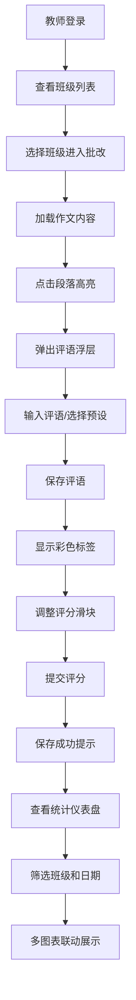

## 1. 产品概述

本产品是一个在线作文批改与评分统计可视化应用，旨在帮助教师高效完成作文批改工作，提供一致性的批改标准，并通过可视化图表让学生和教师直观了解评分分布。

- 解决问题：教师逐字校对和评语撰写耗时且缺乏一致性，学生难以直观看到修改和评分分布
- 目标用户：在线教育平台的教师和学生
- 市场价值：提升批改效率300%，提供数据驱动的教学改进依据

## 2. 核心功能

### 2.1 用户角色

| 角色 | 登录方式 | 核心权限 |
|------|----------|----------|
| 教师 | 账号登录 | 班级管理、作文批改、评分统计、数据导出 |
| 学生 | 账号登录 | 查看批改结果、评分统计图表 |

### 2.2 功能模块

1. **班级列表页**：班级卡片展示、学生人数统计、上次批改日期、进入批改页面
2. **作文批改页**：原文高亮批注、评语输入浮层、预设评语选择、评分滑块、评语分类统计
3. **统计仪表盘**：多维度评分图表、班级筛选、日期范围筛选、图表联动

### 2.3 页面详情

| 页面名称 | 模块名称 | 功能描述 |
|-----------|-------------|---------------------|
| 班级列表页 | 班级卡片网格 | 2行3列布局，显示班级名称、学生人数、上次批改日期，悬停上浮效果 |
| 班级列表页 | 顶部导航栏 | 品牌Logo、页面标题、用户信息、仪表盘入口 |
| 作文批改页 | 原文展示区 | 左侧60%宽度，暖白背景，衬线字体，段落编号圆点，分割线间隔 |
| 作文批改页 | 高亮批注系统 | 点击段落高亮、评语浮层、预设评语、彩色标签、悬停显示完整评语 |
| 作文批改页 | 评语统计面板 | 环形进度条展示正面/待改进比例，弧形动画，动态计数效果 |
| 作文批改页 | 评分面板 | 四维评分滑块（内容、语言、结构、创意），提交按钮波纹动画，成功提示 |
| 作文批改页 | 评语列表 | 右侧40%宽度，交替行背景色，编辑删除操作 |
| 统计仪表盘 | 筛选器区 | 班级下拉选择、日期范围选择器，选中项品牌色背景 |
| 统计仪表盘 | 柱状图区 | 各维度平均分对比，柱顶数值，按维度配色 |
| 统计仪表盘 | 饼图区 | 评分等级分布（优秀/良好/中等/待提升） |
| 统计仪表盘 | 雷达图区 | 学生得分与班级平均对比，双折线展示 |

## 3. 核心流程

### 主业务流程
教师登录系统 → 查看班级列表 → 选择班级进入批改 → 浏览作文原文 → 点击段落添加批注 → 输入评语并选择类型 → 调整四维评分滑块 → 提交评分 → 查看统计仪表盘 → 筛选分析数据

## 4. 用户界面设计

### 4.1 设计风格
- **主色调**：沉稳蓝 #1976d2，用于品牌、按钮、选中状态
- **辅助色**：嫩绿色 #4caf50（正面评价）、浅橙色 #ff9800（待改进）、浅黄色 #fff3cd（高亮背景）
- **背景色**：柔和灰 #f5f5f5（页面背景）、暖白色 #fffef5（原文区）、纯白色 #ffffff（批注区）
- **文字色**：深灰色 #333333（正文）、中灰色 #666666（辅助文字）
- **按钮样式**：圆角8px，品牌色背景，悬停变深蓝 #1565c0，点击波纹扩散动画
- **字体**：衬线体 Georgia（原文）、无衬线体系统字体（界面）
- **布局风格**：卡片式布局，清晰的模块分割，充足的留白
- **动效**：0.2-0.4秒过渡动画，毛玻璃效果（backdrop-filter: blur(6px)）

### 4.2 页面设计概述

| 页面名称 | 模块名称 | UI元素 |
|-----------|-------------|-------------|
| 班级列表页 | 班级卡片网格 | 2行3列网格，卡片悬停上浮4px，阴影加深，0.3秒过渡 |
| 班级列表页 | 卡片内容 | 班级名称（大号粗体）、学生人数（标签样式）、上次批改日期（浅灰色小字） |
| 作文批改页 | 原文展示区 | 左侧60%，暖白背景，Georgia字体18px，行高1.8，品牌色编号圆点，浅灰分割线 |
| 作文批改页 | 评语浮层 | 白色背景，圆角10px，0.2秒淡入动画，毛玻璃效果，输入框+预设标签+保存按钮 |
| 作文批改页 | 彩色标签 | 绿色/红色圆角小标签，悬停显示完整评语tooltip |
| 作文批改页 | 环形进度条 | 1秒弧形路径动画，动态数字计数，双色展示比例 |
| 作文批改页 | 评分滑块 | 1-10分范围，实时数值显示，品牌色轨道 |
| 作文批改页 | 评语列表 | 交替行背景色 #fafafa，编辑删除按钮整齐排列 |
| 统计仪表盘 | 筛选器 | 白色背景下拉框，选中项品牌色背景白色文字，日期选择器 |
| 统计仪表盘 | 柱状图 | 按维度配色，柱顶显示数值，悬停tooltip（深灰背景白字圆角6px） |
| 统计仪表盘 | 饼图 | 四等级配色，图例在右侧，悬停显示详细数据 |
| 统计仪表盘 | 雷达图 | 深蓝实线（学生）+浅灰虚线（班级平均），右上角图例 |

### 4.3 响应式设计
- **桌面端（≥900px）**：批改页左右布局，原文60% / 批注区40%，图表2x2网格
- **平板端（<900px）**：批改页上下布局，原文100%宽度在上，批注区固定高度可滚动在下
- **移动端（<600px）**：图表单列垂直排列，班级卡片单列布局，字号适当缩小
- **触摸优化**：按钮最小44x44px，滑块增大触摸区域，点击反馈清晰

### 4.4 动效与交互细节
- 页面加载：元素依次淡入，延迟50ms交错
- 卡片悬停：transform: translateY(-4px)，box-shadow加深，transition: all 0.3s ease
- 段落点击：背景色0.2秒过渡到#fff3cd
- 浮层出现：opacity从0到1，transform: translateY(10px)到0，0.2秒动画
- 环形进度条：stroke-dasharray动画，1秒内完成填充
- 数字计数：requestAnimationFrame实现平滑递增
- 提交按钮：点击时ripple波纹扩散效果
- 成功提示：从下往上滑入，1秒后自动淡出
- 图表悬停：tooltip淡入，元素微微放大高亮
