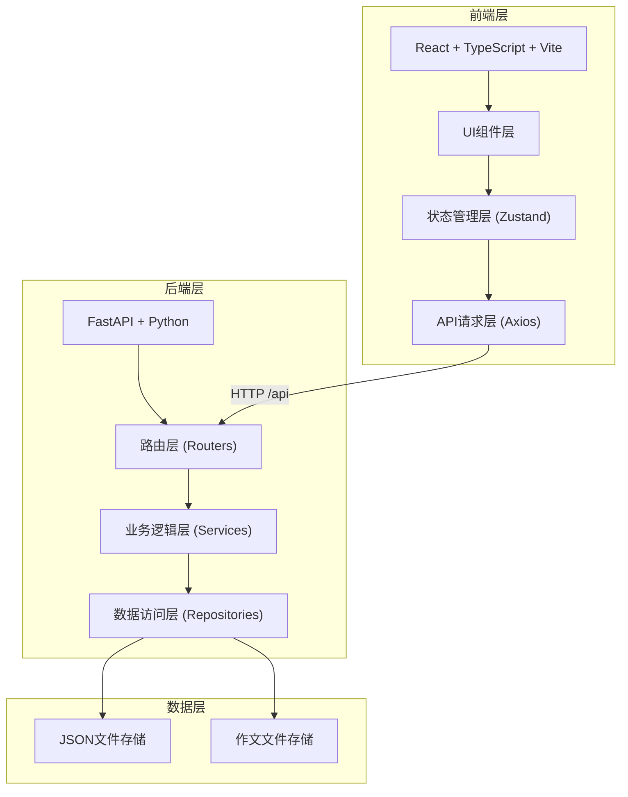
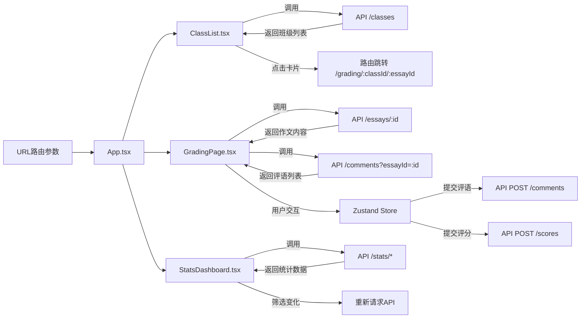
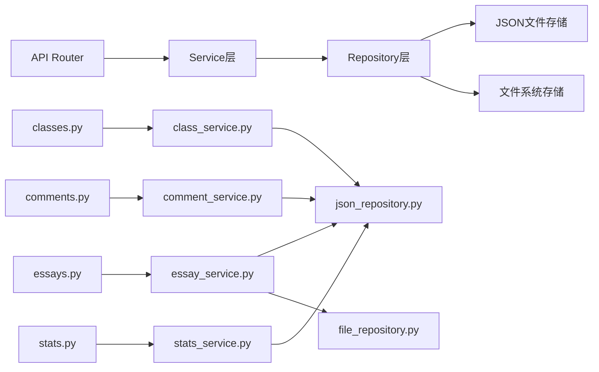

## 1. 架构设计

本应用采用前后端分离的三层架构，前端负责用户交互和数据可视化，后端提供RESTful API服务和文件存储，数据层采用文件存储模拟。



## 2. 技术描述

### 前端技术栈
- **框架**：React@18 + TypeScript@5
- **构建工具**：Vite@5
- **路由**：react-router-dom@6
- **状态管理**：zustand@4
- **HTTP客户端**：axios@1
- **图表库**：recharts@2
- **工具库**：uuid@9, dagre@0.8, jsdiff@5, highlight.js@11
- **样式方案**：CSS Modules + 全局CSS变量

### 后端技术栈
- **框架**：FastAPI@0.100+
- **Python**：3.10+
- **文件上传**：python-multipart
- **CORS支持**：fastapi.middleware.cors
- **数据存储**：本地JSON文件 + 文件系统

### 项目初始化方式
- 前端：使用 Vite 创建 React + TypeScript 项目
- 后端：使用 FastAPI 标准项目结构，Python pip 管理依赖

## 3. 目录结构

### 前端目录结构
```
src/
├── App.tsx                 # 路由定义和全局状态入口
├── main.tsx               # 应用入口
├── index.css              # 全局样式
├── pages/                 # 页面组件
│   ├── ClassList.tsx      # 班级列表页
│   ├── GradingPage.tsx    # 作文批改页
│   └── StatsDashboard.tsx # 统计仪表盘
├── components/            # 可复用组件
│   ├── ClassCard.tsx      # 班级卡片
│   ├── EssayParagraph.tsx # 作文段落组件
│   ├── CommentPopup.tsx   # 评语浮层
│   ├── CommentTag.tsx     # 评语标签
│   ├── CommentList.tsx    # 评语列表
│   ├── RingProgress.tsx   # 环形进度条
│   ├── ScoreSlider.tsx    # 评分滑块
│   ├── ScorePanel.tsx     # 评分面板
│   ├── BarChart.tsx       # 柱状图
│   ├── PieChart.tsx       # 饼图
│   └── RadarChart.tsx     # 雷达图
├── store/                 # 状态管理
│   └── useGradingStore.ts # 批改状态管理
├── api/                   # API请求
│   └── index.ts           # API接口定义
├── types/                 # TypeScript类型定义
│   └── index.ts           # 类型定义
└── utils/                 # 工具函数
    ├── animation.ts       # 动画工具
    └── format.ts          # 格式化工具
```

### 后端目录结构
```
backend/
├── main.py                # FastAPI应用入口
├── requirements.txt       # Python依赖
├── routers/               # 路由层
│   ├── classes.py         # 班级相关路由
│   ├── essays.py          # 作文相关路由
│   ├── comments.py        # 评语相关路由
│   └── stats.py           # 统计相关路由
├── services/              # 业务逻辑层
│   ├── class_service.py   # 班级业务逻辑
│   ├── essay_service.py   # 作文业务逻辑
│   ├── comment_service.py # 评语业务逻辑
│   └── stats_service.py   # 统计业务逻辑
├── repositories/          # 数据访问层
│   ├── file_repository.py # 文件存储操作
│   └── json_repository.py # JSON数据操作
├── models/                # 数据模型
│   └── schemas.py         # Pydantic模型定义
├── data/                  # 数据存储目录
│   ├── classes.json       # 班级数据
│   ├── essays.json        # 作文数据
│   ├── comments.json      # 评语数据
│   └── uploads/           # 上传文件目录
└── utils/                 # 工具函数
    └── mock_data.py       # Mock数据生成
```

## 4. 路由定义

### 前端路由
| 路由路径 | 页面组件 | 功能描述 |
|---------|---------|---------|
| `/` | ClassList | 班级列表页，展示所有班级卡片 |
| `/grading/:classId/:essayId` | GradingPage | 作文批改页，批改指定作文 |
| `/stats/:classId?` | StatsDashboard | 统计仪表盘，展示评分数据可视化 |

### 后端API路由
| HTTP方法 | API路径 | 功能描述 |
|---------|---------|---------|
| GET | `/api/classes` | 获取班级列表 |
| GET | `/api/classes/:id` | 获取班级详情 |
| GET | `/api/essays?classId=:id` | 获取指定班级的作文列表 |
| GET | `/api/essays/:id` | 获取作文详情（含内容） |
| POST | `/api/essays/upload` | 上传作文文件 |
| GET | `/api/comments?essayId=:id` | 获取作文的评语列表 |
| POST | `/api/comments` | 添加评语 |
| PUT | `/api/comments/:id` | 更新评语 |
| DELETE | `/api/comments/:id` | 删除评语 |
| POST | `/api/scores` | 提交评分 |
| GET | `/api/stats/overview?classId=:id` | 获取班级评分概览 |
| GET | `/api/stats/dimensions?classId=:id` | 获取各维度平均分 |
| GET | `/api/stats/distribution?classId=:id` | 获取评分等级分布 |
| GET | `/api/stats/student/:essayId` | 获取学生雷达图对比数据 |

## 5. 数据模型

### ER图
```mermaid
erDiagram
    CLASS ||--o{ ESSAY : contains
    ESSAY ||--o{ COMMENT : has
    ESSAY ||--|| SCORE : has
    
    CLASS {
        string id PK
        string name
        int studentCount
        date lastGradedDate
    }
    
    ESSAY {
        string id PK
        string classId FK
        string studentName
        string title
        string content
        string filePath
        datetime uploadTime
    }
    
    COMMENT {
        string id PK
        string essayId FK
        int paragraphIndex
        string content
        string type
        string presetType
        datetime createdAt
    }
    
    SCORE {
        string id PK
        string essayId FK
        int content
        int language
        int structure
        int creativity
        datetime gradedAt
    }
```

### TypeScript类型定义

```typescript
// 班级
interface Class {
  id: string;
  name: string;
  studentCount: number;
  lastGradedDate: string;
}

// 作文
interface Essay {
  id: string;
  classId: string;
  studentName: string;
  title: string;
  content: string;
  filePath?: string;
  uploadTime: string;
  paragraphs: string[];
}

// 评语
interface Comment {
  id: string;
  essayId: string;
  paragraphIndex: number;
  content: string;
  type: 'positive' | 'improvement';
  presetType?: string;
  createdAt: string;
}

// 评分
interface Score {
  id: string;
  essayId: string;
  content: number;
  language: number;
  structure: number;
  creativity: number;
  gradedAt: string;
}

// 统计数据
interface DimensionStats {
  dimension: string;
  average: number;
  color: string;
}

interface GradeDistribution {
  grade: string;
  count: number;
  color: string;
}

interface RadarData {
  dimension: string;
  student: number;
  classAverage: number;
}
```

### Pydantic模型定义（Python）

```python
from pydantic import BaseModel
from datetime import date, datetime
from typing import List, Optional

class ClassBase(BaseModel):
    name: str
    studentCount: int

class ClassCreate(ClassBase):
    pass

class Class(ClassBase):
    id: str
    lastGradedDate: Optional[date] = None
    class Config:
        from_attributes = True

class EssayBase(BaseModel):
    classId: str
    studentName: str
    title: str
    content: str

class EssayCreate(EssayBase):
    pass

class Essay(EssayBase):
    id: str
    filePath: Optional[str] = None
    uploadTime: datetime
    class Config:
        from_attributes = True

class CommentBase(BaseModel):
    essayId: str
    paragraphIndex: int
    content: str
    type: str
    presetType: Optional[str] = None

class CommentCreate(CommentBase):
    pass

class Comment(CommentBase):
    id: str
    createdAt: datetime
    class Config:
        from_attributes = True

class ScoreBase(BaseModel):
    essayId: str
    content: int
    language: int
    structure: int
    creativity: int

class ScoreCreate(ScoreBase):
    pass

class Score(ScoreBase):
    id: str
    gradedAt: datetime
    class Config:
        from_attributes = True
```

## 6. 数据流向与调用关系

### 前端数据流向



### 后端调用关系



## 7. 性能优化策略

### 前端性能优化
1. **高亮响应优化**：使用 CSS `transition` 而非 JavaScript 动画，确保高亮响应时间 < 100ms
2. **图表渲染优化**：
   - 使用 Recharts 的 `isAnimationActive` 控制动画，大数据集时禁用
   - 使用 `React.memo` 包裹图表组件，避免不必要重渲染
   - 图表数据预处理，减少渲染时计算
3. **状态管理优化**：Zustand 状态分片，避免全局状态更新导致全量重渲染
4. **虚拟滚动**：作文段落过多时使用虚拟滚动，减少DOM节点
5. **防抖节流**：筛选器变化时使用防抖，避免频繁API请求

### 后端性能优化
1. **数据缓存**：统计数据使用内存缓存，5分钟过期
2. **JSON文件读取优化**：使用 `functools.lru_cache` 缓存文件读取结果
3. **批量数据处理**：统计计算使用生成器和列表推导式，减少内存占用
4. **异步文件处理**：文件上传使用异步处理，避免阻塞主线程

## 8. API请求响应示例

### 获取班级列表 - 请求
```
GET /api/classes
```

### 获取班级列表 - 响应
```json
{
  "code": 200,
  "data": [
    {
      "id": "class-001",
      "name": "高三(1)班",
      "studentCount": 45,
      "lastGradedDate": "2024-01-15"
    },
    {
      "id": "class-002",
      "name": "高三(2)班",
      "studentCount": 42,
      "lastGradedDate": "2024-01-14"
    }
  ],
  "message": "success"
}
```

### 提交评分 - 请求
```
POST /api/scores
Content-Type: application/json

{
  "essayId": "essay-001",
  "content": 8,
  "language": 7,
  "structure": 9,
  "creativity": 6
}
```

### 提交评分 - 响应
```json
{
  "code": 200,
  "data": {
    "id": "score-001",
    "essayId": "essay-001",
    "content": 8,
    "language": 7,
    "structure": 9,
    "creativity": 6,
    "gradedAt": "2024-01-16T10:30:00Z"
  },
  "message": "评分提交成功"
}
```
