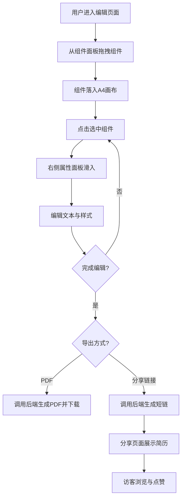

## 1. 产品概述

线上简历制作工具，让用户通过拖拽组件搭建个性化简历，支持导出PDF和生成分享链接。
- 解决传统简历制作流程繁琐、排版困难的问题，目标用户为求职者、学生及自由职业者
- 产品价值在于零门槛的可视化简历搭建体验，一键导出与分享降低传播成本

## 2. 核心功能

### 2.1 用户角色
| 角色 | 注册方式 | 核心权限 |
|------|----------|----------|
| 普通用户 | 无需注册 | 拖拽搭建简历、导出PDF、生成分享链接 |
| 访客 | 无需注册 | 浏览分享页面、查看浏览量、点赞 |

### 2.2 功能模块
1. **编辑页面**：组件面板、A4画布、属性编辑面板
2. **分享页面**：移动端优先的卡片式简历展示、浏览量统计、点赞

### 2.3 页面详情
| 页面名称 | 模块名称 | 功能描述 |
|----------|----------|----------|
| 编辑页面 | 组件面板 | 列出可拖拽组件类型（标题、经历、技能条、教育背景、项目列表），支持拖入画布 |
| 编辑页面 | A4画布 | 接收拖拽组件，管理组件位置和大小，支持自由移动和缩放，选中状态显示操作边框 |
| 编辑页面 | 属性面板 | 选中组件后侧边滑入，显示文本编辑和样式控件（字体、字号、颜色、背景色），实时预览 |
| 编辑页面 | 导出功能 | PDF导出（保持排版不变）和分享链接生成 |
| 分享页面 | 简历展示 | 移动端优先的卡片样式展示简历内容 |
| 分享页面 | 互动统计 | 浏览量统计和点赞按钮 |

## 3. 核心流程

用户打开编辑页面 → 从左侧组件面板拖拽组件到中间A4画布 → 点击组件在右侧属性面板编辑文本和样式 → 完成后导出PDF或生成分享链接 → 分享页面以卡片形式展示简历，访客可浏览和点赞

## 4. 用户界面设计

### 4.1 设计风格
- 主色调：低饱和度蓝灰（#6B7B8D）搭配白色（#FFFFFF）
- 辅助色：浅灰边框（#E2E8F0）、深灰文字（#334155）
- 按钮样式：圆角设计（border-radius: 8px~12px），柔和阴影
- 字体：Noto Sans SC（正文）、DM Serif Display（英文标题装饰）
- 布局风格：三栏式（左面板 + 中间画布 + 右属性面板）
- 动效：拖拽弹性动画、平滑阴影跟随、组件悬停浅色操作边框、属性面板侧边滑入、按钮涟漪反馈

### 4.2 页面设计概览
| 页面名称 | 模块名称 | UI元素 |
|----------|----------|--------|
| 编辑页面 | 组件面板 | 左侧固定宽度240px，组件卡片列表，拖拽手柄图标，悬停微弹效果 |
| 编辑页面 | A4画布 | 中间区域居中，A4比例(210:297)，浅灰背景，组件选中时蓝色虚线边框+缩放手柄 |
| 编辑页面 | 属性面板 | 右侧滑入宽度280px，表单控件（字体选择器、颜色选择器、字号滑块），平滑过渡动画 |
| 编辑页面 | 顶部工具栏 | 导出PDF按钮、分享按钮、撤销/重做，圆角按钮+涟漪反馈 |
| 分享页面 | 简历卡片 | 移动端优先，卡片式布局，圆角阴影，响应式自适应 |
| 分享页面 | 互动区域 | 浏览量数字显示、心形点赞按钮+动画 |

### 4.3 响应式设计
- 桌面端（≥1024px）：三栏布局，画布居中显示
- 平板端（768px~1023px）：组件面板收起为抽屉，画布缩小适配，属性面板浮层显示
- 移动端（<768px）：单栏布局，组件面板和属性面板均为底部抽屉，画布可滚动

### 4.4 性能目标
- 拖拽操作保持60fps
- PDF生成时间不超过3秒
- 首屏加载时间不超过2秒
