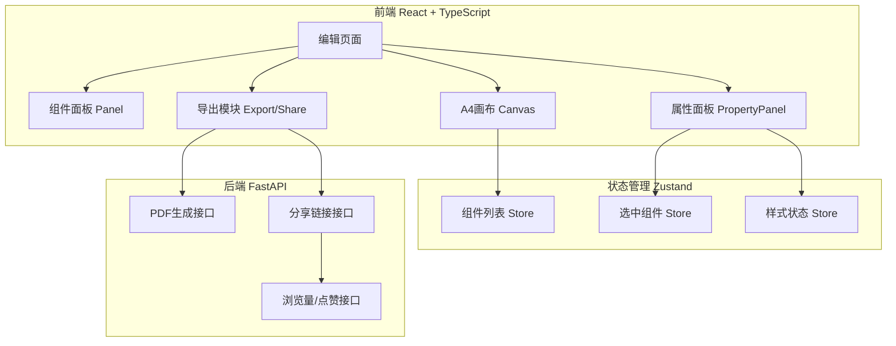
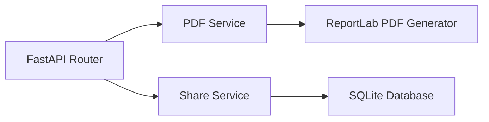
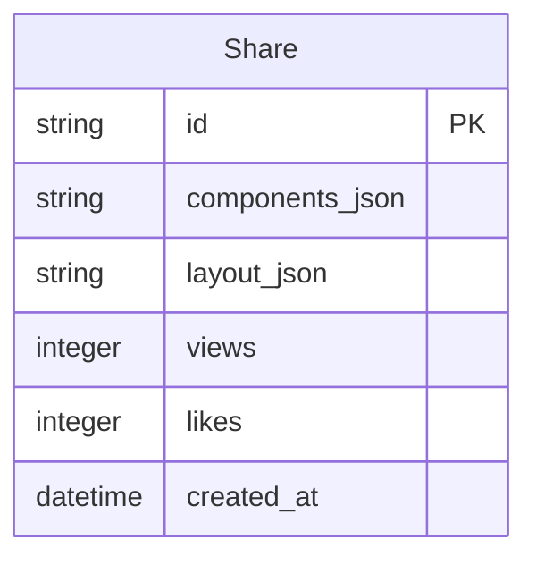

## 1. 架构设计



## 2. 技术说明
- 前端：React@18 + TypeScript + Vite + TailwindCSS + Zustand
- 初始化工具：vite-init（react-ts模板）
- 拖拽库：react-dnd + react-dnd-html5-backend
- PDF渲染：@react-pdf/renderer
- HTTP客户端：axios
- 后端：FastAPI + reportlab（PDF生成）
- 数据库：SQLite（分享链接、浏览量、点赞数据存储）
- 路由：react-router-dom

## 3. 路由定义
| 路由 | 用途 |
|------|------|
| / | 编辑页面，包含组件面板、画布、属性面板 |
| /share/:id | 分享页面，展示简历卡片、浏览量、点赞 |

## 4. API定义

### 4.1 PDF生成接口
```
POST /api/export/pdf
Request: { components: ResumeComponent[], layout: { width: number, height: number } }
Response: PDF文件流（application/pdf）
```

### 4.2 分享链接接口
```
POST /api/share
Request: { components: ResumeComponent[], layout: { width: number, height: number } }
Response: { share_id: string, share_url: string }
```

### 4.3 获取分享内容接口
```
GET /api/share/{share_id}
Response: { components: ResumeComponent[], layout: { width: number, height: number }, views: number, likes: number }
```

### 4.4 点赞接口
```
POST /api/share/{share_id}/like
Response: { likes: number }
```

### 4.5 浏览量接口
```
POST /api/share/{share_id}/view
Response: { views: number }
```

### 4.6 TypeScript类型定义
```typescript
interface ResumeComponent {
  id: string;
  type: 'heading' | 'experience' | 'skill-bar' | 'education' | 'project-list';
  x: number;
  y: number;
  width: number;
  height: number;
  content: string;
  style: ComponentStyle;
}

interface ComponentStyle {
  fontFamily: string;
  fontSize: number;
  color: string;
  backgroundColor: string;
  fontWeight: string;
}

interface ResumeLayout {
  width: number;
  height: number;
}
```

## 5. 服务端架构图



## 6. 数据模型

### 6.1 数据模型定义



### 6.2 数据定义语言
```sql
CREATE TABLE shares (
    id TEXT PRIMARY KEY,
    components_json TEXT NOT NULL,
    layout_json TEXT NOT NULL,
    views INTEGER DEFAULT 0,
    likes INTEGER DEFAULT 0,
    created_at TIMESTAMP DEFAULT CURRENT_TIMESTAMP
);
```
