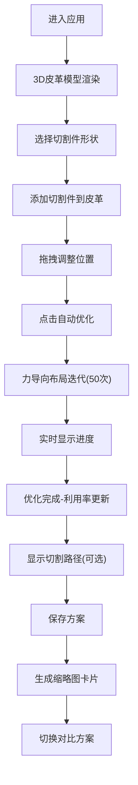

## 1. 产品概述

3D皮革切割排版与排样优化预览应用，为皮革加工行业提供直观的三维可视化排样工具，帮助用户在三维空间中规划切割方案、优化材料利用率、预览切割路径。

- 主要用途：皮革切割方案的3D可视化设计、智能排样优化、切割路径预览
- 解决问题：传统2D排样无法直观展示皮革纹理和缺陷、材料利用率低、方案对比困难
- 目标用户：皮革加工厂设计师、皮具制造商、裁切工艺工程师
- 产品价值：提升材料利用率15%-30%，减少废料产生，缩短方案设计周期

## 2. 核心功能

### 2.1 用户角色

| 角色 | 注册方式 | 核心权限 |
|------|----------|----------|
| 设计师用户 | 无需注册，直接使用 | 完整的排样设计、优化、保存和导出功能 |

### 2.2 功能模块

1. **3D皮革模型展示模块**：三维皮革模型渲染、纹理模拟、视角控制
2. **切割件管理模块**：切割件选择、添加、拖拽、旋转、缩放
3. **智能排样优化模块**：力导向布局算法、50次迭代优化、碰撞检测
4. **切割路径可视化模块**：3D路径动画、2D展开图、流光效果
5. **方案管理模块**：方案保存、缩略图预览、快速切换、方案对比
6. **统计分析模块**：材料利用率计算、实时数据展示、优化进度动画

### 2.3 页面详情

| 页面名称 | 模块名称 | 功能描述 |
|---------|---------|----------|
| 主应用页面 | 3D场景区域 | 皮革模型渲染、切割件交互、视角控制（旋转/缩放/平移） |
| 主应用页面 | 控制面板 | 切割件选择、参数调整（缩放/旋转/密度）、操作按钮 |
| 主应用页面 | 统计面板 | 利用率显示、优化进度条、迭代次数动画 |
| 主应用页面 | 方案管理条 | 已保存方案缩略图、快速切换、水平滚动 |
| 主应用页面 | 2D展开视窗 | 切割路径2D视图、网格背景、路径绘制 |

## 3. 核心流程

用户进入应用后，首先看到带有自然纹理的3D皮革模型。从右侧面板选择切割件形状，点击添加到皮革表面，可拖拽调整位置。点击"自动优化"按钮，系统通过力导向算法进行50次迭代优化，实时显示进度。优化完成后查看利用率，可勾选"显示切割路径"预览切割动画。满意后保存方案，底部生成缩略图卡片，可随时切换对比不同方案。

## 4. 用户界面设计

### 4.1 设计风格
- **设计基调**：工业科技感，高精度工具风格，深色主题
- **主色调**：深灰渐变背景(#2a2a2a到#1a1a1a)，皮革暖棕(#8b5e3c)和米色(#d2b48c)
- **强调色**：翠绿色(#00ff88)用于交互反馈，青绿色(#00aa88)用于主按钮
- **警示色**：红色(#ff4444)用于碰撞提示和切割路径
- **字体**：标题使用Space Grotesk，正文使用Inter，数字显示使用JetBrains Mono
- **按钮样式**：圆角8px，悬停缩放1.02倍，点击缩放0.98倍，带平滑过渡
- **图标**：使用lucide-react线性图标，保持统一的2px描边

### 4.2 页面设计概览

| 页面名称 | 模块名称 | UI元素 |
|---------|---------|--------|
| 主应用 | 3D场景区域 | 透视相机、OrbitControls、皮革网格、线框叠加、半透明切割件 |
| 主应用 | 控制面板 | 毛玻璃背景(backdrop-filter: blur(12px))、4列切割件图标网格、自定义滑条、操作按钮组 |
| 主应用 | 利用率显示 | 32px大字、白色、text-shadow、右下角浮动、数字滚动动画 |
| 主应用 | 方案条 | 底部固定、深色半透明、水平滚动、卡片悬停放大 |
| 主应用 | 2D视窗 | 左下角固定、深色网格背景、白色路径线、圆角边框 |

### 4.3 动画与交互
- 页面加载：皮革模型淡入(0.8s ease-out)，控制面板滑入(0.5s cubic-bezier(0.25, 0.1, 0.25, 1))
- 切割件添加：缩放弹性动画(scale 0→1，bounce效果)
- 拖拽：辅助对齐线(水平/垂直虚线#00ff88)，碰撞时红色边框闪烁
- 优化过程：进度条颜色渐变(红→绿)，数字滚动动画(0%→最终值)
- 方案切换：3D场景淡入淡出(0.6s cross-fade)
- 切割路径：流光动画(2s循环，渐变#ff4444→#ff8844)

### 4.4 响应式设计
- **桌面端**(>768px)：左侧70% 3D场景，右侧280px控制面板
- **移动端**(≤768px)：3D场景全屏，控制面板折叠为底部抽屉，上滑展开
- **触摸优化**：双指缩放旋转，长按拖拽，增大按钮点击区域至48px

### 4.5 3D场景指导
- **环境**：深灰渐变背景(#2a2a2a→#1a1a1a)，柔和环境光+方向光
- **光照**：AmbientLight(0xffffff, 0.4) + DirectionalLight(0xffffff, 0.8, position: [5, 10, 7])
- **相机**：PerspectiveCamera，fov 50，position [0, 3, 5]，lookAt [0, 0, 0]
- **材质**：皮革使用MeshStandardMaterial，带法线贴图和粗糙度贴图模拟纹理
- **后处理**：轻微Bloom效果增强发光路径，FXAA抗锯齿
- **性能**：30个切割件以内保持60FPS，使用InstancedMesh优化渲染

## 5. 非功能需求

### 5.1 性能要求
- 3D场景稳定60FPS
- 30个切割件时拖拽无卡顿
- 50次迭代优化≤2秒完成
- 首次加载≤3秒

### 5.2 视觉要求
- 所有过渡动画0.3s cubic-bezier(0.25, 0.1, 0.25, 1)
- 毛玻璃效果backdrop-filter: blur(12px)
- 按钮悬停/点击反馈一致
- 深色调中确保文字对比度≥4.5:1
