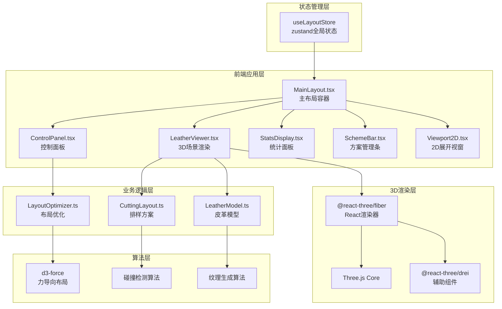

## 1. 架构设计



## 2. 技术栈描述

| 层级 | 技术选型 | 版本 | 用途 |
|------|----------|------|------|
| 基础框架 | React | ^18.2.0 | 用户界面构建 |
| 语言 | TypeScript | ^5.3.0 | 类型安全 |
| 构建工具 | Vite | ^5.0.0 | 快速构建与HMR |
| 3D引擎 | Three.js | ^0.160.0 | 3D图形渲染 |
| React-3D绑定 | @react-three/fiber | ^8.15.0 | React方式声明3D场景 |
| 3D辅助库 | @react-three/drei | ^9.92.0 | 常用3D组件封装 |
| 3D类型 | @types/three | ^0.160.0 | Three.js类型定义 |
| 布局算法 | d3-force | ^3.0.0 | 力导向布局优化 |
| 状态管理 | zustand | ^4.4.0 | 轻量级全局状态 |
| 样式 | Tailwind CSS | ^3.4.0 | 原子化CSS |
| 图标 | lucide-react | ^0.294.0 | 线性图标库 |

## 3. 目录结构

```
d:\P\tasks\auto70\
├── .trae/
│   └── documents/
│       ├── prd.md
│       └── tech-arch.md
├── src/
│   ├── modules/
│   │   ├── leather/
│   │   │   ├── LeatherModel.ts      # 皮革模型数据结构与材质
│   │   │   └── LeatherViewer.ts     # 3D场景渲染与交互
│   │   └── cutting/
│   │       ├── CuttingLayout.ts     # 排样方案数据结构
│   │       └── LayoutOptimizer.ts   # 力导向布局优化算法
│   ├── components/
│   │   ├── MainLayout.tsx           # 主布局容器
│   │   ├── ControlPanel.tsx         # 右侧控制面板
│   │   ├── StatsDisplay.tsx         # 利用率与进度显示
│   │   ├── SchemeBar.tsx            # 底部方案管理条
│   │   ├── Viewport2D.tsx           # 2D展开视窗
│   │   ├── CuttingPiece.tsx         # 3D切割件组件
│   │   └── CuttingPath.tsx          # 切割路径动画组件
│   ├── store/
│   │   └── useLayoutStore.ts        # zustand全局状态
│   ├── types/
│   │   └── index.ts                 # 全局类型定义
│   ├── utils/
│   │   ├── textureGenerator.ts      # 纹理生成工具
│   │   └── collision.ts             # 碰撞检测工具
│   ├── App.tsx                      # 应用入口
│   ├── main.tsx                     # 渲染入口
│   └── index.css                    # 全局样式
├── index.html                       # HTML入口
├── vite.config.ts                   # Vite配置
├── tsconfig.json                    # TypeScript配置
├── tailwind.config.js               # Tailwind配置
├── postcss.config.js                # PostCSS配置
└── package.json                     # 项目依赖
```

## 4. 数据模型定义

### 4.1 核心类型定义

```typescript
// 切割件形状类型
type PieceShape = 'rectangle' | 'circle' | 'triangle' | 'hexagon' | 'pentagon' | 'irregular';

// 切割件实例
interface CuttingPiece {
  id: string;
  shape: PieceShape;
  position: { x: number; y: number };
  rotation: number;
  scale: number;
  width: number;
  height: number;
  color: string;
  isColliding: boolean;
  isDragging: boolean;
}

// 皮革缺陷（疤痕/毛孔）
interface LeatherDefect {
  id: string;
  type: 'scar' | 'porosity' | 'wrinkle';
  position: { x: number; y: number };
  radius: number;
  severity: number;
}

// 排样方案
interface LayoutScheme {
  id: string;
  name: string;
  pieces: CuttingPiece[];
  utilization: number;
  thumbnail: string;
  createdAt: number;
}

// 皮革材质属性
interface LeatherMaterial {
  baseColor: string;
  secondaryColor: string;
  roughness: number;
  metalness: number;
  normalScale: number;
}

// 优化进度
interface OptimizationProgress {
  currentIteration: number;
  totalIterations: number;
  currentUtilization: number;
  isRunning: boolean;
}

// 全局应用状态
interface LayoutState {
  pieces: CuttingPiece[];
  selectedPieceId: string | null;
  leatherMaterial: LeatherMaterial;
  defects: LeatherDefect[];
  schemes: LayoutScheme[];
  currentSchemeId: string | null;
  showCuttingPath: boolean;
  optimizationProgress: OptimizationProgress;
  utilization: number;
  params: {
    scaleRatio: number;
    rotationAngle: number;
    layoutDensity: number;
  };
}
```

### 4.2 状态操作方法

```typescript
// zustand store actions
interface LayoutActions {
  addPiece: (shape: PieceShape) => void;
  removePiece: (id: string) => void;
  updatePiece: (id: string, updates: Partial<CuttingPiece>) => void;
  selectPiece: (id: string | null) => void;
  setParams: (params: Partial<LayoutState['params']>) => void;
  toggleCuttingPath: () => void;
  runOptimization: () => Promise<void>;
  saveScheme: () => void;
  loadScheme: (id: string) => void;
  deleteScheme: (id: string) => void;
  clearAll: () => void;
  calculateUtilization: () => number;
}
```

## 5. 核心算法说明

### 5.1 力导向布局优化算法
- 使用d3-force的forceSimulation
- 力类型：collide(碰撞排斥)、center(中心吸引)、x/y(边界约束)
- 迭代50次，每次迭代后更新位置
- 使用requestAnimationFrame分片计算，不阻塞主线程
- 碰撞检测使用SAT(分离轴定理)算法处理多边形

### 5.2 材料利用率计算
```
利用率 = (所有切割件面积之和) / (皮革有效面积 - 缺陷面积) × 100%
```

### 5.3 皮革纹理生成
- 使用Perlin噪声生成基础纹理
- 叠加随机分布的毛孔点
- 添加随机疤痕线条
- 生成法线贴图增强3D质感

### 5.4 碰撞检测
- 矩形：AABB碰撞检测
- 圆形：圆心距离检测
- 多边形：SAT分离轴定理
- 缺陷避让：距离缺陷中心>缺陷半径

## 6. 性能优化策略

1. **3D渲染优化**
   - 使用InstancedMesh渲染多个切割件
   - 纹理尺寸限制在1024×1024
   - 开启frustumCulling
   - 合理设置pixelRatio(≤2)

2. **计算优化**
   - 力导向迭代使用requestAnimationFrame分片
   - 碰撞检测使用空间划分网格(Broad Phase)
   - 利用率计算防抖处理

3. **状态更新**
   - zustand状态选择器优化重渲染
   - 拖拽使用useRef避免频繁setState
   - 动画使用useFrame而非React状态

4. **资源优化**
   - 纹理按需生成，使用Canvas生成后释放
   - 方案缩略图压缩至200×120
   - 懒加载非关键组件
