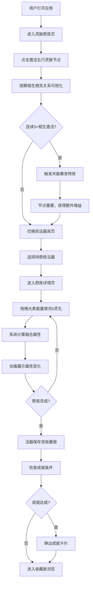

## 1. 产品概述

元素灵脉共振与法器祭炼模拟器是一款面向手游玩家的在线教育娱乐应用，通过可视化交互帮助玩家直观理解五行（金、木、水、火、土）元素间相生相克关系，并模拟法器祭炼过程中元素能量融合的效果。

- **核心目标**：降低玩家对复杂元素系统的理解门槛，提供沉浸式的法器养成模拟体验
- **目标用户**：修仙/玄幻题材手游玩家、游戏爱好者、对五行文化感兴趣的用户
- **市场价值**：填补手游辅助工具在元素系统可视化教育领域的空白，提升玩家游戏策略制定能力

---

## 2. 核心功能

### 2.1 用户角色

| 角色 | 注册方式 | 核心权限 |
|------|----------|----------|
| 普通用户 | 无需注册，本地存储 | 使用全部功能、保存收藏数据、触发成就 |

### 2.2 功能模块

1. **灵脉祭炼页面**：五行灵脉节点圆形布局、节点激活交互、相生相克连线可视化、能量平衡环形进度条
2. **法器库页面**：法器4列响应式网格展示、法器类型分类（剑/鼎/幡/珠/镜/符）、基础属性展示
3. **祭炼详情页**：法器3D/图标展示、6灵孔拖拽填充、元素能量流光特效、属性融合计算动画
4. **收藏册页面**：书架式布局展示、法器浮雕格子、成就弹窗系统、详细属性浮层

### 2.3 页面详情

| 页面名称 | 模块名称 | 功能描述 |
|----------|----------|----------|
| 灵脉祭炼页 | 灵脉节点系统 | 5元素节点圆形布局，点击激活触发脉冲动画，相生节点亮，相克节点闪烁警告 |
| 灵脉祭炼页 | 能量连线系统 | 相生线绿色高亮实线，相克线红色虚线，根据节点状态动态变化 |
| 灵脉祭炼页 | 环形进度条 | 每个节点周围环形进度条实时显示能量平衡百分比 |
| 灵脉祭炼页 | 共振爆发系统 | 连续3+相生节点激活时触发5秒爆发特效，额外提升法器属性5% |
| 法器库页 | 法器网格 | 4列响应式布局（1440px/768px/480px断点），卡片悬停上浮动画 |
| 祭炼详情页 | 灵孔拖拽系统 | 拖拽元素能量到6个灵孔，流光粒子轨迹动画，元素光晕填充 |
| 祭炼详情页 | 属性计算 | 主属性×1.5，相生+20%，相克-15%，200ms内响应更新 |
| 祭炼详情页 | 法器动画 | 每次填充后轻微旋转，全息混合光效，Canvas能量波纹 |
| 收藏册页 | 书架展示 | 深色木纹背景，圆形浮雕格子，镀金渐变边框 |
| 收藏册页 | 成就系统 | 集齐5元素、累计10次爆发等条件触发，滑入弹窗5秒自动淡出 |
| 收藏册页 | 浮层展示 | 悬停放大1.1倍，毛玻璃背景浮层展示详细属性 |

---

## 3. 核心流程

---

## 4. 用户界面设计

### 4.1 设计风格

- **主色调**：深空紫 `#1a0a2e` → 墨蓝 `#0d1b2a` 径向渐变背景
- **辅助色**：
  - 金：`#ffd700`（齿轮）
  - 木：`#4ade80`（嫩芽）
  - 水：`#3b82f6`（波浪）
  - 火：`#ef4444`（火焰）
  - 土：`#a16207`（山峰）
  - 相生线：绿色高亮 `#22c55e`
  - 相克线：红色虚线 `#ef4444`
- **装饰色**：镀金渐变 `#cda434` → `#8b6914`，浅金文字 `#f5e6a3`
- **按钮风格**：圆角16px，半透明气泡卡片 `rgba(255,255,255,0.06)`，边框 `rgba(255,215,0,0.3)` 1px
- **字体**：标题-圆角无衬线渐变字（#ffdf00→#ff8800），正文-深色背景适配无衬线字体
- **布局风格**：顶部磨砂半透明导航栏（backdrop-filter: blur(12px)），主区域卡片式布局
- **动画风格**：弹簧收缩（0.95倍→恢复）、上浮平移8px、横向滑动过渡0.4s easeInOut、clip-path圆环过渡

### 4.2 页面设计概览

| 页面名称 | 模块名称 | UI元素描述 |
|----------|----------|------------|
| 灵脉祭炼页 | 导航栏 | 磨砂半透明，三标签页，切换横向滑动过渡 |
| 灵脉祭炼页 | 节点区域 | 半透明气泡卡片容器，5节点圆形布局，脉冲光环0.6s |
| 灵脉祭炼页 | 能量系统 | 相生绿实线、相克红虚线、环形进度条、数字滚动特效 |
| 法器库页 | 网格容器 | 4列响应式，卡片悬停上浮8px+金色阴影 |
| 法器库页 | 法器卡片 | SVG/缩小3D模型、五行属性标签、攻防速数值 |
| 祭炼详情页 | 法器展示区 | 大尺寸图标、6灵孔环绕、流光粒子、旋转动画 |
| 祭炼详情页 | 元素拖拽区 | 已激活元素能量球、拖拽流光轨迹 |
| 祭炼详情页 | 属性面板 | 基础/新属性对比，数值变化动画，增益衰减标注 |
| 收藏册页 | 书架背景 | 深色木纹#3e2723，分层搁板 |
| 收藏册页 | 法器格子 | 圆形浮雕，镀金边框，悬停放大1.1 |
| 收藏册页 | 成就卡片 | 右侧滑入，金色边框+红色绶带，5秒自动淡出 |
| 收藏册页 | 详情浮层 | 毛玻璃模糊，浅金文字#f5e6a3 |

### 4.3 响应式设计

- **桌面优先（1440px+）**：法器库4列布局，灵脉节点区600px直径圆形
- **平板（768px-1439px）**：法器库2列布局，节点区480px直径，导航栏标签缩小
- **移动端（<480px）**：法器库1列布局，节点区360px直径，灵孔环绕布局调整为上下堆叠

### 4.4 Canvas特效指引

- **环境**：法器能量波纹叠加层，半透明流动纹理
- **光源**：节点激活时径向渐变光晕，共振爆发时全屏白色冲击波
- **粒子系统**：拖拽元素时流光粒子轨迹，爆发时金色闪光粒子扩散
- **性能预算**：所有动画稳定60fps，多节点激活计算响应≤100ms
