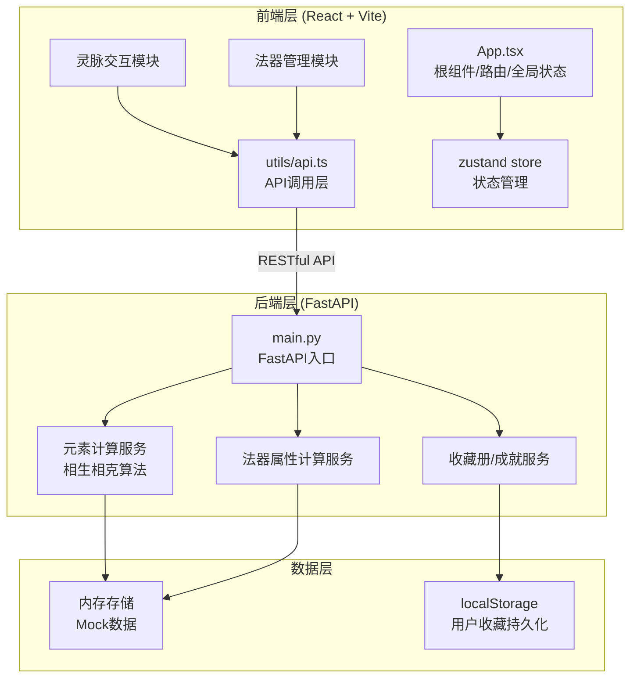
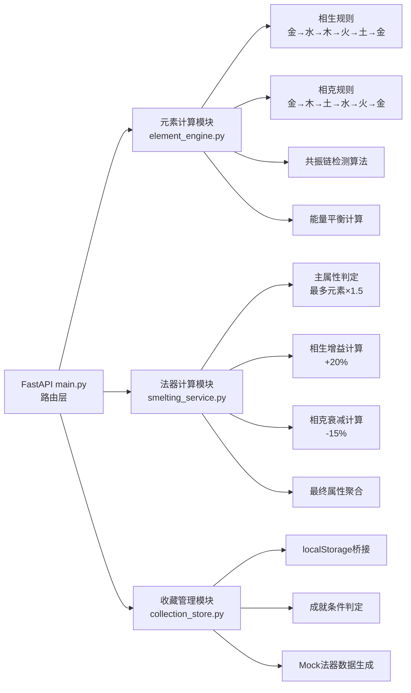

## 1. 架构设计



---

## 2. 技术栈说明

- **前端框架**：React@18 + TypeScript@5 + Vite@5
- **构建工具**：Vite（React + TypeScript模板）
- **状态管理**：zustand@4（轻量级状态管理）
- **路由管理**：react-router-dom@6
- **HTTP客户端**：axios@1（统一错误处理）
- **后端框架**：FastAPI@0.100+ + Uvicorn
- **工具库**：uuid（唯一ID生成）、dayjs（时间处理）
- **CSS方案**：原生CSS + CSS变量 + Tailwind@3（响应式工具类）

---

## 3. 路由定义

| 路由 | 页面/组件 | 用途 |
|------|-----------|------|
| `/` | 灵脉祭炼页（VeinNode + EnergyCircle） | 主界面，五行节点交互与共振 |
| `/artifacts` | 法器库页 | 展示所有法器卡片，响应式网格 |
| `/smelt/:artifactId` | 祭炼详情页（ArtifactSmelter） | 法器祭炼核心，灵孔拖拽与属性计算 |
| `/collection` | 收藏册页（CollectionBook） | 书架展示收藏法器与成就系统 |

---

## 4. API定义

### 4.1 TypeScript类型定义

```typescript
export type ElementType = 'metal' | 'wood' | 'water' | 'fire' | 'earth';

export interface VeinNodeState {
  id: ElementType;
  name: string;
  symbol: string;
  color: string;
  isActive: boolean;
  energy: number;        // 0-100
  energyBalance: Record<ElementType, number>;  // 与其他节点平衡百分比
}

export type ArtifactType = 'sword' | 'ding' | 'banner' | 'pearl' | 'mirror' | 'talisman';

export interface BaseArtifact {
  id: string;
  name: string;
  type: ArtifactType;
  icon: string;          // SVG路径或标识
  baseElement: ElementType;
  baseStats: {
    attack: number;
    defense: number;
    speed: number;
  };
}

export interface SmeltedArtifact extends BaseArtifact {
  smeltedId: string;
  soulHoles: (ElementType | null)[];  // 6个灵孔
  finalStats: {
    attack: number;
    defense: number;
    speed: number;
  };
  mainElement: ElementType;
  bonuses: Record<ElementType, number>;  // 每个元素增益/衰减率
  smeltedAt: string;
  resonationBoost: number;  // 共振爆发额外加成
}

export interface ResonationResult {
  chainLength: number;
  isBurst: boolean;
  totalEnergyOutput: number;
  burstNodes: ElementType[];
  boostPercent: number;
}

export interface Achievement {
  id: string;
  name: string;
  description: string;
  icon: string;
  isUnlocked: boolean;
  unlockedAt?: string;
  conditions: {
    type: 'collect_elements' | 'resonation_count' | 'smelt_count';
    target: number;
    current: number;
  };
}
```

### 4.2 API端点定义

| 方法 | 路径 | 请求体 | 响应 | 用途 |
|------|------|--------|------|------|
| POST | `/api/vein/activate` | `{ nodeId: ElementType, currentStates: VeinNodeState[] }` | `{ nodes: VeinNodeState[], resonation?: ResonationResult }` | 激活灵脉节点，计算能量传播 |
| POST | `/api/vein/resonate` | `{ activeNodes: ElementType[] }` | `ResonationResult` | 检查并触发共振爆发 |
| GET | `/api/artifacts` | - | `BaseArtifact[]` | 获取法器库列表 |
| GET | `/api/artifacts/:id` | - | `BaseArtifact` | 获取单法器详情 |
| POST | `/api/smelt/calculate` | `{ artifactId, soulHoles: ElementType[], resonationBoost: number }` | `{ mainElement, finalStats, bonuses }` | 计算祭炼后属性 |
| POST | `/api/smelt/save` | `SmeltedArtifact` | `{ success: boolean, smeltedId }` | 保存祭炼成品到收藏册 |
| GET | `/api/collection` | - | `SmeltedArtifact[]` | 获取用户收藏册 |
| GET | `/api/achievements` | - | `Achievement[]` | 获取成就列表与进度 |
| POST | `/api/achievements/check` | `{ collection: SmeltedArtifact[], resonationCount: number }` | `{ newlyUnlocked: Achievement[] }` | 检查成就解锁条件 |

---

## 5. 后端服务架构



---

## 6. 数据模型

### 6.1 ER关系图

```mermaid
erDiagram
    BASE_ARTIFACT {
        string id PK
        string name
        string type
        string base_element
        int base_attack
        int base_defense
        int base_speed
        string icon
    }
    
    SMELTED_ARTIFACT {
        string smelted_id PK
        string artifact_id FK
        string main_element
        string soul_holes JSON
        int final_attack
        int final_defense
        int final_speed
        string bonuses JSON
        float resonation_boost
        datetime smelted_at
    }
    
    ACHIEVEMENT {
        string id PK
        string name
        string description
        boolean is_unlocked
        datetime unlocked_at
        string condition_type
        int condition_target
        int condition_current
    }
    
    VEIN_NODE_CACHE {
        string session_id PK
        string node_states JSON
        int active_chain_length
        int total_resonation_count
    }
    
    BASE_ARTIFACT ||--o{ SMELTED_ARTIFACT : "被祭炼为"
```

### 6.2 核心算法规则

**五行相生链（生成关系）**：
- 金 → 水（金生水）
- 水 → 木（水生木）
- 木 → 火（木生火）
- 火 → 土（火生土）
- 土 → 金（土生金）

**五行相克链（制约关系）**：
- 金 → 木（金克木）
- 木 → 土（木克土）
- 土 → 水（土克水）
- 水 → 火（水克火）
- 火 → 金（火克金）

**共振爆发判定**：
- 在激活顺序中搜索长度≥3的连续相生子序列
- 例：金→水→木（长度3 ✓），火→土→金→水（长度4 ✓）

**属性计算公式**：
```
主元素系数 = 1.5（仅主元素对应属性）
相生加成 = 每个相生元素对对应属性 +20%
相克减成 = 每个相克元素对对应属性 -15%
最终值 = 基础值 × (主元素系数?主元素:1.0) × Σ(元素系数) × (1 + 共振加成%)
```

**元素属性映射**：
- 金 → 攻击
- 木 → 生命/防御
- 水 → 速度
- 火 → 暴击/攻击
- 土 → 防御/抗性
