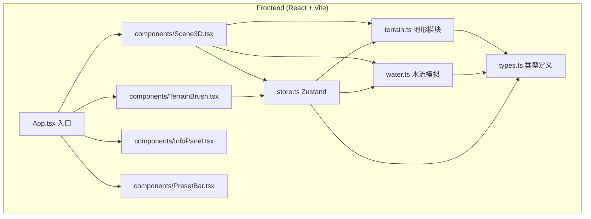

## 1. 架构设计



## 2. 技术描述
- **前端框架**：React@18 + TypeScript@5 + Vite@5
- **3D渲染**：three@0.160 + @react-three/fiber@8 + @react-three/drei@9
- **状态管理**：zustand@4
- **样式方案**：原生CSS + CSS变量（无Tailwind依赖，保持轻量）
- **初始化工具**：vite-init react-ts 模板

## 3. 路由定义
| 路由 | 用途 |
|-----|------|
| / | 主场景，单页应用无路由 |

## 4. 数据模型

### 4.1 类型定义 (types.ts)

```typescript
export type BrushType = 'raise' | 'lower' | 'smooth';
export type BrushShape = 'circle' | 'square';
export type PresetType = 'plain' | 'mountain' | 'basin';

export interface TileHeightMap {
  size: number;          // 网格大小，默认20
  heights: number[][];   // height[y][x] 顶点高度矩阵
}

export interface FlowParticle {
  id: number;
  position: { x: number; y: number; z: number };
  pathIndex: number;
  speed: number;
}

export interface BrushState {
  type: BrushType;
  shape: BrushShape;
  strength: number;       // 1-10
  radius: number;         // 影响格子半径
}

export interface WaterState {
  startPoint: { x: number; z: number } | null;
  path: { x: number; z: number }[];
  particles: FlowParticle[];
}
```

### 4.2 Zustand Store (store.ts)

```
State:
  - heightMap: TileHeightMap
  - brush: BrushState
  - water: WaterState
  - mouseGridPos: { x: number; z: number; height: number } | null

Actions:
  - modifyTerrain(centerX, centerZ): 应用笔刷修改地形（支持smooth）
  - setBrushType(type), setBrushShape(shape), setBrushStrength(n)
  - setWaterStart(x, z): 设置水流起点并计算路径
  - updateParticles(delta): 每帧更新粒子位置
  - applyPreset(preset): 2秒平滑过渡到预设地形
  - resetTerrain(): 恢复初始地形
  - setMouseGridPos(pos): 更新鼠标拾取坐标
```

## 5. 核心模块说明

### terrain.ts
- `generateInitialHeightMap(size)`: 中心高边缘低的初始高度
- `buildGeometry(heightMap)`: 根据高度矩阵生成 PlaneBufferGeometry（顶点向上为Y）
- `updateVertexPositions(geometry, heightMap)`: 实时更新顶点Y坐标
- `computeVertexColors(heightMap)`: 按高度映射三段颜色并插值
- `smoothHeightAt(heights, x, z, strength)`: 返回(x,z)处周围顶点加权平均高度，供store调用
- `generatePresetHeightMap(preset)`: 生成三种预设地形高度矩阵

### water.ts
- `computeFlowPath(heightMap, startX, startZ)`: 梯度下降算法，每步走向8邻域中最低且低于当前的格子，直到无处可去或到达边界，返回路径点数组
- `createParticles(path, count=20)`: 沿路径均匀分布创建粒子
- `advanceParticles(particles, path, delta, speed=2)`: 每帧推进粒子，到达终点后重置为起点，实现循环
