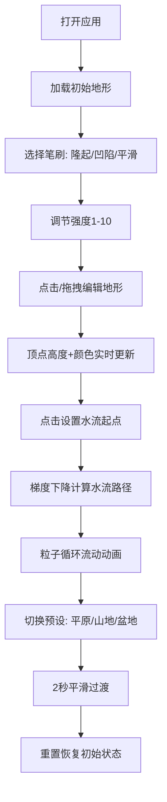

## 1. 产品概述

在线交互式3D地形编辑器与实时水文模拟应用，让用户在三维场景中通过画笔工具自由塑造地形，并直观观察水流从高地流向低地的粒子动画效果。面向景观设计师、游戏开发者、地理教育工作者及3D爱好者，提供直观易用的地形创作与水文可视化工具。

## 2. 核心功能

### 2.1 功能模块
1. **主场景页**：3D地形视口、笔刷面板、信息面板、预设控制栏
2. **地形编辑模块**：升高/降低/平滑笔刷、强度调节、网格实时更新
3. **水流模拟模块**：点击设置起点、梯度下降寻路、粒子循环流动动画
4. **地形预设模块**：平原/山地/盆地预设、2秒平滑过渡、一键重置
5. **动态信息模块**：笔刷状态、海拔高度、坡度百分比实时显示

### 2.2 页面详情
| 页面名称 | 模块名称 | 功能描述 |
|---------|---------|---------|
| 主场景页 | 3D地形视口 | 全屏Three.js Canvas渲染20×20网格地形，支持OrbitControls旋转缩放，鼠标拾取交互 |
| 主场景页 | 笔刷面板 | 圆形/矩形笔刷形状，隆起/凹陷/平滑笔刷模式，1-10强度滑块 |
| 主场景页 | 信息面板 | 右上角半透明深色浮层，显示笔刷名称、压力、海拔(0.1精度)、坡度% |
| 主场景页 | 预设控制栏 | 平原/山地/盆地预设按钮、重置按钮，预设切换2秒平滑过渡 |
| 主场景页 | 水流起点标记 | 蓝色光圈标记用户点击的水流起始点 |

## 3. 核心流程

用户打开应用 → 初始地形加载（中心略高边缘降低）→ 选择笔刷类型与强度 → 在地形上点击/拖拽编辑 → 地形几何与颜色实时更新 → 点击地形任意位置设置水流起点 → 梯度下降算法计算路径 → 蓝色粒子沿路径循环流动 → 切换预设地形平滑过渡 → 重置恢复初始状态

## 4. 用户界面设计

### 4.1 设计风格
- **主背景**：深灰科技感 `#1a1a2e`
- **UI控件**：蓝紫渐变 `#4a90d9` → `#7c4dff`
- **悬停效果**：亮度提升10%
- **点击动效**：缩放至0.95倍 + 弹性回弹
- **文字**：白色，信息面板背景 `rgba(0,0,0,0.6)`
- **地形颜色**：低地 `#3a7b3a`(绿)、中地 `#8b6f47`(棕)、高地 `#d4c9b0`(浅灰)
- **水流粒子**：半透明蓝 `#4fc3f7`，大小0.2单位

### 4.2 页面设计概述
| 页面名称 | 模块名称 | UI元素 |
|---------|---------|--------|
| 主场景页 | 3D视口 | 全屏Canvas，地形网格顶点着色，方向光+环境光 |
| 主场景页 | 笔刷面板 | 左侧半透明浮窗，图标+标签按钮组，渐变滑块 |
| 主场景页 | 信息面板 | 右上角固定，半透明深色背景，白色等宽字体数字 |
| 主场景页 | 预设栏 | 底部居中横排按钮，蓝紫渐变背景 |
| 主场景页 | 水流标记 | 地面蓝色光圈Sprite，带脉冲动画 |

### 4.3 响应式
桌面端为主布局；宽度<768px时笔刷面板折叠为底部可拖拽条状，信息面板移至左上角缩小尺寸。

### 4.4 3D场景指南
- **光照**：ambientLight(0.5) + directionalLight(1.0, 位置(10,20,10)) 投射柔和阴影
- **相机**：PerspectiveCamera fov=60，初始位置(0,15,20) 看向原点
- **交互**：OrbitControls 支持阻尼，target 锁定地形中心
- **粒子**：THREE.Points + AdditiveBlending，20-200个粒子
- **性能**：帧率≥30fps，地形更新≤1秒，粒子上限200
